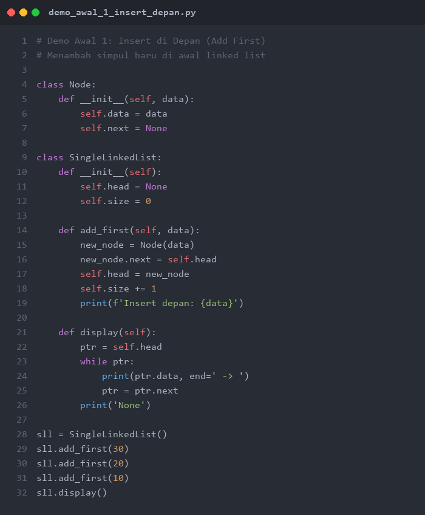
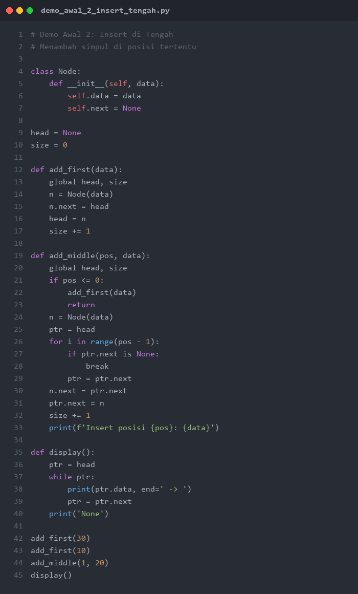
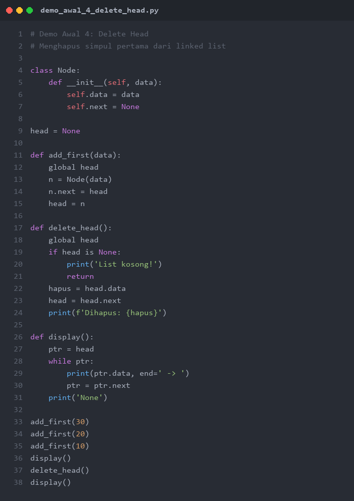

# PERTEMUAN 11-12: OPERASI INSERT DAN DELETE PADA SINGLE LINKED LIST

## SUMMARY MATERI

### 1. Operasi-operasi Single Linked List

Single Linked List memiliki tiga operasi utama yang dapat dilakukan pada **tiga posisi berbeda**:

| Operasi | Depan (Head) | Tengah | Akhir (Tail) |
|---------|-------------|--------|--------------|
| **Insert** | Add First | Add Middle | Add Last |
| **Delete** | Delete Head | Delete Middle | Delete Last |
| **Search** | Locate / Find | Locate / Find | Locate / Find |

### 2. Insert Operation

#### 2.1 Insert di Depan (Add First)

**Langkah-langkah:**
1. Buat simpul baru dengan data yang diinginkan
2. Arahkan `next` simpul baru ke `head` (simpul pertama saat ini)
3. Ubah `head` agar menunjuk ke simpul baru
4. Tambahkan size + 1

```
Sebelum: Head --> [10|*] --> [20|*] --> [30|*] --> None
Insert 5 di depan:
Sesudah: Head --> [5|*] --> [10|*] --> [20|*] --> [30|*] --> None
```

#### 2.2 Insert di Tengah

**Langkah-langkah:**
1. Buat simpul baru
2. Tentukan posisi (indeks) untuk insert
3. Iterasi dari head sampai posisi **sebelum** target
4. Arahkan `next` simpul baru ke simpul setelah posisi sebelumnya
5. Arahkan `next` simpul sebelumnya ke simpul baru
6. Tambahkan size + 1

```
Sebelum: Head --> [10|*] --> [20|*] --> [30|*] --> None
Insert 25 di posisi 2:

Langkah:
1. ptr = Head --> [10|*]
2. ptr = ptr.next --> [20|*]  (posisi sebelum target)
3. new_node.next = ptr.next  ([25|*] --> [30|*])
4. ptr.next = new_node       ([20|*] --> [25|*])

Sesudah: Head --> [10|*] --> [20|*] --> [25|*] --> [30|*] --> None
```

**PENTING:** Urutan assignment pointer harus benar! Jika salah urutan, link bisa terputus.

#### 2.3 Insert di Akhir (Add Last)

**Langkah-langkah:**
1. Buat simpul baru dengan `next = None`
2. Jika list kosong, simpul baru menjadi head
3. Jika tidak, iterasi sampai node terakhir (yang `next`-nya None)
4. Arahkan `next` node terakhir ke simpul baru
5. Tambahkan size + 1

```
Sebelum: Head --> [10|*] --> [20|*] --> [30|*] --> None
Insert 40 di akhir:
Sesudah: Head --> [10|*] --> [20|*] --> [30|*] --> [40|*] --> None
```

### 3. Delete Operation

#### 3.1 Delete Head

**Langkah-langkah:**
1. Cek apakah list kosong (jika ya, tidak bisa delete)
2. Simpan referensi head saat ini (untuk mengembalikan datanya)
3. Ubah `head` agar menunjuk ke node kedua (`head.next`)
4. Kurangi size - 1

```
Sebelum: Head --> [10|*] --> [20|*] --> [30|*] --> None
Delete Head:
Sesudah: Head --> [20|*] --> [30|*] --> None
(Node [10] dihapus)
```

**WARNING:** Jangan sampai kehilangan Head! Pastikan Head dipindahkan ke node berikutnya **sebelum** memutus koneksi.

#### 3.2 Delete di Tengah

**Langkah-langkah:**
1. Tentukan posisi node yang akan dihapus
2. Iterasi ke posisi **sebelum** node target
3. Ubah `next` node sebelumnya agar menunjuk ke node setelah target
4. Node target otomatis terputus dari linked list
5. Kurangi size - 1

```
Sebelum: Head --> [10|*] --> [20|*] --> [30|*] --> [40|*] --> None
Delete posisi 2 (nilai 30):

Langkah:
1. ptr = Head --> [10|*]
2. ptr = ptr.next --> [20|*]  (posisi sebelum target)
3. ptr.next = ptr.next.next  ([20|*] --> [40|*])

Sesudah: Head --> [10|*] --> [20|*] --> [40|*] --> None
(Node [30] dihapus)
```

#### 3.3 Delete di Akhir (Delete Tail)

**Langkah-langkah:**
1. Cek apakah list kosong
2. Jika hanya ada 1 elemen, set head = None
3. Jika lebih, iterasi sampai node **sebelum terakhir** (yang `next.next`-nya None)
4. Set `next` node tersebut menjadi None
5. Kurangi size - 1

```
Sebelum: Head --> [10|*] --> [20|*] --> [30|*] --> None
Delete Tail:

Langkah:
1. ptr = Head --> [10|*]
2. ptr = ptr.next --> [20|*]  (ptr.next.next == None)
3. ptr.next = None

Sesudah: Head --> [10|*] --> [20|*] --> None
(Node [30] dihapus)
```

### 4. Locate / Search Operation

**Langkah-langkah:**
1. Arahkan pointer ke Head
2. Bergerak maju dengan `ptr = ptr.next` sampai menemukan node yang sesuai atau sampai None
3. Jika ditemukan, kembalikan posisi/node
4. Jika sampai None, berarti tidak ditemukan

```python
ptr = head
while ptr is not None and ptr.data != target:
    ptr = ptr.next
```

### 5. Ringkasan Kompleksitas Waktu

| Operasi | Kompleksitas | Keterangan |
|---------|-------------|------------|
| Insert di depan | O(1) | Langsung ubah head |
| Insert di tengah | O(n) | Perlu traversal ke posisi |
| Insert di akhir | O(n) | Perlu traversal sampai akhir |
| Delete head | O(1) | Langsung ubah head |
| Delete di tengah | O(n) | Perlu traversal ke posisi |
| Delete di akhir | O(n) | Perlu traversal sampai sebelum akhir |
| Search | O(n) | Perlu traversal untuk mencari |

### 6. Tips Penting

- **Jangan sampai link terputus!** Saat insert/delete, pastikan urutan assignment pointer benar
- **Selalu cek kondisi kosong** sebelum melakukan operasi delete
- **Gunakan variabel tail** (opsional) untuk mempercepat operasi di akhir list menjadi O(1)
- **Head jangan sampai hilang!** Head adalah satu-satunya akses ke seluruh linked list

---

## DEMO PYTHON

> **PERATURAN DEMO AWAL:**
> Demo Awal 1-4 di bawah ini ditampilkan sebagai **gambar** (tidak bisa di-copy-paste).
> Mahasiswa **WAJIB mengetik sendiri** kode program secara manual di Python.
> **Dilarang copy-paste!** Tujuannya agar mahasiswa memahami setiap baris kode.

---

### Demo Awal 1: Insert di Depan (Add First)

**Tujuan:** Memahami cara menambahkan simpul baru di awal linked list.

**Instruksi:** Lihat gambar di bawah, lalu **ketik ulang** kode tersebut di Python dan jalankan.



**Output yang Diharapkan:**
```
Insert depan: 30
Insert depan: 20
Insert depan: 10
10 -> 20 -> 30 -> None
```

---

### Demo Awal 2: Insert di Tengah

**Tujuan:** Memahami cara menyisipkan simpul baru di posisi tertentu dalam linked list.

**Instruksi:** Lihat gambar di bawah, lalu **ketik ulang** kode tersebut di Python dan jalankan.



**Output yang Diharapkan:**
```
Insert posisi 1: 20
10 -> 20 -> 30 -> None
```

---

### Demo Awal 3: Insert di Akhir (Add Last)

**Tujuan:** Memahami cara menambahkan simpul baru di akhir linked list.

**Instruksi:** Lihat gambar di bawah, lalu **ketik ulang** kode tersebut di Python dan jalankan.


**Output yang Diharapkan:**
```
Insert akhir: 20
Insert akhir: 30
10 -> 20 -> 30 -> None
```

---

### Demo Awal 4: Delete Head

**Tujuan:** Memahami cara menghapus simpul pertama (head) dari linked list tanpa kehilangan sisa list.

**Instruksi:** Lihat gambar di bawah, lalu **ketik ulang** kode tersebut di Python dan jalankan.



**Output yang Diharapkan:**
```
10 -> 20 -> 30 -> None
Dihapus: 10
20 -> 30 -> None
```

---

### Demo 1: Single Linked List - Semua Operasi Insert

```python
"""
Demo 1: Single Linked List - Semua Operasi Insert
Insert di depan, tengah, dan akhir
"""

class Node:
    def __init__(self, data):
        self.data = data
        self.next = None


class SingleLinkedList:
    def __init__(self):
        self.head = None
        self.size = 0

    def add_first(self, data):
        """Insert di depan"""
        new_node = Node(data)
        new_node.next = self.head
        self.head = new_node
        self.size += 1
        print(f"  Insert depan: {data}")

    def add_middle(self, position, data):
        """Insert di posisi tertentu (0-indexed)"""
        if position <= 0:
            self.add_first(data)
            return
        if position >= self.size:
            self.add_last(data)
            return

        new_node = Node(data)
        ptr = self.head
        for i in range(position - 1):
            ptr = ptr.next

        new_node.next = ptr.next
        ptr.next = new_node
        self.size += 1
        print(f"  Insert posisi {position}: {data}")

    def add_last(self, data):
        """Insert di akhir"""
        new_node = Node(data)
        if self.head is None:
            self.head = new_node
        else:
            ptr = self.head
            while ptr.next is not None:
                ptr = ptr.next
            ptr.next = new_node
        self.size += 1
        print(f"  Insert akhir: {data}")

    def display(self):
        if self.head is None:
            print("  List: [kosong]")
            return
        result = "  List: "
        ptr = self.head
        while ptr:
            result += str(ptr.data) + " -> "
            ptr = ptr.next
        result += "None"
        print(result)
        print(f"  Size: {self.size}")


print("=" * 60)
print("DEMO 1: SEMUA OPERASI INSERT")
print("=" * 60)

sll = SingleLinkedList()

# Insert di depan
print("\n1. Insert di Depan (10, 20, 30):")
sll.add_first(30)
sll.add_first(20)
sll.add_first(10)
sll.display()

# Insert di akhir
print("\n2. Insert di Akhir (40, 50):")
sll.add_last(40)
sll.add_last(50)
sll.display()

# Insert di tengah
print("\n3. Insert di Tengah:")
sll.add_middle(2, 25)
sll.display()

print("\n4. Insert 15 di posisi 1:")
sll.add_middle(1, 15)
sll.display()

# Insert di posisi 0 (sama dengan add_first)
print("\n5. Insert di posisi 0 (sama dengan add_first):")
sll.add_middle(0, 5)
sll.display()

# Insert di posisi >= size (sama dengan add_last)
print("\n6. Insert di posisi >= size (sama dengan add_last):")
sll.add_middle(100, 99)
sll.display()
```

**Output:**
```
============================================================
DEMO 1: SEMUA OPERASI INSERT
============================================================

1. Insert di Depan (10, 20, 30):
  Insert depan: 30
  Insert depan: 20
  Insert depan: 10
  List: 10 -> 20 -> 30 -> None
  Size: 3

2. Insert di Akhir (40, 50):
  Insert akhir: 40
  Insert akhir: 50
  List: 10 -> 20 -> 30 -> 40 -> 50 -> None
  Size: 5

3. Insert di Tengah:
  Insert posisi 2: 25
  List: 10 -> 20 -> 25 -> 30 -> 40 -> 50 -> None
  Size: 6

4. Insert 15 di posisi 1:
  Insert posisi 1: 15
  List: 10 -> 15 -> 20 -> 25 -> 30 -> 40 -> 50 -> None
  Size: 7

5. Insert di posisi 0 (sama dengan add_first):
  Insert depan: 5
  List: 5 -> 10 -> 15 -> 20 -> 25 -> 30 -> 40 -> 50 -> None
  Size: 8

6. Insert di posisi >= size (sama dengan add_last):
  Insert akhir: 99
  List: 5 -> 10 -> 15 -> 20 -> 25 -> 30 -> 40 -> 50 -> 99 -> None
  Size: 9
```

---

### Demo 2: Single Linked List - Semua Operasi Delete

```python
"""
Demo 2: Single Linked List - Semua Operasi Delete
Delete head, middle, dan tail
"""

class Node:
    def __init__(self, data):
        self.data = data
        self.next = None


class SingleLinkedList:
    def __init__(self):
        self.head = None
        self.size = 0

    def add_last(self, data):
        new_node = Node(data)
        if self.head is None:
            self.head = new_node
        else:
            ptr = self.head
            while ptr.next:
                ptr = ptr.next
            ptr.next = new_node
        self.size += 1

    def delete_head(self):
        """Menghapus node pertama (head)"""
        if self.head is None:
            print("  Error: List kosong, tidak dapat delete!")
            return None

        hapus = self.head
        self.head = self.head.next
        self.size -= 1
        print(f"  Delete Head: {hapus.data}")
        return hapus.data

    def delete_middle(self, position):
        """Menghapus node pada posisi tertentu (0-indexed)"""
        if self.head is None:
            print("  Error: List kosong!")
            return None

        if position <= 0:
            return self.delete_head()

        if position >= self.size:
            position = self.size - 1

        ptr = self.head
        for i in range(position - 1):
            if ptr.next is None:
                break
            ptr = ptr.next

        if ptr.next is None:
            print("  Error: Posisi di luar jangkauan!")
            return None

        hapus = ptr.next
        ptr.next = hapus.next
        self.size -= 1
        print(f"  Delete posisi {position}: {hapus.data}")
        return hapus.data

    def delete_last(self):
        """Menghapus node terakhir (tail)"""
        if self.head is None:
            print("  Error: List kosong, tidak dapat delete!")
            return None

        if self.head.next is None:
            hapus = self.head
            self.head = None
            self.size -= 1
            print(f"  Delete Last: {hapus.data}")
            return hapus.data

        ptr = self.head
        while ptr.next.next is not None:
            ptr = ptr.next

        hapus = ptr.next
        ptr.next = None
        self.size -= 1
        print(f"  Delete Last: {hapus.data}")
        return hapus.data

    def display(self):
        if self.head is None:
            print("  List: [kosong]")
            return
        result = "  List: "
        ptr = self.head
        while ptr:
            result += str(ptr.data) + " -> "
            ptr = ptr.next
        result += "None"
        print(result)
        print(f"  Size: {self.size}")


print("=" * 60)
print("DEMO 2: SEMUA OPERASI DELETE")
print("=" * 60)

sll = SingleLinkedList()
for d in [10, 20, 30, 40, 50, 60]:
    sll.add_last(d)

print("\n1. List awal:")
sll.display()

# Delete Head
print("\n2. Delete Head:")
sll.delete_head()
sll.display()

# Delete Last
print("\n3. Delete Last:")
sll.delete_last()
sll.display()

# Delete Middle (posisi 1 = elemen kedua)
print("\n4. Delete posisi 1:")
sll.delete_middle(1)
sll.display()

# Delete Head lagi
print("\n5. Delete Head lagi:")
sll.delete_head()
sll.display()

# Delete Last lagi
print("\n6. Delete Last lagi:")
sll.delete_last()
sll.display()

# Delete terakhir (1 elemen)
print("\n7. Delete terakhir (1 elemen tersisa):")
sll.delete_head()
sll.display()

# Delete dari list kosong
print("\n8. Coba delete dari list kosong:")
sll.delete_head()
sll.delete_last()
```

**Output:**
```
============================================================
DEMO 2: SEMUA OPERASI DELETE
============================================================

1. List awal:
  List: 10 -> 20 -> 30 -> 40 -> 50 -> 60 -> None
  Size: 6

2. Delete Head:
  Delete Head: 10
  List: 20 -> 30 -> 40 -> 50 -> 60 -> None
  Size: 5

3. Delete Last:
  Delete Last: 60
  List: 20 -> 30 -> 40 -> 50 -> None
  Size: 4

4. Delete posisi 1:
  Delete posisi 1: 30
  List: 20 -> 40 -> 50 -> None
  Size: 3

5. Delete Head lagi:
  Delete Head: 20
  List: 40 -> 50 -> None
  Size: 2

6. Delete Last lagi:
  Delete Last: 50
  List: 40 -> None
  Size: 1

7. Delete terakhir (1 elemen tersisa):
  Delete Head: 40
  List: [kosong]

8. Coba delete dari list kosong:
  Error: List kosong, tidak dapat delete!
  Error: List kosong, tidak dapat delete!
```

---

### Demo 3: Single Linked List - Delete by Value

```python
"""
Demo 3: Single Linked List - Delete by Value
Menghapus node berdasarkan nilai data
"""

class Node:
    def __init__(self, data):
        self.data = data
        self.next = None


class SingleLinkedList:
    def __init__(self):
        self.head = None
        self.size = 0

    def add_last(self, data):
        new_node = Node(data)
        if self.head is None:
            self.head = new_node
        else:
            ptr = self.head
            while ptr.next:
                ptr = ptr.next
            ptr.next = new_node
        self.size += 1

    def delete_by_value(self, target):
        """Menghapus node pertama yang memiliki nilai target"""
        if self.head is None:
            print(f"  List kosong! Tidak dapat menghapus {target}")
            return False

        # Kasus: target ada di head
        if self.head.data == target:
            self.head = self.head.next
            self.size -= 1
            print(f"  Dihapus: {target} (dari head)")
            return True

        # Kasus: target ada di tengah/akhir
        ptr = self.head
        while ptr.next is not None:
            if ptr.next.data == target:
                ptr.next = ptr.next.next
                self.size -= 1
                print(f"  Dihapus: {target}")
                return True
            ptr = ptr.next

        print(f"  Nilai {target} tidak ditemukan!")
        return False

    def delete_all_by_value(self, target):
        """Menghapus SEMUA node yang memiliki nilai target"""
        count = 0

        # Hapus dari head jika cocok
        while self.head is not None and self.head.data == target:
            self.head = self.head.next
            self.size -= 1
            count += 1

        # Hapus dari tengah/akhir
        if self.head is not None:
            ptr = self.head
            while ptr.next is not None:
                if ptr.next.data == target:
                    ptr.next = ptr.next.next
                    self.size -= 1
                    count += 1
                else:
                    ptr = ptr.next

        if count > 0:
            print(f"  Dihapus semua '{target}': {count} node")
        else:
            print(f"  Nilai {target} tidak ditemukan!")
        return count

    def display(self):
        if self.head is None:
            print("  List: [kosong]")
            return
        result = "  List: "
        ptr = self.head
        while ptr:
            result += str(ptr.data) + " -> "
            ptr = ptr.next
        result += "None"
        print(result)


print("=" * 60)
print("DEMO 3: DELETE BY VALUE")
print("=" * 60)

sll = SingleLinkedList()
for d in [10, 30, 20, 30, 40, 30, 50]:
    sll.add_last(d)

print("\n1. List awal:")
sll.display()

# Delete satu nilai
print("\n2. Delete nilai 20:")
sll.delete_by_value(20)
sll.display()

# Delete nilai di head
print("\n3. Delete nilai 10 (di head):")
sll.delete_by_value(10)
sll.display()

# Delete nilai di akhir
print("\n4. Delete nilai 50 (di akhir):")
sll.delete_by_value(50)
sll.display()

# Delete nilai yang tidak ada
print("\n5. Delete nilai 99 (tidak ada):")
sll.delete_by_value(99)

# Delete semua kemunculan
print("\n6. Delete semua nilai 30:")
sll.display()
sll.delete_all_by_value(30)
sll.display()
```

**Output:**
```
============================================================
DEMO 3: DELETE BY VALUE
============================================================

1. List awal:
  List: 10 -> 30 -> 20 -> 30 -> 40 -> 30 -> 50 -> None

2. Delete nilai 20:
  Dihapus: 20
  List: 10 -> 30 -> 30 -> 40 -> 30 -> 50 -> None

3. Delete nilai 10 (di head):
  Dihapus: 10 (dari head)
  List: 30 -> 30 -> 40 -> 30 -> 50 -> None

4. Delete nilai 50 (di akhir):
  Dihapus: 50
  List: 30 -> 30 -> 40 -> 30 -> None

5. Delete nilai 99 (tidak ada):
  Nilai 99 tidak ditemukan!

6. Delete semua nilai 30:
  List: 30 -> 30 -> 40 -> 30 -> None
  Dihapus semua '30': 3 node
  List: 40 -> None
```

---

### Demo 4: Aplikasi - Manajemen Kontak

```python
"""
Demo 4: Aplikasi - Manajemen Kontak dengan Linked List
CRUD lengkap (Create, Read, Update, Delete)
"""

class KontakNode:
    def __init__(self, nama, telepon, email):
        self.nama = nama
        self.telepon = telepon
        self.email = email
        self.next = None

    def __str__(self):
        return f"{self.nama} | {self.telepon} | {self.email}"


class DaftarKontak:
    def __init__(self):
        self.head = None
        self.size = 0

    def tambah_kontak(self, nama, telepon, email):
        """Menambahkan kontak baru (urut abjad)"""
        new_node = KontakNode(nama, telepon, email)

        # Jika list kosong atau nama baru lebih kecil dari head
        if self.head is None or nama.lower() < self.head.nama.lower():
            new_node.next = self.head
            self.head = new_node
        else:
            ptr = self.head
            while ptr.next is not None and ptr.next.nama.lower() < nama.lower():
                ptr = ptr.next
            new_node.next = ptr.next
            ptr.next = new_node

        self.size += 1
        print(f"  + Kontak ditambahkan: {nama}")

    def hapus_kontak(self, nama):
        """Menghapus kontak berdasarkan nama"""
        if self.head is None:
            print("  Daftar kontak kosong!")
            return False

        if self.head.nama.lower() == nama.lower():
            self.head = self.head.next
            self.size -= 1
            print(f"  - Kontak dihapus: {nama}")
            return True

        ptr = self.head
        while ptr.next is not None:
            if ptr.next.nama.lower() == nama.lower():
                ptr.next = ptr.next.next
                self.size -= 1
                print(f"  - Kontak dihapus: {nama}")
                return True
            ptr = ptr.next

        print(f"  Kontak '{nama}' tidak ditemukan!")
        return False

    def cari_kontak(self, nama):
        """Mencari kontak berdasarkan nama"""
        ptr = self.head
        while ptr is not None:
            if ptr.nama.lower() == nama.lower():
                return ptr
            ptr = ptr.next
        return None

    def update_kontak(self, nama, telepon_baru=None, email_baru=None):
        """Mengupdate info kontak"""
        kontak = self.cari_kontak(nama)
        if kontak is None:
            print(f"  Kontak '{nama}' tidak ditemukan!")
            return False
        if telepon_baru:
            kontak.telepon = telepon_baru
        if email_baru:
            kontak.email = email_baru
        print(f"  Kontak diupdate: {kontak}")
        return True

    def tampilkan(self):
        """Menampilkan seluruh daftar kontak"""
        if self.head is None:
            print("  Daftar kontak kosong!")
            return

        print(f"\n  {'No':<4} {'Nama':<18} {'Telepon':<16} {'Email':<25}")
        print("  " + "-" * 60)

        ptr = self.head
        no = 1
        while ptr is not None:
            print(f"  {no:<4} {ptr.nama:<18} {ptr.telepon:<16} {ptr.email:<25}")
            ptr = ptr.next
            no += 1

        print(f"\n  Total kontak: {self.size}")


print("=" * 60)
print("DEMO 4: MANAJEMEN KONTAK")
print("=" * 60)

kontak = DaftarKontak()

# Tambah kontak (otomatis terurut abjad)
print("\n1. Menambahkan kontak:")
kontak.tambah_kontak("Doni", "08123456789", "doni@email.com")
kontak.tambah_kontak("Ani", "08234567890", "ani@email.com")
kontak.tambah_kontak("Citra", "08345678901", "citra@email.com")
kontak.tambah_kontak("Budi", "08456789012", "budi@email.com")
kontak.tambah_kontak("Eka", "08567890123", "eka@email.com")

# Tampilkan daftar
print("\n2. Daftar Kontak (urut abjad):")
kontak.tampilkan()

# Cari kontak
print("\n3. Cari kontak 'Citra':")
found = kontak.cari_kontak("Citra")
if found:
    print(f"  Ditemukan: {found}")

# Update kontak
print("\n4. Update telepon Budi:")
kontak.update_kontak("Budi", telepon_baru="08999999999")

# Hapus kontak
print("\n5. Hapus kontak 'Doni':")
kontak.hapus_kontak("Doni")

# Tampilkan hasil akhir
print("\n6. Daftar Kontak Akhir:")
kontak.tampilkan()

# Hapus kontak yang tidak ada
print("\n7. Coba hapus 'Fajar':")
kontak.hapus_kontak("Fajar")
```

**Output:**
```
============================================================
DEMO 4: MANAJEMEN KONTAK
============================================================

1. Menambahkan kontak:
  + Kontak ditambahkan: Doni
  + Kontak ditambahkan: Ani
  + Kontak ditambahkan: Citra
  + Kontak ditambahkan: Budi
  + Kontak ditambahkan: Eka

2. Daftar Kontak (urut abjad):

  No   Nama               Telepon          Email
  ------------------------------------------------------------
  1    Ani                08234567890      ani@email.com
  2    Budi               08456789012      budi@email.com
  3    Citra              08345678901      citra@email.com
  4    Doni               08123456789      doni@email.com
  5    Eka                08567890123      eka@email.com

  Total kontak: 5

3. Cari kontak 'Citra':
  Ditemukan: Citra | 08345678901 | citra@email.com

4. Update telepon Budi:
  Kontak diupdate: Budi | 08999999999 | budi@email.com

5. Hapus kontak 'Doni':
  - Kontak dihapus: Doni

6. Daftar Kontak Akhir:

  No   Nama               Telepon          Email
  ------------------------------------------------------------
  1    Ani                08234567890      ani@email.com
  2    Budi               08999999999      budi@email.com
  3    Citra              08345678901      citra@email.com
  4    Eka                08567890123      eka@email.com

  Total kontak: 4

7. Coba hapus 'Fajar':
  Kontak 'Fajar' tidak ditemukan!
```

---

## CARA MENJALANKAN DEMO

Semua file demo dapat dijalankan langsung menggunakan Python.

### Persiapan Awal

1. **Pastikan Python sudah terinstall**
   ```bash
   python --version
   ```

2. **Navigasi ke folder pert11-12**
   ```bash
   cd d:\_CodeDev\strukturdatadanalgoritma\pert11-12
   ```

### Menjalankan Demo

1. **Demo 1 - Semua Operasi Insert**
   ```bash
   python demo1_insert_operations.py
   ```
   Yang akan ditampilkan:
   - Insert di depan (add_first)
   - Insert di tengah (add_middle)
   - Insert di akhir (add_last)
   - Handling edge cases

2. **Demo 2 - Semua Operasi Delete**
   ```bash
   python demo2_delete_operations.py
   ```
   Yang akan ditampilkan:
   - Delete head, middle, last
   - Delete satu elemen tersisa
   - Delete dari list kosong

3. **Demo 3 - Delete by Value**
   ```bash
   python demo3_delete_by_value.py
   ```
   Yang akan ditampilkan:
   - Hapus node berdasarkan nilai
   - Hapus semua kemunculan nilai
   - Handling nilai tidak ditemukan

4. **Demo 4 - Manajemen Kontak**
   ```bash
   python demo4_manajemen_kontak.py
   ```
   Yang akan ditampilkan:
   - CRUD lengkap (Create, Read, Update, Delete)
   - Insert terurut abjad
   - Pencarian dan update kontak

---

## LATIHAN SOAL

### Soal 1: Sistem Playlist Musik

**Deskripsi:**
Buatlah program pengelolaan playlist musik menggunakan Single Linked List dengan operasi insert dan delete.

**Spesifikasi:**

1. Buatlah class `LaguNode` dengan atribut:
   - `judul` (string): Judul lagu
   - `artis` (string): Nama artis
   - `durasi` (int): Durasi dalam detik
   - `next`: Pointer ke node berikutnya

2. Buatlah class `Playlist` dengan fungsi:
   - `tambah_awal(judul, artis, durasi)`: Menambahkan lagu di awal playlist
   - `tambah_akhir(judul, artis, durasi)`: Menambahkan lagu di akhir playlist
   - `tambah_setelah(judul_target, judul, artis, durasi)`: Menambahkan lagu setelah lagu tertentu
   - `hapus_lagu(judul)`: Menghapus lagu berdasarkan judul
   - `tampilkan()`: Menampilkan seluruh playlist
   - `total_durasi()`: Menghitung total durasi semua lagu (format menit:detik)
   - `putar_lagu(judul)`: Mencari dan menampilkan info lagu yang sedang diputar

**Contoh Output yang Diharapkan:**
```
=== PLAYLIST MUSIK ===

1. Menambahkan lagu:
   + "Bohemian Rhapsody" - Queen (354 detik)
   + "Hotel California" - Eagles (390 detik)
   + "Imagine" - John Lennon (183 detik)

2. Tambah "Yesterday" setelah "Bohemian Rhapsody":
   + Ditambahkan setelah "Bohemian Rhapsody"

3. Playlist:
   1. Bohemian Rhapsody - Queen [5:54]
   2. Yesterday - Beatles [125 detik]
   3. Hotel California - Eagles [6:30]
   4. Imagine - John Lennon [3:03]
   Total durasi: 17:32

4. Hapus "Hotel California":
   - Lagu dihapus

5. Putar "Imagine":
   Now Playing: Imagine - John Lennon [3:03]
```

---

### Soal 2: Manajemen Inventory Toko

**Deskripsi:**
Buatlah program manajemen inventory toko menggunakan Single Linked List. Program harus mendukung semua operasi CRUD (Create, Read, Update, Delete).

**Spesifikasi:**

1. Buatlah class `BarangNode` dengan atribut:
   - `kode` (string): Kode barang
   - `nama` (string): Nama barang
   - `stok` (int): Jumlah stok
   - `harga` (int): Harga per item
   - `next`: Pointer ke node berikutnya

2. Buatlah class `Inventory` dengan fungsi:
   - `tambah_barang(kode, nama, stok, harga)`: Menambahkan barang baru (insert terurut berdasarkan kode)
   - `hapus_barang(kode)`: Menghapus barang berdasarkan kode
   - `update_stok(kode, jumlah)`: Menambah/mengurangi stok barang
   - `cari_barang(kode)`: Mencari barang berdasarkan kode
   - `tampilkan()`: Menampilkan seluruh inventory dalam bentuk tabel
   - `total_nilai_inventory()`: Menghitung total nilai inventory (stok x harga)
   - `barang_habis()`: Menampilkan daftar barang dengan stok 0

**Contoh Output yang Diharapkan:**
```
=== INVENTORY TOKO ===

1. Tambah barang:
   + BRG001 - Pensil (stok: 100, Rp 3000)
   + BRG002 - Buku Tulis (stok: 50, Rp 8000)
   + BRG003 - Penghapus (stok: 75, Rp 2000)

2. Inventory:
   Kode     Nama              Stok    Harga       Nilai
   -------------------------------------------------------
   BRG001   Pensil            100     Rp 3000     Rp 300000
   BRG002   Buku Tulis        50      Rp 8000     Rp 400000
   BRG003   Penghapus         75      Rp 2000     Rp 150000

   Total Nilai Inventory: Rp 850000

3. Update stok BRG002 (-30):
   Stok BRG002 berkurang 30: 50 -> 20

4. Hapus BRG003:
   Barang BRG003 dihapus
```

**Hint:**
- Untuk insert terurut, bandingkan kode barang saat traversal
- Untuk update_stok, gunakan nilai positif untuk menambah dan negatif untuk mengurangi
- Cek apakah stok mencukupi sebelum mengurangi

---

## TIPS PENGERJAAN

1. **Pahami urutan pointer**: Saat insert, arahkan next node baru **terlebih dahulu**, baru ubah pointer sebelumnya
2. **Jangan putus link**: Pastikan tidak ada node yang kehilangan referensi
3. **Selalu cek kondisi kosong**: Sebelum delete, pastikan list tidak kosong
4. **Kasus khusus**: Perhatikan kasus head, tail, dan satu elemen
5. **Gunakan variabel temp**: Untuk menyimpan node yang akan dihapus
6. **Test edge cases**: List kosong, 1 elemen, delete head, delete tail
7. **Debug step by step**: Gunakan display() setelah setiap operasi untuk verifikasi

**Selamat mengerjakan!**

---

*Catatan: File ini merupakan bagian dari materi Struktur Data dan Algoritma - Pertemuan 11-12*
