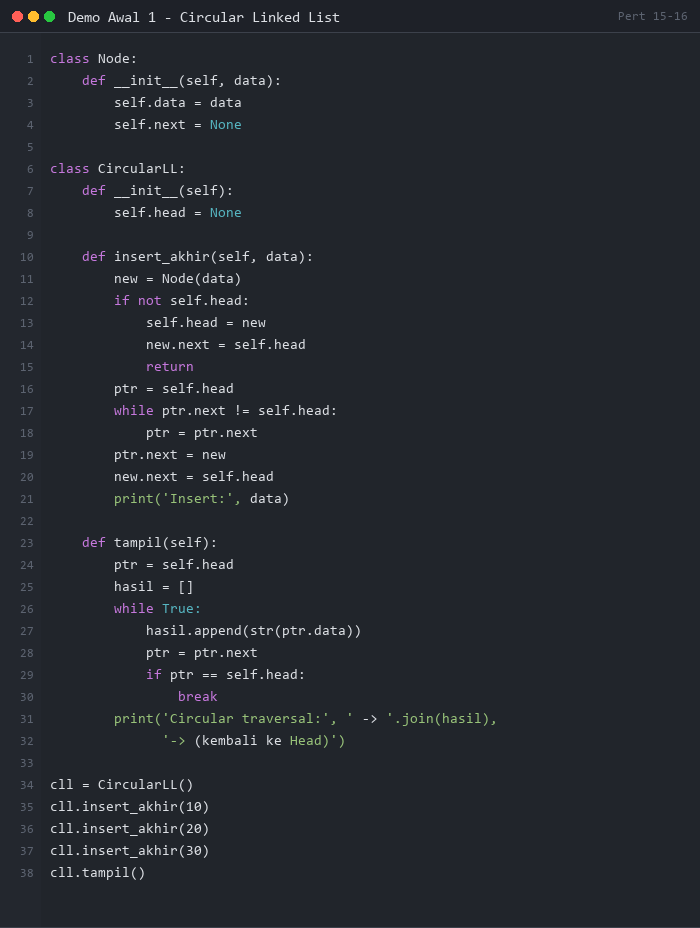
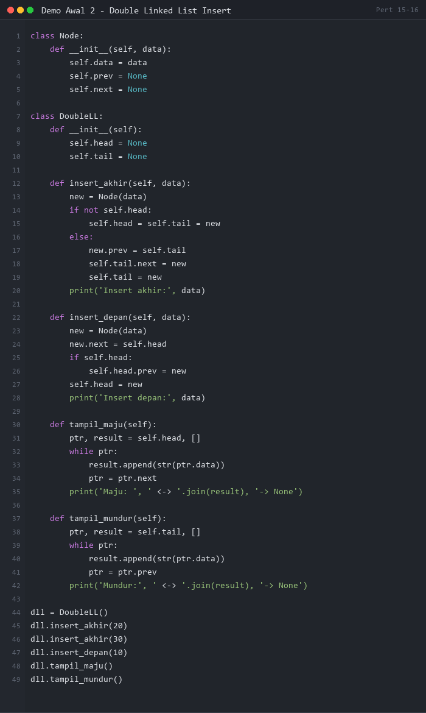
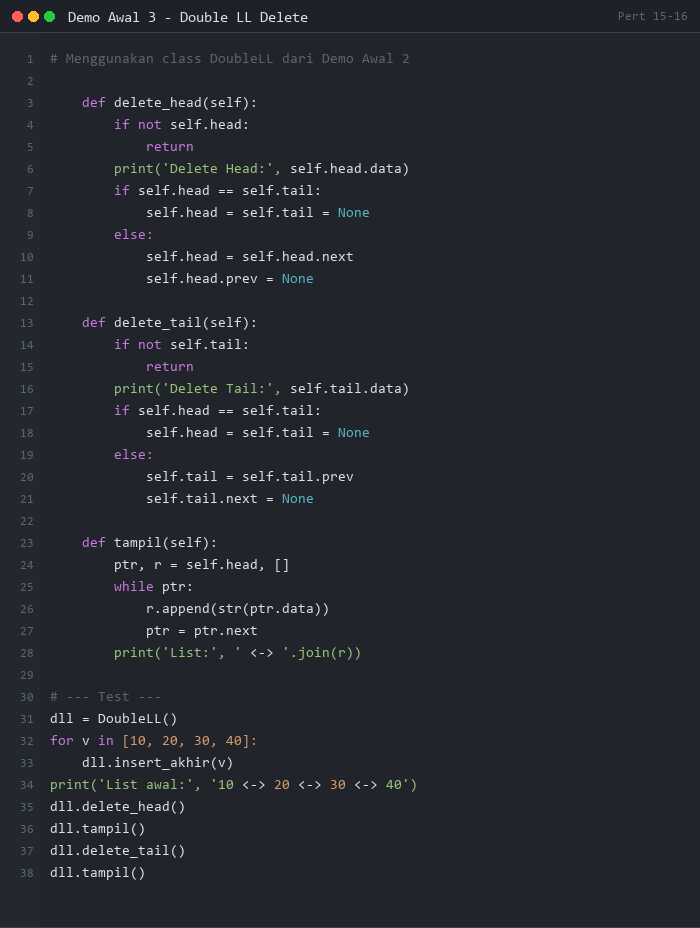
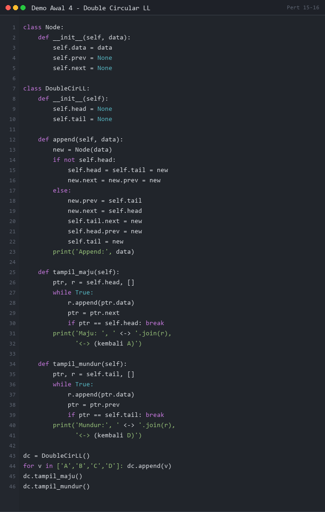

# PERTEMUAN 15-16: MODEL-MODEL LINKED LIST

## SUMMARY MATERI

### 1. Model-model Linked List

Selain **Single Linked List** yang telah dipelajari, terdapat beberapa model Linked List lain yang memiliki keunggulan masing-masing:

| Model | Karakteristik Utama | Keunggulan |
|-------|---------------------|------------|
| **Circular Linked List** | Tail.next → Head | Traversal terus-menerus (round-robin) |
| **Double Linked List** | Setiap node punya `prev` dan `next` | Traversal dua arah |
| **Double Circular LL** | Gabungan keduanya | Paling fleksibel, Head dapat dicari dari node mana saja |
| **Multiple/Multilevel LL** | Node memiliki link ke parent dan child list | Representasi data hierarki |

---

### 2. Circular Linked List

**Circular Linked List** adalah Single Linked List di mana pointer `next` pada node **tail (terakhir)** tidak menunjuk ke `None`, melainkan kembali ke **Head**.

```
Head --> [10|*] --> [20|*] --> [30|*] --> [40|*]
          ^                                  |
          |__________________________________|
```

#### 2.1 Perbedaan dengan Single Linked List

| Operasi | Single LL | Circular LL |
|---------|-----------|-------------|
| Insert akhir | `new_node.next = None` | `new_node.next = Head` |
| Delete tail | `ptr.next = None` | `ptr.next = Head` |
| Traversal berhenti | Saat `ptr is None` | Saat `ptr.next == Head` |

#### 2.2 Insert pada Circular Linked List

- **Insert di depan**: Sama seperti Single LL, tapi pastikan tail tetap menunjuk ke head baru
- **Insert di tengah**: Sama seperti Single LL
- **Insert di akhir**: Perbedaan utama — `new_node.next = Head` (bukan `None`)

```
Langkah insert di akhir:
1. Buat node baru
2. new_node.next = Head
3. tail.next = new_node
4. (Jika ada variabel tail) tail = new_node
```

#### 2.3 Delete pada Circular Linked List

- **Delete head / tengah**: Sama seperti Single LL
- **Delete tail**: Perbedaan — node sebelum tail menunjuk ke `Head` (bukan `None`)

```
Langkah delete tail:
1. Cari node sebelum tail (ptr.next.next == Head)
2. ptr.next = Head  (bukan None!)
3. Hapus node tail
```

---

### 3. Double Linked List

**Double Linked List** adalah Linked List di mana setiap node memiliki **dua pointer**: `prev` (ke node sebelumnya) dan `next` (ke node berikutnya).

```
Struktur node:
[prev | data | next]

NULL <-- [*|10|*] <--> [*|20|*] <--> [*|30|*] --> NULL
          head                          tail
```

- **Head** → `prev = None`
- **Tail** → `next = None`

#### 3.1 Kelebihan Double Linked List

1. **Traversal dua arah**: bisa maju (via `next`) atau mundur (via `prev`)
2. **Recovery Head**: jika Head hilang, masih bisa dicari dengan terus `prev` sampai `prev == None`
3. **Delete lebih mudah**: tidak perlu menyimpan pointer ke node sebelumnya saat delete

#### 3.2 Insert pada Double Linked List

**Insert di depan:**
```
1. new_node.next = Head
2. Head.prev = new_node
3. new_node.prev = None
4. Head = new_node
```

**Insert di tengah (setelah Ptr):**
```
1. new_node.next = Ptr.next
2. new_node.prev = Ptr
3. Ptr.next.prev = new_node
4. Ptr.next = new_node
```

**Insert di akhir:**
```
1. new_node.next = None
2. new_node.prev = Tail
3. Tail.next = new_node
4. Tail = new_node
```

#### 3.3 Delete pada Double Linked List

**Delete Head:**
```
1. Ptr = Head
2. Head = Head.next
3. Head.prev = None
4. del Ptr
```

**Delete di tengah (node Ptr):**
```
1. Ptr.next.prev = Ptr.prev
2. Ptr.prev.next = Ptr.next
3. del Ptr
```

**Delete Tail:**
```
1. Ptr = Tail
2. Tail.prev.next = None
3. Tail = Tail.prev
4. del Ptr
```

---

### 4. Double Circular Linked List

**Double Circular Linked List** = gabungan Double LL + Circular LL:
- `tail.next = head`
- `head.prev = tail`

```
    +-----------------------------------------+
    |                                         |
    v                                         |
[*|10|*] <--> [*|20|*] <--> [*|30|*] <--> [*|40|*]
head                                         tail
    ^                                         |
    |_________________________________________|
```

---

### 5. Multiple/Multilevel Linked List

**Multilevel List** adalah list di mana setiap node dapat memiliki link ke list lain sebagai **child list**.

```
Elemen node:
[info | link ke parent berikutnya | link ke child list]
```

**Contoh penggunaan**: sistem menu bertingkat, struktur folder, daftar kosakata berdasarkan kategori.

---

### 6. Ringkasan Kompleksitas

| Operasi | Single LL | Double LL | Circular LL |
|---------|-----------|-----------|-------------|
| Insert depan | O(1) | O(1) | O(1) |
| Insert akhir | O(n) | O(1)* | O(n) |
| Delete depan | O(1) | O(1) | O(1) |
| Delete akhir | O(n) | O(1)* | O(n) |
| Traversal | O(n) | O(n) | O(n) |

*Jika ada pointer Tail

---

## DEMO PYTHON

> **PERATURAN DEMO AWAL:**
> Demo Awal 1-4 di bawah ini ditampilkan sebagai **gambar** (tidak bisa di-copy-paste).
> Mahasiswa **WAJIB mengetik sendiri** kode program secara manual di Python.
> **Dilarang copy-paste!** Tujuannya agar mahasiswa memahami setiap baris kode.

---

### Demo Awal 1: Circular Linked List - Insert & Traversal

**Tujuan:** Memahami cara membuat Circular Linked List dan traversal-nya.

**Instruksi:** Lihat gambar di bawah, lalu **ketik ulang** kode tersebut di Python dan jalankan.



**Output yang Diharapkan:**
```
Insert: 10
Insert: 20
Insert: 30
Circular traversal: 10 -> 20 -> 30 -> (kembali ke Head)
```

---

### Demo Awal 2: Double Linked List - Insert Depan & Akhir

**Tujuan:** Memahami cara insert di depan dan di akhir Double Linked List dengan pengelolaan prev/next.

**Instruksi:** Lihat gambar di bawah, lalu **ketik ulang** kode tersebut di Python dan jalankan.



**Output yang Diharapkan:**
```
Insert akhir: 20
Insert akhir: 30
Insert depan: 10
Maju:  10 <-> 20 <-> 30 -> None
Mundur: 30 <-> 20 <-> 10 -> None
```

---

### Demo Awal 3: Double Linked List - Delete

**Tujuan:** Memahami operasi delete pada Double Linked List dengan memperhatikan prev link.

**Instruksi:** Lihat gambar di bawah, lalu **ketik ulang** kode tersebut di Python dan jalankan.



**Output yang Diharapkan:**
```
List awal: 10 <-> 20 <-> 30 <-> 40
Delete Head: 10
List: 20 <-> 30 <-> 40
Delete Tail: 40
List: 20 <-> 30
```

---

### Demo Awal 4: Double Circular Linked List

**Tujuan:** Memahami Double Circular Linked List dimana head.prev = tail dan tail.next = head.

**Instruksi:** Lihat gambar di bawah, lalu **ketik ulang** kode tersebut di Python dan jalankan.



**Output yang Diharapkan:**
```
Append: A, B, C, D
Maju:  A <-> B <-> C <-> D <-> (kembali A)
Mundur: D <-> C <-> B <-> A <-> (kembali D)
```

---

### Demo 1: Circular Linked List - Semua Operasi

```python
"""
Demo 1: Circular Linked List - Semua Operasi
Insert depan, akhir, dan traversal circular
"""

class Node:
    def __init__(self, data):
        self.data = data
        self.next = None


class CircularLinkedList:
    def __init__(self):
        self.head = None
        self.size = 0

    def append(self, data):
        """Insert di akhir (tail.next = head)"""
        new_node = Node(data)
        if self.head is None:
            self.head = new_node
            new_node.next = self.head   # Circular: menunjuk ke diri sendiri
        else:
            # Cari tail
            tail = self.head
            while tail.next != self.head:
                tail = tail.next
            tail.next = new_node
            new_node.next = self.head   # Circular: tail baru menunjuk ke head
        self.size += 1
        print(f"  Append: {data}")

    def prepend(self, data):
        """Insert di depan (head baru)"""
        new_node = Node(data)
        if self.head is None:
            self.head = new_node
            new_node.next = self.head
        else:
            # Cari tail untuk diupdate
            tail = self.head
            while tail.next != self.head:
                tail = tail.next
            new_node.next = self.head
            self.head = new_node
            tail.next = self.head       # Circular: tail tetap menunjuk ke head baru
        self.size += 1
        print(f"  Prepend: {data}")

    def delete(self, data):
        """Hapus node berdasarkan nilai"""
        if self.head is None:
            print("  List kosong!")
            return

        # Kasus: head yang dihapus
        if self.head.data == data:
            if self.size == 1:
                self.head = None
            else:
                tail = self.head
                while tail.next != self.head:
                    tail = tail.next
                self.head = self.head.next
                tail.next = self.head   # Circular: tail menunjuk ke head baru
            self.size -= 1
            print(f"  Deleted: {data}")
            return

        # Cari node
        ptr = self.head
        while ptr.next != self.head:
            if ptr.next.data == data:
                ptr.next = ptr.next.next
                self.size -= 1
                print(f"  Deleted: {data}")
                return
            ptr = ptr.next
        print(f"  Nilai {data} tidak ditemukan!")

    def display(self):
        if self.head is None:
            print("  List: [kosong]")
            return
        result = "  Circular: "
        ptr = self.head
        while True:
            result += str(ptr.data) + " -> "
            ptr = ptr.next
            if ptr == self.head:
                break
        result += f"(HEAD={self.head.data})"
        print(result)
        print(f"  Size: {self.size}")


print("=" * 60)
print("DEMO 1: CIRCULAR LINKED LIST")
print("=" * 60)

cll = CircularLinkedList()

print("\n1. Append 10, 20, 30:")
cll.append(10)
cll.append(20)
cll.append(30)
cll.display()

print("\n2. Prepend 5:")
cll.prepend(5)
cll.display()

print("\n3. Append 40:")
cll.append(40)
cll.display()

print("\n4. Delete 20:")
cll.delete(20)
cll.display()

print("\n5. Delete Head (5):")
cll.delete(5)
cll.display()

print("\n6. Delete Tail (40):")
cll.delete(40)
cll.display()
```

**Output:**
```
============================================================
DEMO 1: CIRCULAR LINKED LIST
============================================================

1. Append 10, 20, 30:
  Append: 10
  Append: 20
  Append: 30
  Circular: 10 -> 20 -> 30 -> (HEAD=10)
  Size: 3

2. Prepend 5:
  Prepend: 5
  Circular: 5 -> 10 -> 20 -> 30 -> (HEAD=5)
  Size: 4

3. Append 40:
  Append: 40
  Circular: 5 -> 10 -> 20 -> 30 -> 40 -> (HEAD=5)
  Size: 5

4. Delete 20:
  Deleted: 20
  Circular: 5 -> 10 -> 30 -> 40 -> (HEAD=5)
  Size: 4

5. Delete Head (5):
  Deleted: 5
  Circular: 10 -> 30 -> 40 -> (HEAD=10)
  Size: 3

6. Delete Tail (40):
  Deleted: 40
  Circular: 10 -> 30 -> (HEAD=10)
  Size: 2
```

---

### Demo 2: Double Linked List - Insert & Traversal Dua Arah

```python
"""
Demo 2: Double Linked List - Insert & Traversal Dua Arah
Setiap node memiliki prev dan next
"""

class DNode:
    def __init__(self, data):
        self.data = data
        self.prev = None
        self.next = None


class DoublyLinkedList:
    def __init__(self):
        self.head = None
        self.tail = None
        self.size = 0

    def append(self, data):
        """Insert di akhir"""
        new_node = DNode(data)
        if self.head is None:
            self.head = new_node
            self.tail = new_node
        else:
            new_node.prev = self.tail   # Link prev ke tail saat ini
            self.tail.next = new_node
            self.tail = new_node
        self.size += 1
        print(f"  Append: {data}")

    def prepend(self, data):
        """Insert di depan"""
        new_node = DNode(data)
        if self.head is None:
            self.head = new_node
            self.tail = new_node
        else:
            new_node.next = self.head
            self.head.prev = new_node   # Head lama prev-nya ke node baru
            self.head = new_node
        self.size += 1
        print(f"  Prepend: {data}")

    def insert_after(self, target, data):
        """Insert setelah node dengan nilai target"""
        ptr = self.head
        while ptr and ptr.data != target:
            ptr = ptr.next
        if ptr is None:
            print(f"  Target {target} tidak ditemukan!")
            return
        new_node = DNode(data)
        new_node.next = ptr.next
        new_node.prev = ptr
        if ptr.next:
            ptr.next.prev = new_node
        else:
            self.tail = new_node    # Jika ptr adalah tail, update tail
        ptr.next = new_node
        self.size += 1
        print(f"  Insert {data} setelah {target}")

    def display_forward(self):
        """Traversal maju"""
        if self.head is None:
            print("  List: [kosong]")
            return
        result = "  Maju : "
        ptr = self.head
        while ptr:
            result += str(ptr.data)
            if ptr.next:
                result += " <-> "
            ptr = ptr.next
        result += " -> None"
        print(result)

    def display_backward(self):
        """Traversal mundur"""
        if self.tail is None:
            print("  List: [kosong]")
            return
        result = "  Mundur: "
        ptr = self.tail
        while ptr:
            result += str(ptr.data)
            if ptr.prev:
                result += " <-> "
            ptr = ptr.prev
        result += " -> None"
        print(result)


print("=" * 60)
print("DEMO 2: DOUBLE LINKED LIST - INSERT & TRAVERSAL")
print("=" * 60)

dll = DoublyLinkedList()

print("\n1. Append 10, 20, 30:")
dll.append(10)
dll.append(20)
dll.append(30)
dll.display_forward()
dll.display_backward()

print("\n2. Prepend 5:")
dll.prepend(5)
dll.display_forward()
dll.display_backward()

print("\n3. Insert 15 setelah 10:")
dll.insert_after(10, 15)
dll.display_forward()
dll.display_backward()

print("\n4. Insert 25 setelah 20:")
dll.insert_after(20, 25)
dll.display_forward()
dll.display_backward()
```

**Output:**
```
============================================================
DEMO 2: DOUBLE LINKED LIST - INSERT & TRAVERSAL
============================================================

1. Append 10, 20, 30:
  Append: 10
  Append: 20
  Append: 30
  Maju : 10 <-> 20 <-> 30 -> None
  Mundur: 30 <-> 20 <-> 10 -> None

2. Prepend 5:
  Prepend: 5
  Maju : 5 <-> 10 <-> 20 <-> 30 -> None
  Mundur: 30 <-> 20 <-> 10 <-> 5 -> None

3. Insert 15 setelah 10:
  Insert 15 setelah 10
  Maju : 5 <-> 10 <-> 15 <-> 20 <-> 30 -> None
  Mundur: 30 <-> 20 <-> 15 <-> 10 <-> 5 -> None

4. Insert 25 setelah 20:
  Insert 25 setelah 20
  Maju : 5 <-> 10 <-> 15 <-> 20 <-> 25 <-> 30 -> None
  Mundur: 30 <-> 25 <-> 20 <-> 15 <-> 10 <-> 5 -> None
```

---

### Demo 3: Double Linked List - Semua Operasi Delete

```python
"""
Demo 3: Double Linked List - Semua Operasi Delete
Delete head, tail, dan by value
"""

class DNode:
    def __init__(self, data):
        self.data = data
        self.prev = None
        self.next = None


class DoublyLinkedList:
    def __init__(self):
        self.head = None
        self.tail = None
        self.size = 0

    def append(self, data):
        new_node = DNode(data)
        if not self.head:
            self.head = self.tail = new_node
        else:
            new_node.prev = self.tail
            self.tail.next = new_node
            self.tail = new_node
        self.size += 1

    def delete_head(self):
        if not self.head:
            print("  Error: List kosong!")
            return None
        data = self.head.data
        if self.size == 1:
            self.head = self.tail = None
        else:
            self.head = self.head.next
            self.head.prev = None   # Head baru prev-nya = None
        self.size -= 1
        print(f"  Delete Head: {data}")
        return data

    def delete_tail(self):
        if not self.tail:
            print("  Error: List kosong!")
            return None
        data = self.tail.data
        if self.size == 1:
            self.head = self.tail = None
        else:
            self.tail = self.tail.prev
            self.tail.next = None   # Tail baru next-nya = None
        self.size -= 1
        print(f"  Delete Tail: {data}")
        return data

    def delete_by_value(self, target):
        ptr = self.head
        while ptr and ptr.data != target:
            ptr = ptr.next
        if ptr is None:
            print(f"  Nilai {target} tidak ditemukan!")
            return False
        if ptr.prev:
            ptr.prev.next = ptr.next
        else:
            self.head = ptr.next        # ptr adalah head
        if ptr.next:
            ptr.next.prev = ptr.prev
        else:
            self.tail = ptr.prev        # ptr adalah tail
        self.size -= 1
        print(f"  Delete {target}: berhasil")
        return True

    def display(self):
        if not self.head:
            print("  List: [kosong]")
            return
        result = "  List: "
        ptr = self.head
        while ptr:
            result += str(ptr.data)
            if ptr.next:
                result += " <-> "
            ptr = ptr.next
        result += f"  (Size: {self.size})"
        print(result)


print("=" * 60)
print("DEMO 3: DOUBLE LINKED LIST - DELETE")
print("=" * 60)

dll = DoublyLinkedList()
for d in [10, 20, 30, 40, 50]:
    dll.append(d)

print("\n1. List awal:")
dll.display()

print("\n2. Delete Head:")
dll.delete_head()
dll.display()

print("\n3. Delete Tail:")
dll.delete_tail()
dll.display()

print("\n4. Delete by value (30):")
dll.delete_by_value(30)
dll.display()

print("\n5. Delete nilai tidak ada (99):")
dll.delete_by_value(99)

print("\n6. Delete semua sisa:")
dll.delete_head()
dll.delete_tail()
dll.display()
```

**Output:**
```
============================================================
DEMO 3: DOUBLE LINKED LIST - DELETE
============================================================

1. List awal:
  List: 10 <-> 20 <-> 30 <-> 40 <-> 50  (Size: 5)

2. Delete Head:
  Delete Head: 10
  List: 20 <-> 30 <-> 40 <-> 50  (Size: 4)

3. Delete Tail:
  Delete Tail: 50
  List: 20 <-> 30 <-> 40  (Size: 3)

4. Delete by value (30):
  Delete 30: berhasil
  List: 20 <-> 40  (Size: 2)

5. Delete nilai tidak ada (99):
  Nilai 99 tidak ditemukan!

6. Delete semua sisa:
  Delete Head: 20
  Delete Tail: 40
  List: [kosong]
```

---

### Demo 4: Aplikasi - Riwayat Browser (Double LL)

```python
"""
Demo 4: Aplikasi - Simulasi Riwayat Browser
Menggunakan Double Linked List untuk navigasi maju/mundur
"""

class PageNode:
    def __init__(self, url, title):
        self.url = url
        self.title = title
        self.prev = None
        self.next = None

    def __str__(self):
        return f"{self.title} ({self.url})"


class BrowserHistory:
    def __init__(self):
        self.current = None
        self.size = 0

    def visit(self, url, title):
        """Kunjungi halaman baru — hapus forward history"""
        new_page = PageNode(url, title)
        if self.current:
            new_page.prev = self.current
            self.current.next = None    # Hapus forward history
            self.current.next = new_page
        self.current = new_page
        self.size += 1
        print(f"  Visiting: {title}")

    def back(self):
        """Kembali ke halaman sebelumnya"""
        if not self.current or not self.current.prev:
            print("  Tidak ada halaman sebelumnya!")
            return
        self.current = self.current.prev
        print(f"  Back -> {self.current}")

    def forward(self):
        """Maju ke halaman berikutnya"""
        if not self.current or not self.current.next:
            print("  Tidak ada halaman berikutnya!")
            return
        self.current = self.current.next
        print(f"  Forward -> {self.current}")

    def current_page(self):
        if self.current:
            print(f"  Halaman saat ini: {self.current}")
        else:
            print("  Tidak ada halaman terbuka")

    def show_history(self):
        """Tampilkan seluruh riwayat (dari awal sampai current)"""
        pages = []
        ptr = self.current
        while ptr:
            pages.append(str(ptr))
            ptr = ptr.prev
        pages.reverse()
        print("  Riwayat:")
        for i, p in enumerate(pages):
            marker = " <-- CURRENT" if i == len(pages) - 1 else ""
            print(f"    {i+1}. {p}{marker}")


print("=" * 60)
print("DEMO 4: SIMULASI RIWAYAT BROWSER")
print("=" * 60)

browser = BrowserHistory()

print("\n1. Membuka halaman-halaman:")
browser.visit("google.com", "Google")
browser.visit("github.com", "GitHub")
browser.visit("python.org", "Python.org")
browser.visit("stackoverflow.com", "Stack Overflow")

print("\n2. Halaman saat ini:")
browser.current_page()

print("\n3. Navigasi mundur 2x:")
browser.back()
browser.back()
browser.current_page()

print("\n4. Buka halaman baru (menghapus forward history):")
browser.visit("wikipedia.org", "Wikipedia")

print("\n5. Coba forward (seharusnya tidak bisa):")
browser.forward()

print("\n6. Riwayat akhir:")
browser.show_history()
```

**Output:**
```
============================================================
DEMO 4: SIMULASI RIWAYAT BROWSER
============================================================

1. Membuka halaman-halaman:
  Visiting: Google
  Visiting: GitHub
  Visiting: Python.org
  Visiting: Stack Overflow

2. Halaman saat ini:
  Halaman saat ini: Stack Overflow (stackoverflow.com)

3. Navigasi mundur 2x:
  Back -> Python.org (python.org)
  Back -> GitHub (github.com)
  Halaman saat ini: GitHub (github.com)

4. Buka halaman baru (menghapus forward history):
  Visiting: Wikipedia

5. Coba forward (seharusnya tidak bisa):
  Tidak ada halaman berikutnya!

6. Riwayat akhir:
  Riwayat:
    1. Google (google.com)
    2. GitHub (github.com)
    3. Wikipedia (wikipedia.org) <-- CURRENT
```

---

## CARA MENJALANKAN DEMO

Semua file demo dapat dijalankan langsung menggunakan Python.

### Persiapan Awal

1. **Pastikan Python sudah terinstall**
   ```bash
   python --version
   ```

2. **Navigasi ke folder pert15-16**
   ```bash
   cd d:\_CodeDev\strukturdatadanalgoritma\pert15-16
   ```

### Menjalankan Demo

1. **Demo 1 - Circular Linked List**
   ```bash
   python demo1_circular_ll.py
   ```

2. **Demo 2 - Double LL Insert & Traversal**
   ```bash
   python demo2_double_ll_insert.py
   ```

3. **Demo 3 - Double LL Delete**
   ```bash
   python demo3_double_ll_delete.py
   ```

4. **Demo 4 - Riwayat Browser**
   ```bash
   python demo4_browser_history.py
   ```

---

## LATIHAN SOAL

### Soal 1: Sistem Antrian Melingkar (Circular Queue)

**Deskripsi:**
Buatlah implementasi **Circular Queue** menggunakan Circular Linked List untuk sistem antrian kasir supermarket. Antrian bersifat melingkar sehingga setelah pelanggan terakhir, kembali ke pelanggan pertama untuk keperluan re-queue.

**Spesifikasi:**

1. Buatlah class `PelangganNode` dengan atribut:
   - `nomor_antrian` (int): Nomor antrian
   - `nama` (string): Nama pelanggan
   - `jumlah_belanja` (int): Jumlah item belanja
   - `next`: Pointer ke node berikutnya

2. Buatlah class `AntrianKasir` dengan fungsi:
   - `tambah_pelanggan(nama, jumlah_belanja)`: Tambah pelanggan ke akhir antrian
   - `layani_pelanggan()`: Layani pelanggan terdepan (hapus dari antrian)
   - `lihat_terdepan()`: Lihat pelanggan yang sedang dilayani tanpa menghapus
   - `tampilkan_antrian()`: Tampilkan seluruh antrian melingkar
   - `jumlah_antrian()`: Kembalikan jumlah pelanggan dalam antrian

**Contoh Output yang Diharapkan:**
```
=== ANTRIAN KASIR SUPERMARKET ===

1. Tambah pelanggan:
   [001] Budi       (5 item) masuk antrian
   [002] Ani        (3 item) masuk antrian
   [003] Citra      (8 item) masuk antrian

2. Antrian saat ini:
   Circular: [001]Budi -> [002]Ani -> [003]Citra -> (kembali ke [001]Budi)

3. Layani 2 pelanggan:
   Melayani: [001] Budi (5 item)
   Melayani: [002] Ani (3 item)

4. Antrian sekarang:
   Circular: [003]Citra -> (kembali ke [003])

5. Tambah 2 pelanggan baru:
   [004] Doni       (2 item) masuk antrian
   [005] Eka        (6 item) masuk antrian

6. Antrian akhir (melingkar):
   Circular: [003]Citra -> [004]Doni -> [005]Eka -> (kembali ke [003])
   Total: 3 pelanggan
```

---

### Soal 2: Playlist Musik dengan Double Linked List

**Deskripsi:**
Buatlah program manajemen playlist musik menggunakan **Double Linked List** yang mendukung navigasi maju dan mundur antar lagu.

**Spesifikasi:**

1. Buatlah class `LaguNode` dengan atribut:
   - `judul` (string): Judul lagu
   - `artis` (string): Nama artis
   - `durasi` (int): Durasi dalam detik
   - `prev`, `next`: Pointer double linked

2. Buatlah class `Playlist` dengan fungsi:
   - `tambah_lagu(judul, artis, durasi)`: Tambahkan lagu di akhir playlist
   - `hapus_lagu(judul)`: Hapus lagu dari playlist (perbarui prev/next)
   - `putar_selanjutnya()`: Pindah ke lagu berikutnya
   - `putar_sebelumnya()`: Pindah ke lagu sebelumnya
   - `tampilkan_playlist()`: Tampilkan semua lagu dengan info durasi (format m:ss)
   - `lagu_sekarang()`: Tampilkan lagu yang sedang diputar

**Contoh Output yang Diharapkan:**
```
=== PLAYLIST MUSIK ===

1. Menambah lagu:
   + Bohemian Rhapsody - Queen [5:54]
   + Hotel California - Eagles [6:30]
   + Imagine - John Lennon [3:03]
   + Yesterday - Beatles [2:05]

2. Lagu saat ini: Bohemian Rhapsody - Queen [5:54]

3. Navigasi maju 2x:
   >> Hotel California - Eagles [6:30]
   >> Imagine - John Lennon [3:03]

4. Navigasi mundur 1x:
   << Hotel California - Eagles [6:30]

5. Hapus Hotel California:
   - Lagu dihapus

6. Playlist akhir (maju/mundur):
   Maju : Bohemian Rhapsody <-> Imagine <-> Yesterday
   Mundur: Yesterday <-> Imagine <-> Bohemian Rhapsody
```

**Hint:**
- Saat hapus, perhatikan update `ptr.prev.next` dan `ptr.next.prev`
- Untuk format durasi: `f"{durasi // 60}:{durasi % 60:02d}"`
- Tangani kasus hapus head, hapus tail, dan hapus tengah secara terpisah

---

## TIPS PENGERJAAN

1. **Circular LL — jangan infinite loop!**: Kondisi berhenti traversal adalah `ptr.next == head`, bukan `ptr.next is None`
2. **Double LL — dua pointer, dua masalah**: Setiap insert/delete WAJIB update KEDUA arah (`prev` dan `next`)
3. **Selalu update Head dan Tail**: Saat insert/delete di ujung, pastikan variabel `head` dan `tail` diperbarui
4. **Test kasus 1 elemen**: Edge case paling kritis — saat hanya ada 1 elemen dan dihapus
5. **Verifikasi circular**: Setelah setiap operasi pada Circular LL, cek apakah `tail.next == head`
6. **Gunakan display() sesering mungkin**: Tampilkan list setelah setiap operasi untuk debug

**Selamat mengerjakan!**

---

*Catatan: File ini merupakan bagian dari materi Struktur Data dan Algoritma - Pertemuan 15-16*
