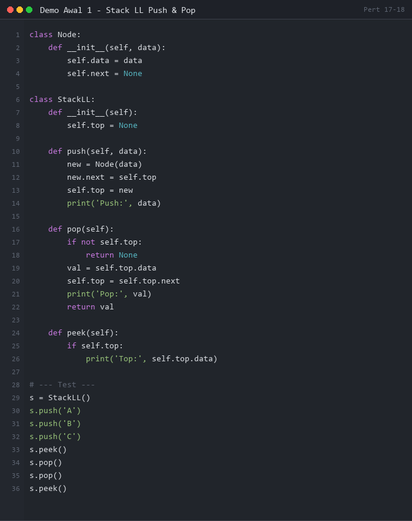
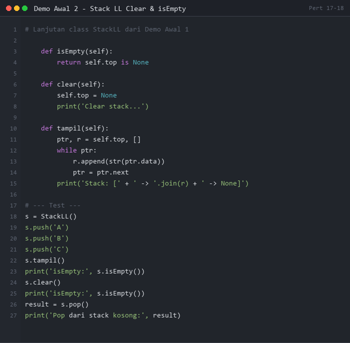
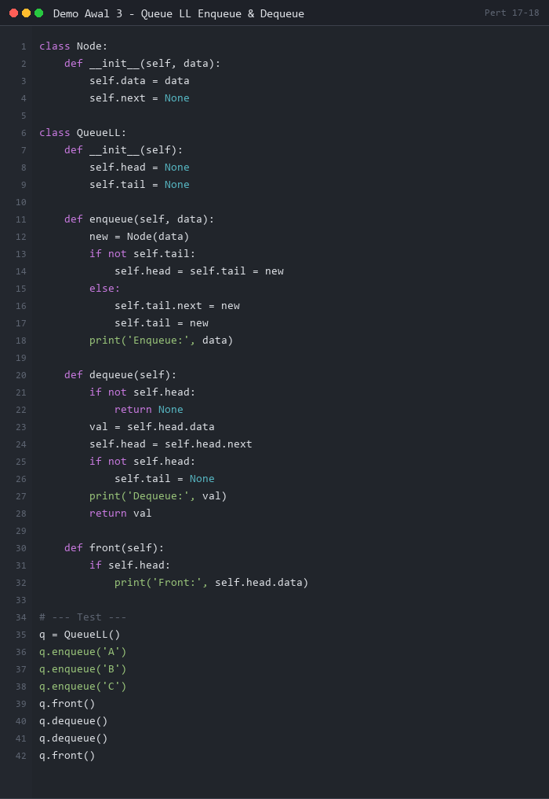
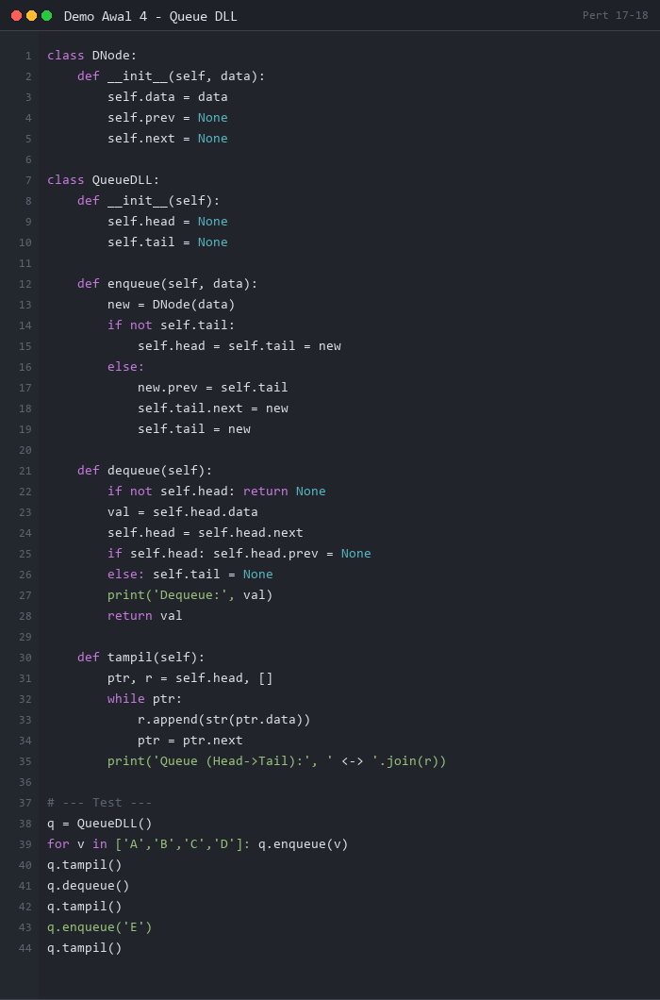

# PERTEMUAN 17-18: STACK DAN QUEUE BERBASIS LINKED LIST

## SUMMARY MATERI

### 1. Stack Berbasis Linked List

Pada Pertemuan 5-6, Stack diimplementasikan dengan **Array** (ukuran terbatas).
Kini Stack diimplementasikan menggunakan **Single Linked List** sehingga ukurannya **dinamis** (tidak terbatas).

#### 1.1 Representasi Stack dengan Linked List

- Gunakan **Single Linked List** dengan **Head Node**
- **Head** berfungsi sebagai **Top Stack** (elemen teratas)
- Push = insert di depan (head), Pop = delete dari depan (head)

```
Top/Head
  |
  v
[C|*] --> [B|*] --> [A|*] --> None

Push C (terbaru di atas/head)
Pop C (ambil dari head)
```

#### 1.2 Operasi Stack Berbasis Linked List

| Operasi | Implementasi | Kompleksitas |
|---------|--------------|--------------|
| `push(el)` | Insert node baru di head | O(1) |
| `pop()` | Delete node dari head, kembalikan data | O(1) |
| `top_el()` / `peek()` | Baca data head tanpa delete | O(1) |
| `is_empty()` | Cek apakah head == None | O(1) |
| `clear()` | Hapus semua node satu per satu | O(n) |

#### 1.3 Algoritma Push

```
push(el):
1. Buat node baru dengan data el
2. new_node.next = Head        (arahkan ke head lama)
3. Head = new_node             (head baru adalah node baru)
```

#### 1.4 Algoritma Pop

```
pop():
1. Jika Head == None → Stack kosong, return None
2. data = Head.data
3. Head = Head.next            (pindahkan head ke node berikutnya)
4. return data
```

#### 1.5 Perbandingan Stack Array vs Stack Linked List

| Aspek | Stack Array | Stack Linked List |
|-------|-------------|-------------------|
| Ukuran | Terbatas (MAX_SIZE) | Dinamis |
| Memori | Pra-alokasi | Per elemen |
| Push/Pop | O(1) | O(1) |
| Overflow | Mungkin | Tidak ada |
| Underflow | Ada | Ada (saat kosong) |

---

### 2. Queue Berbasis Linked List

Pada Pertemuan 7-8, Queue diimplementasikan dengan **Array** (masalah: circular/reset).
Dengan **Linked List**, masalah tersebut tidak ada.

#### 2.1 Representasi Queue dengan Linked List

- Memerlukan **dua pointer**: `head` (front/dequeue) dan `tail` (rear/enqueue)
- **Head** = elemen pertama (yang akan keluar)
- **Tail** = elemen terakhir (yang baru masuk)

```
Head/Front                    Tail/Rear
   |                              |
   v                              v
[A|*] <--> [B|*] <--> [C|*] <--> [D|*]

enqueue(E) → tambah di Tail
dequeue()  → ambil dari Head
```

> **Catatan**: Untuk dequeue yang mudah, gunakan **Double Linked List** agar bisa menemukan node sebelum tail tanpa traversal O(n).

#### 2.2 Operasi Queue Berbasis Linked List

| Operasi | Implementasi | Kompleksitas |
|---------|--------------|--------------|
| `enqueue(el)` | Insert node baru di tail | O(1) |
| `dequeue()` | Delete node dari head, kembalikan data | O(1) |
| `first_el()` / `peek()` | Baca data head tanpa delete | O(1) |
| `is_empty()` | Cek apakah head == None | O(1) |
| `clear()` | Hapus semua node | O(n) |

#### 2.3 Algoritma Enqueue

```
enqueue(el):
1. Buat node baru dengan data el
2. new_node.next = None
3. Jika Tail ada: Tail.next = new_node
4. Jika Head kosong (queue kosong): Head = new_node
5. Tail = new_node              (Tail = node baru)
```

#### 2.4 Algoritma Dequeue

```
dequeue():
1. Jika Head == None → Queue kosong, return None
2. data = Head.data
3. Head = Head.next             (pindahkan head ke berikutnya)
4. Jika Head == None: Tail = None  (queue jadi kosong)
5. return data
```

#### 2.5 Perbandingan Queue Array vs Queue Linked List

| Aspek | Queue Array | Queue Linked List |
|-------|-------------|-------------------|
| Ukuran | Terbatas | Dinamis |
| Masalah circular | Ada (perlu modulo) | Tidak ada |
| Enqueue/Dequeue | O(1) | O(1) |
| Implementasi | Lebih rumit | **Lebih mudah** |

---

## DEMO PYTHON

> **PERATURAN DEMO AWAL:**
> Demo Awal 1-4 di bawah ini ditampilkan sebagai **gambar** (tidak bisa di-copy-paste).
> Mahasiswa **WAJIB mengetik sendiri** kode program secara manual di Python.
> **Dilarang copy-paste!** Tujuannya agar mahasiswa memahami setiap baris kode.

---

### Demo Awal 1: Stack LL - Push & Pop Dasar

**Tujuan:** Memahami cara Push (insert di head) dan Pop (delete dari head) pada Stack berbasis Linked List.

**Instruksi:** Lihat gambar di bawah, lalu **ketik ulang** kode tersebut di Python dan jalankan.



**Output yang Diharapkan:**
```
Push: A
Push: B
Push: C
Top: C
Pop: C
Pop: B
Top: A
```

---

### Demo Awal 2: Stack LL - Clear & isEmpty

**Tujuan:** Memahami operasi clear() untuk mengosongkan stack dan isEmpty() untuk mengecek status.

**Instruksi:** Lihat gambar di bawah, lalu **ketik ulang** kode tersebut di Python dan jalankan.



**Output yang Diharapkan:**
```
Stack: [C -> B -> A -> None]
isEmpty: False
Clear stack...
isEmpty: True
Pop dari stack kosong: None
```

---

### Demo Awal 3: Queue LL - Enqueue & Dequeue

**Tujuan:** Memahami cara Enqueue (insert di tail) dan Dequeue (delete dari head) pada Queue berbasis Linked List.

**Instruksi:** Lihat gambar di bawah, lalu **ketik ulang** kode tersebut di Python dan jalankan.



**Output yang Diharapkan:**
```
Enqueue: A
Enqueue: B
Enqueue: C
Front: A
Dequeue: A
Dequeue: B
Front: C
```

---

### Demo Awal 4: Queue LL - Double LL Implementation

**Tujuan:** Memahami implementasi Queue menggunakan Double Linked List agar dequeue lebih efisien.

**Instruksi:** Lihat gambar di bawah, lalu **ketik ulang** kode tersebut di Python dan jalankan.



**Output yang Diharapkan:**
```
Queue (Head->Tail): A <-> B <-> C <-> D
Dequeue: A
Queue: B <-> C <-> D
Enqueue: E
Queue: B <-> C <-> D <-> E
```

---

### Demo 1: Stack Berbasis Linked List - Lengkap

```python
"""
Demo 1: Stack Berbasis Linked List
Push, Pop, Peek, isEmpty, Clear, dan Display
"""

class Node:
    def __init__(self, data):
        self.data = data
        self.next = None


class StackLinkedList:
    def __init__(self):
        self.top = None      # Head = Top
        self.size = 0

    def is_empty(self):
        return self.top is None

    def push(self, data):
        """Insert node baru di HEAD (top)"""
        new_node = Node(data)
        new_node.next = self.top    # Node baru menunjuk ke top lama
        self.top = new_node         # Top sekarang adalah node baru
        self.size += 1
        print(f"  Push: {data}")

    def pop(self):
        """Hapus dan kembalikan elemen dari TOP"""
        if self.is_empty():
            print("  Error: Stack kosong, tidak bisa pop!")
            return None
        data = self.top.data
        self.top = self.top.next    # Top pindah ke node berikutnya
        self.size -= 1
        print(f"  Pop: {data}")
        return data

    def peek(self):
        """Baca elemen TOP tanpa menghapus"""
        if self.is_empty():
            print("  Stack kosong!")
            return None
        return self.top.data

    def clear(self):
        """Kosongkan stack"""
        while not self.is_empty():
            self.pop()
        print("  Stack dikosongkan.")

    def display(self):
        if self.is_empty():
            print("  Stack: [kosong]")
            return
        result = "  Stack (top→bottom): "
        ptr = self.top
        while ptr:
            result += str(ptr.data) + " -> "
            ptr = ptr.next
        result += "None"
        print(result)
        print(f"  Size: {self.size} | Top: {self.top.data}")


print("=" * 60)
print("DEMO 1: STACK BERBASIS LINKED LIST")
print("=" * 60)

stack = StackLinkedList()

print("\n1. Push A, B, C, D, E:")
for ch in ["A", "B", "C", "D", "E"]:
    stack.push(ch)
stack.display()

print("\n2. Peek (baca top tanpa pop):")
top = stack.peek()
print(f"  Top element: {top}")
stack.display()

print("\n3. Pop 3x:")
stack.pop()
stack.pop()
stack.pop()
stack.display()

print("\n4. Push F, G:")
stack.push("F")
stack.push("G")
stack.display()

print("\n5. Clear stack:")
stack.clear()
stack.display()

print("\n6. Pop dari stack kosong:")
stack.pop()
```

**Output:**
```
============================================================
DEMO 1: STACK BERBASIS LINKED LIST
============================================================

1. Push A, B, C, D, E:
  Push: A
  Push: B
  Push: C
  Push: D
  Push: E
  Stack (top→bottom): E -> D -> C -> B -> A -> None
  Size: 5 | Top: E

2. Peek (baca top tanpa pop):
  Top element: E
  Stack (top→bottom): E -> D -> C -> B -> A -> None
  Size: 5 | Top: E

3. Pop 3x:
  Pop: E
  Pop: D
  Pop: C
  Stack (top→bottom): B -> A -> None
  Size: 2 | Top: B

4. Push F, G:
  Push: F
  Push: G
  Stack (top→bottom): G -> F -> B -> A -> None
  Size: 4 | Top: G

5. Clear stack:
  Pop: G
  Pop: F
  Pop: B
  Pop: A
  Stack dikosongkan.
  Stack: [kosong]

6. Pop dari stack kosong:
  Error: Stack kosong, tidak bisa pop!
```

---

### Demo 2: Queue Berbasis Linked List - Lengkap

```python
"""
Demo 2: Queue Berbasis Linked List
Enqueue (di tail), Dequeue (dari head), Peek, isEmpty, Clear
"""

class QNode:
    def __init__(self, data):
        self.data = data
        self.next = None


class QueueLinkedList:
    def __init__(self):
        self.head = None    # Front — tempat dequeue
        self.tail = None    # Rear  — tempat enqueue
        self.size = 0

    def is_empty(self):
        return self.head is None

    def enqueue(self, data):
        """Tambah elemen di TAIL (rear)"""
        new_node = QNode(data)
        if self.tail:
            self.tail.next = new_node
        self.tail = new_node
        if self.head is None:       # Queue sebelumnya kosong
            self.head = new_node
        self.size += 1
        print(f"  Enqueue: {data}")

    def dequeue(self):
        """Hapus dan kembalikan elemen dari HEAD (front)"""
        if self.is_empty():
            print("  Error: Queue kosong!")
            return None
        data = self.head.data
        self.head = self.head.next  # Head pindah ke berikutnya
        if self.head is None:       # Queue jadi kosong
            self.tail = None
        self.size -= 1
        print(f"  Dequeue: {data}")
        return data

    def first_el(self):
        """Baca elemen HEAD tanpa menghapus"""
        if self.is_empty():
            print("  Queue kosong!")
            return None
        return self.head.data

    def clear(self):
        while not self.is_empty():
            self.dequeue()
        print("  Queue dikosongkan.")

    def display(self):
        if self.is_empty():
            print("  Queue: [kosong]")
            return
        result = "  Queue (front→rear): "
        ptr = self.head
        while ptr:
            result += str(ptr.data) + " -> "
            ptr = ptr.next
        result += "None"
        print(result)
        print(f"  Size: {self.size} | Front: {self.head.data} | Rear: {self.tail.data}")


print("=" * 60)
print("DEMO 2: QUEUE BERBASIS LINKED LIST")
print("=" * 60)

q = QueueLinkedList()

print("\n1. Enqueue A, B, C, D, E:")
for ch in ["A", "B", "C", "D", "E"]:
    q.enqueue(ch)
q.display()

print("\n2. First element (peek front):")
front = q.first_el()
print(f"  Front: {front}")
q.display()

print("\n3. Dequeue 3x:")
q.dequeue()
q.dequeue()
q.dequeue()
q.display()

print("\n4. Enqueue F, G:")
q.enqueue("F")
q.enqueue("G")
q.display()

print("\n5. Clear queue:")
q.clear()
q.display()

print("\n6. Dequeue dari queue kosong:")
q.dequeue()
```

**Output:**
```
============================================================
DEMO 2: QUEUE BERBASIS LINKED LIST
============================================================

1. Enqueue A, B, C, D, E:
  Enqueue: A
  Enqueue: B
  Enqueue: C
  Enqueue: D
  Enqueue: E
  Queue (front→rear): A -> B -> C -> D -> E -> None
  Size: 5 | Front: A | Rear: E

2. First element (peek front):
  Front: A
  Queue (front→rear): A -> B -> C -> D -> E -> None
  Size: 5 | Front: A | Rear: E

3. Dequeue 3x:
  Dequeue: A
  Dequeue: B
  Dequeue: C
  Queue (front→rear): D -> E -> None
  Size: 2 | Front: D | Rear: E

4. Enqueue F, G:
  Enqueue: F
  Enqueue: G
  Queue (front→rear): D -> E -> F -> G -> None
  Size: 4 | Front: D | Rear: G

5. Clear queue:
  Dequeue: D
  Dequeue: E
  Dequeue: F
  Dequeue: G
  Queue dikosongkan.
  Queue: [kosong]

6. Dequeue dari queue kosong:
  Error: Queue kosong!
```

---

### Demo 3: Stack LL - Aplikasi Cek Keseimbangan Kurung

```python
"""
Demo 3: Aplikasi Stack LL - Cek Keseimbangan Kurung
Menentukan apakah ekspresi matematika memiliki kurung yang seimbang
"""

class Node:
    def __init__(self, data):
        self.data = data
        self.next = None


class Stack:
    def __init__(self):
        self.top = None

    def is_empty(self):
        return self.top is None

    def push(self, data):
        new_node = Node(data)
        new_node.next = self.top
        self.top = new_node

    def pop(self):
        if self.is_empty():
            return None
        data = self.top.data
        self.top = self.top.next
        return data

    def peek(self):
        return self.top.data if self.top else None


def cek_keseimbangan(ekspresi):
    """Cek apakah kurung dalam ekspresi seimbang"""
    stack = Stack()
    pasangan = {')': '(', '}': '{', ']': '['}
    pembuka = set('({[')
    penutup = set(')}]')

    for ch in ekspresi:
        if ch in pembuka:
            stack.push(ch)
        elif ch in penutup:
            if stack.is_empty():
                return False, f"Kurung '{ch}' tidak punya pasangan pembuka"
            top = stack.pop()
            if top != pasangan[ch]:
                return False, f"Kurung '{ch}' tidak cocok dengan '{top}'"

    if not stack.is_empty():
        return False, f"Kurung '{stack.peek()}' tidak punya pasangan penutup"
    return True, "Seimbang!"


print("=" * 60)
print("DEMO 3: CEK KESEIMBANGAN KURUNG")
print("=" * 60)

test_cases = [
    "(a + b) * (c - d)",
    "{[x + y] * (z - 1)}",
    "((a + b)",
    "(a + [b * c})",
    "a + b * c",
    "[({})]",
    "(((())))",
    "([)]",
]

print(f"\n{'Ekspresi':<30} {'Status':<12} Keterangan")
print("-" * 65)
for expr in test_cases:
    ok, keterangan = cek_keseimbangan(expr)
    status = "✓ SEIMBANG" if ok else "✗ TIDAK"
    print(f"  {expr:<28} {status:<12} {keterangan}")
```

**Output:**
```
============================================================
DEMO 3: CEK KESEIMBANGAN KURUNG
============================================================

  Ekspresi                       Status       Keterangan
-----------------------------------------------------------------
  (a + b) * (c - d)              ✓ SEIMBANG   Seimbang!
  {[x + y] * (z - 1)}           ✓ SEIMBANG   Seimbang!
  ((a + b)                       ✗ TIDAK      Kurung '(' tidak punya pasangan penutup
  (a + [b * c})                  ✗ TIDAK      Kurung '}' tidak cocok dengan '['
  a + b * c                      ✓ SEIMBANG   Seimbang!
  [({})]                         ✓ SEIMBANG   Seimbang!
  (((()))))                      ✗ TIDAK      Kurung ')' tidak punya pasangan pembuka
  ([)]                           ✗ TIDAK      Kurung ')' tidak cocok dengan '['
```

---

### Demo 4: Queue LL - Simulasi Antrian Bank

```python
"""
Demo 4: Queue LL - Simulasi Antrian Bank
Menggunakan Queue berbasis Linked List untuk manajemen antrian
"""

class NasabahNode:
    def __init__(self, nomor, nama, layanan):
        self.nomor = nomor
        self.nama = nama
        self.layanan = layanan
        self.next = None

    def __str__(self):
        return f"[{self.nomor:03d}] {self.nama:<15} - {self.layanan}"


class AntrianBank:
    def __init__(self):
        self.head = None
        self.tail = None
        self.size = 0
        self.counter = 0
        self.total_dilayani = 0

    def is_empty(self):
        return self.head is None

    def ambil_nomor(self, nama, layanan):
        """Nasabah ambil nomor antrian (enqueue)"""
        self.counter += 1
        new_node = NasabahNode(self.counter, nama, layanan)
        if self.tail:
            self.tail.next = new_node
        self.tail = new_node
        if not self.head:
            self.head = new_node
        self.size += 1
        print(f"  + Nomor {self.counter:03d}: {nama} ({layanan})")
        return self.counter

    def panggil_nasabah(self):
        """Teller memanggil nasabah berikutnya (dequeue)"""
        if self.is_empty():
            print("  Antrian kosong, tidak ada yang dipanggil.")
            return None
        nasabah = self.head
        self.head = self.head.next
        if not self.head:
            self.tail = None
        self.size -= 1
        self.total_dilayani += 1
        print(f"  ★ Memanggil: {nasabah}")
        return nasabah

    def lihat_berikutnya(self):
        if self.is_empty():
            print("  Antrian kosong.")
            return None
        print(f"  Berikutnya: {self.head}")
        return self.head

    def tampilkan_antrian(self):
        if self.is_empty():
            print("  Antrian kosong.")
            return
        print(f"  Antrian ({self.size} orang):")
        ptr = self.head
        pos = 1
        while ptr:
            marker = " ← berikutnya" if pos == 1 else ""
            print(f"    {pos}. {ptr}{marker}")
            ptr = ptr.next
            pos += 1
        print(f"  Total sudah dilayani: {self.total_dilayani} orang")


print("=" * 60)
print("DEMO 4: SIMULASI ANTRIAN BANK")
print("=" * 60)

bank = AntrianBank()

print("\n1. Nasabah datang mengambil nomor:")
bank.ambil_nomor("Budi Santoso", "Setor Tunai")
bank.ambil_nomor("Ani Wijaya", "Penarikan")
bank.ambil_nomor("Citra Dewi", "Transfer")
bank.ambil_nomor("Doni Kusuma", "Pembukaan Rekening")
bank.ambil_nomor("Eka Pratama", "Setor Tunai")

print("\n2. Status antrian awal:")
bank.tampilkan_antrian()

print("\n3. Teller memanggil 3 nasabah:")
bank.panggil_nasabah()
bank.panggil_nasabah()
bank.panggil_nasabah()

print("\n4. Status antrian sekarang:")
bank.tampilkan_antrian()

print("\n5. Nasabah baru datang:")
bank.ambil_nomor("Fajar Nugroho", "Penarikan")

print("\n6. Status antrian akhir:")
bank.tampilkan_antrian()
```

**Output:**
```
============================================================
DEMO 4: SIMULASI ANTRIAN BANK
============================================================

1. Nasabah datang mengambil nomor:
  + Nomor 001: Budi Santoso (Setor Tunai)
  + Nomor 002: Ani Wijaya (Penarikan)
  + Nomor 003: Citra Dewi (Transfer)
  + Nomor 004: Doni Kusuma (Pembukaan Rekening)
  + Nomor 005: Eka Pratama (Setor Tunai)

2. Status antrian awal:
  Antrian (5 orang):
    1. [001] Budi Santoso    - Setor Tunai ← berikutnya
    2. [002] Ani Wijaya      - Penarikan
    3. [003] Citra Dewi      - Transfer
    4. [004] Doni Kusuma     - Pembukaan Rekening
    5. [005] Eka Pratama     - Setor Tunai
  Total sudah dilayani: 0 orang

3. Teller memanggil 3 nasabah:
  ★ Memanggil: [001] Budi Santoso    - Setor Tunai
  ★ Memanggil: [002] Ani Wijaya      - Penarikan
  ★ Memanggil: [003] Citra Dewi      - Transfer

4. Status antrian sekarang:
  Antrian (2 orang):
    1. [004] Doni Kusuma     - Pembukaan Rekening ← berikutnya
    2. [005] Eka Pratama     - Setor Tunai
  Total sudah dilayani: 3 orang

5. Nasabah baru datang:
  + Nomor 006: Fajar Nugroho (Penarikan)

6. Status antrian akhir:
  Antrian (3 orang):
    1. [004] Doni Kusuma     - Pembukaan Rekening ← berikutnya
    2. [005] Eka Pratama     - Setor Tunai
    3. [006] Fajar Nugroho   - Penarikan
  Total sudah dilayani: 3 orang
```

---

## CARA MENJALANKAN DEMO

### Persiapan Awal

1. **Pastikan Python sudah terinstall**
   ```bash
   python --version
   ```

2. **Navigasi ke folder pert17-18**
   ```bash
   cd d:\_CodeDev\strukturdatadanalgoritma\pert17-18
   ```

### Menjalankan Demo

1. **Demo 1 - Stack LL Lengkap**
   ```bash
   python demo1_stack_ll.py
   ```

2. **Demo 2 - Queue LL Lengkap**
   ```bash
   python demo2_queue_ll.py
   ```

3. **Demo 3 - Cek Keseimbangan Kurung**
   ```bash
   python demo3_cek_kurung.py
   ```

4. **Demo 4 - Simulasi Antrian Bank**
   ```bash
   python demo4_antrian_bank.py
   ```

---

## LATIHAN SOAL

### Soal 1: Kalkulator Ekspresi Postfix (Stack LL)

**Deskripsi:**
Buatlah kalkulator yang mengevaluasi **ekspresi postfix** (Reverse Polish Notation) menggunakan Stack berbasis Linked List.

Dalam notasi postfix, operator ditulis setelah operand.
- Infix: `3 + 4` → Postfix: `3 4 +`
- Infix: `(3 + 4) * 2` → Postfix: `3 4 + 2 *`

**Spesifikasi:**

1. Buatlah class `StackLL` dengan operasi `push()`, `pop()`, `peek()`, `is_empty()`
2. Buatlah fungsi `evaluasi_postfix(ekspresi)` yang:
   - Membaca token per token dari ekspresi postfix
   - Jika token adalah angka → push ke stack
   - Jika token adalah operator (`+`, `-`, `*`, `/`) → pop 2 angka, hitung, push hasilnya
   - Kembalikan hasil akhir
3. Tangani pembagian dengan nol
4. Tangani ekspresi yang tidak valid

**Contoh Output yang Diharapkan:**
```
=== KALKULATOR POSTFIX ===

Ekspresi             Hasil
----------------------------
3 4 +             →  7
5 3 - 2 *         →  4
2 3 4 * +         →  14
15 7 1 1 + - / 3 * 2 1 1 + + -  →  5
10 0 /            →  Error: Pembagian dengan nol!
3 +               →  Error: Ekspresi tidak valid!
```

**Hint:**
- Gunakan `ekspresi.split()` untuk memisahkan token
- Untuk cek angka: `token.lstrip('-').isdigit()`
- Operator: `operand2 OP operand1` (urutan pop: operand1 dulu, lalu operand2)

---

### Soal 2: Sistem Antrian Prioritas (Priority Queue LL)

**Deskripsi:**
Buatlah **Priority Queue** berbasis Linked List untuk sistem antrian **UGD Rumah Sakit**. Pasien dengan prioritas lebih tinggi dilayani lebih dulu, terlepas dari urutan kedatangan.

**Tingkat Prioritas:**
- `1` = KRITIS (tertinggi)
- `2` = GAWAT
- `3` = DARURAT
- `4` = TIDAK DARURAT (terendah)

**Spesifikasi:**

1. Buatlah class `PasienNode` dengan atribut:
   - `nomor` (int): Nomor antrian
   - `nama` (string): Nama pasien
   - `keluhan` (string): Keluhan pasien
   - `prioritas` (int): Tingkat prioritas (1-4)
   - `next`: Pointer ke node berikutnya

2. Buatlah class `PriorityQueueUGD` dengan fungsi:
   - `masuk(nama, keluhan, prioritas)`: Pasien masuk ke antrian berdasarkan prioritas
     (insert agar tetap terurut berdasarkan prioritas)
   - `panggil()`: Panggil pasien dengan prioritas tertinggi (dequeue dari head)
   - `tampilkan()`: Tampilkan antrian berurutan berdasarkan prioritas

**Contoh Output yang Diharapkan:**
```
=== UGD RUMAH SAKIT ===

Pasien masuk:
  [001] Budi   | Sesak napas  | Prioritas 2 (GAWAT)
  [002] Ani    | Luka bakar   | Prioritas 1 (KRITIS)
  [003] Citra  | Demam tinggi | Prioritas 3 (DARURAT)
  [004] Doni   | Patah tangan | Prioritas 2 (GAWAT)

Antrian berdasarkan prioritas:
  1. [002] Ani    | Luka bakar   | KRITIS
  2. [001] Budi   | Sesak napas  | GAWAT
  3. [004] Doni   | Patah tangan | GAWAT
  4. [003] Citra  | Demam tinggi | DARURAT

Panggil 2 pasien:
  ★ Memanggil: [002] Ani (KRITIS)
  ★ Memanggil: [001] Budi (GAWAT)

Antrian tersisa:
  1. [004] Doni   | Patah tangan | GAWAT
  2. [003] Citra  | Demam tinggi | DARURAT
```

**Hint:**
- Saat `masuk()`, lakukan insert terurut: cari posisi yang tepat berdasarkan prioritas
- Pasien dengan prioritas sama → yang datang lebih dulu dilayani lebih dulu (FIFO per prioritas)

---

## TIPS PENGERJAAN

1. **Stack: Push = insert depan, Pop = delete depan**: Head selalu adalah Top Stack
2. **Queue: Enqueue = insert belakang, Dequeue = delete depan**: Butuh 2 pointer (head dan tail)
3. **Jangan lupa update tail saat queue kosong**: Saat `dequeue()` membuat queue kosong, `tail = None`
4. **Kelebihan LL vs Array**: Tidak ada batasan ukuran, tidak ada masalah overflow
5. **Cek isEmpty() sebelum Pop/Dequeue**: Selalu validasi sebelum mengambil elemen
6. **Priority Queue**: Kunci ada di `masuk()` — insert terurut agar dequeue selalu ambil prioritas terbaik

**Selamat mengerjakan!**

---

*Catatan: File ini merupakan bagian dari materi Struktur Data dan Algoritma - Pertemuan 17-18*
