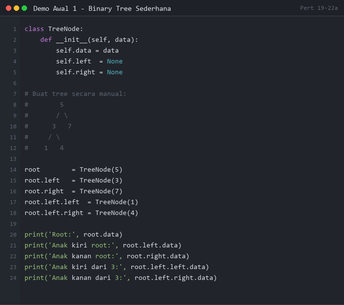
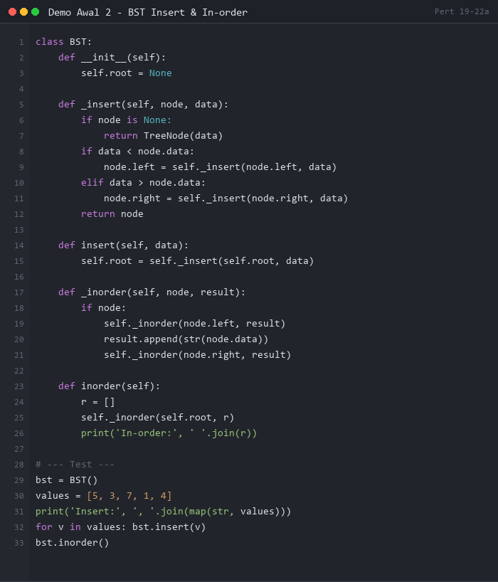
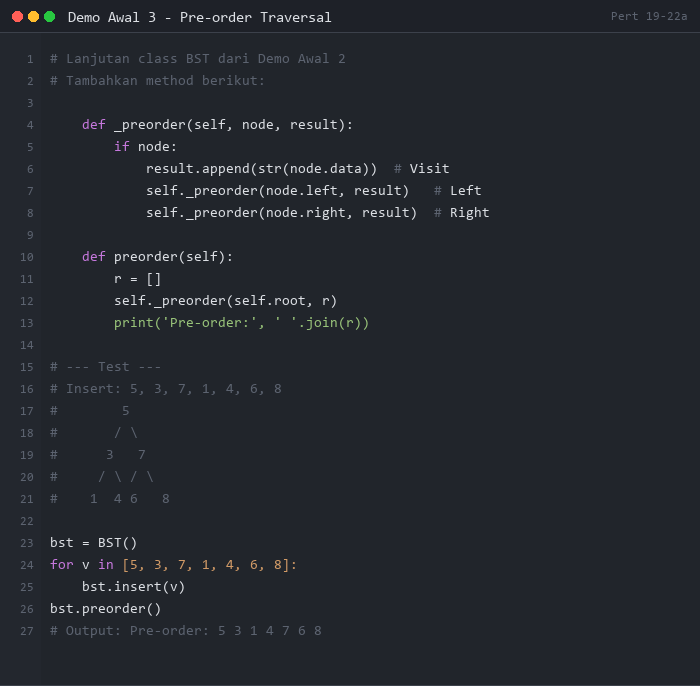
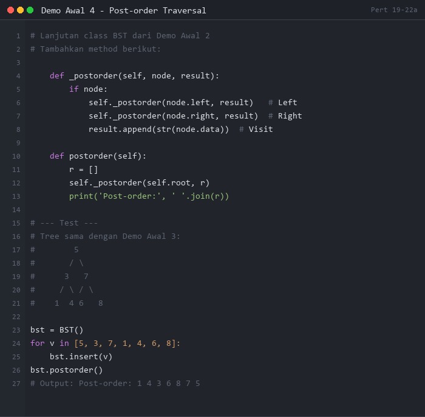

# PERTEMUAN 19-22 (Bagian A): TREE DAN BINARY TREE — KONSEP & TRAVERSAL

## SUMMARY MATERI

### 1. Tree (Pohon)

**Tree** adalah struktur data yang diakses mulai dari **simpul akar (root)** sampai ujung-ujung **daun (leaf)**. Tree merupakan graph terhubung yang berurutan, tidak berputar, dan tidak berarah.

```
         [Root]
        /      \
    [Node]    [Node]
    /    \        \
[Leaf] [Leaf]   [Leaf]
```

> Pada struktur data, tree digambar **terbalik** — root di atas, daun di bawah.

#### 1.1 Terminologi Tree

| Istilah | Penjelasan |
|---------|------------|
| **Node/Simpul** | Satuan data dalam tree |
| **Root/Akar** | Node paling atas, tidak punya induk (hanya 1) |
| **Leaf/Daun** | Node paling ujung, tidak punya anak |
| **Parent/Induk** | Node yang memiliki anak |
| **Child/Anak** | Node yang memiliki induk |
| **Sibling/Saudara** | Node-node dengan induk yang sama |
| **Ancestor/Leluhur** | Semua node di atas sebuah node |
| **Descendant/Keturunan** | Semua node di bawah sebuah node |
| **Level/Degree** | Kedalaman node (root = level 0/1) |
| **Height/Depth** | Kedalaman/ketinggian pohon |

#### 1.2 Jenis Tree

- **Binary Tree**: maksimal 2 anak per node
- **Multiary Tree (n-Ary Tree)**: lebih dari 2 anak per node

---

### 2. Binary Tree

**Binary Tree** adalah tree di mana setiap node memiliki **paling banyak 2 anak**: anak kiri (left child) dan anak kanan (right child).

```
Struktur node Binary Tree:
+------+--------+-------+
| LEFT |  INFO  | RIGHT |
+------+--------+-------+
  ↓                  ↓
left child        right child
```

#### 2.1 Implementasi Binary Tree dengan Linked List

Setiap node memiliki tiga atribut:
- `info` / `data`: nilai yang disimpan
- `left`: pointer ke anak kiri
- `right`: pointer ke anak kanan

```python
class TreeNode:
    def __init__(self, data):
        self.data = data
        self.left = None
        self.right = None
```

---

### 3. Menambah Simpul (Binary Search Tree)

**Binary Search Tree (BST)** adalah Binary Tree dengan aturan:
- Setiap key pada **subtree kanan** > key node induk
- Setiap key pada **subtree kiri** < key node induk

#### 3.1 Aturan Insert (Left-to-Right)

```
Jika key_baru > node_saat_ini → pergi ke kanan
Jika key_baru < node_saat_ini → pergi ke kiri
Ulangi sampai menemukan posisi kosong (None)
Tempatkan key_baru di sana
```

**Contoh:** Insert 5, 3, 7, 1, 4, 6, 8

```
Insert 5:           Insert 3:           Insert 7:
    5                   5                   5
                       /                   / \
                      3                   3   7
```

```
Insert 1, 4, 6, 8:
        5
       / \
      3   7
     / \ / \
    1  4 6  8
```

---

### 4. Binary Tree Traversal

**Tree Traversal** = mengunjungi setiap node tepat satu kali secara terurut.

#### 4.1 Notasi

| Simbol | Arti |
|--------|------|
| **V** | Visiting a node (kunjungi/cetak node) |
| **L** | Traverse subtree kiri (Left) |
| **R** | Traverse subtree kanan (Right) |

#### 4.2 Tiga Metode Traversal (Left-to-Right)

| Metode | Urutan | Pola Penggunaan |
|--------|--------|-----------------|
| **Pre-order** | V → L → R | Salin tree, notasi prefix |
| **In-order** | L → V → R | BST → hasil **terurut ascending** |
| **Post-order** | L → R → V | Hapus tree, notasi postfix |

#### 4.3 Pre-order Traversal (V-L-R)

```
Algoritma:
1. Kunjungi (cetak) node saat ini
2. Traversal subtree kiri secara rekursif
3. Traversal subtree kanan secara rekursif
```

**Contoh pada tree:**
```
        T
       / \
      E   Y
     / \ /
    A  M U
    \ /\
    D I S
```
**Pre-order: T, E, A, D, M, I, S, Y, U**

#### 4.4 In-order Traversal (L-V-R)

```
Algoritma:
1. Traversal subtree kiri secara rekursif
2. Kunjungi (cetak) node saat ini
3. Traversal subtree kanan secara rekursif
```

**Contoh pada BST yang sama:**
**In-order: A, D, E, I, M, S, T, U, Y**
(Hasilnya SELALU terurut pada BST!)

#### 4.5 Post-order Traversal (L-R-V)

```
Algoritma:
1. Traversal subtree kiri secara rekursif
2. Traversal subtree kanan secara rekursif
3. Kunjungi (cetak) node saat ini
```

**Contoh: D, A, I, S, M, E, U, Y, T**

---

### 5. Predecessor dan Successor

- **Predecessor (Pendahulu)**: node yang baru saja dikunjungi sebelum node tertentu (dalam traversal in-order)
- **Successor (Penerus)**: node yang akan dikunjungi setelah node tertentu

**Contoh In-order BST: ..., S, T, U, ...**
- In-order predecessor dari T adalah S
- In-order successor dari T adalah U

---

## DEMO PYTHON

> **PERATURAN DEMO AWAL:**
> Demo Awal 1-4 di bawah ini ditampilkan sebagai **gambar** (tidak bisa di-copy-paste).
> Mahasiswa **WAJIB mengetik sendiri** kode program secara manual di Python.
> **Dilarang copy-paste!** Tujuannya agar mahasiswa memahami setiap baris kode.

---

### Demo Awal 1: Membuat Binary Tree Sederhana

**Tujuan:** Memahami cara membuat node Binary Tree dan menghubungkannya.

**Instruksi:** Lihat gambar di bawah, lalu **ketik ulang** kode tersebut di Python dan jalankan.



**Output yang Diharapkan:**
```
Root: 5
Anak kiri root: 3
Anak kanan root: 7
Anak kiri dari 3: 1
Anak kanan dari 3: 4
```

---

### Demo Awal 2: BST - Insert & In-order Traversal

**Tujuan:** Memahami cara insert ke BST dan membuktikan in-order menghasilkan urutan ascending.

**Instruksi:** Lihat gambar di bawah, lalu **ketik ulang** kode tersebut di Python dan jalankan.



**Output yang Diharapkan:**
```
Insert: 5, 3, 7, 1, 4
In-order: 1 3 4 5 7
```

---

### Demo Awal 3: Pre-order Traversal

**Tujuan:** Memahami urutan kunjungan Pre-order (V-L-R) secara rekursif.

**Instruksi:** Lihat gambar di bawah, lalu **ketik ulang** kode tersebut di Python dan jalankan.



**Output yang Diharapkan:**
```
Pre-order: 5 3 1 4 7 6 8
```

---

### Demo Awal 4: Post-order Traversal

**Tujuan:** Memahami urutan kunjungan Post-order (L-R-V) secara rekursif.

**Instruksi:** Lihat gambar di bawah, lalu **ketik ulang** kode tersebut di Python dan jalankan.



**Output yang Diharapkan:**
```
Post-order: 1 4 3 6 8 7 5
```

---

### Demo 1: Binary Search Tree - Insert & Semua Traversal

```python
"""
Demo 1: Binary Search Tree - Insert & Semua Traversal
Pre-order, In-order, Post-order
"""

class TreeNode:
    def __init__(self, data):
        self.data = data
        self.left = None
        self.right = None


class BinarySearchTree:
    def __init__(self):
        self.root = None

    def insert(self, data):
        """Insert node baru ke BST (Left-to-Right)"""
        if self.root is None:
            self.root = TreeNode(data)
            print(f"  Insert {data} → root")
        else:
            self._insert_rekursif(self.root, data)

    def _insert_rekursif(self, node, data):
        if data < node.data:
            if node.left is None:
                node.left = TreeNode(data)
                print(f"  Insert {data} → kiri dari {node.data}")
            else:
                self._insert_rekursif(node.left, data)
        elif data > node.data:
            if node.right is None:
                node.right = TreeNode(data)
                print(f"  Insert {data} → kanan dari {node.data}")
            else:
                self._insert_rekursif(node.right, data)
        else:
            print(f"  Skip {data} (duplikat)")

    def inorder(self, node=None, hasil=None, _start=True):
        """L → V → R: menghasilkan urutan ascending pada BST"""
        if _start:
            hasil = []
            node = self.root
        if node:
            self.inorder(node.left, hasil, False)
            hasil.append(node.data)
            self.inorder(node.right, hasil, False)
        if _start:
            return hasil
        return hasil

    def preorder(self, node=None, hasil=None, _start=True):
        """V → L → R"""
        if _start:
            hasil = []
            node = self.root
        if node:
            hasil.append(node.data)
            self.preorder(node.left, hasil, False)
            self.preorder(node.right, hasil, False)
        if _start:
            return hasil
        return hasil

    def postorder(self, node=None, hasil=None, _start=True):
        """L → R → V"""
        if _start:
            hasil = []
            node = self.root
        if node:
            self.postorder(node.left, hasil, False)
            self.postorder(node.right, hasil, False)
            hasil.append(node.data)
        if _start:
            return hasil
        return hasil

    def search(self, data):
        """Cari node dengan nilai tertentu"""
        return self._search_rekursif(self.root, data)

    def _search_rekursif(self, node, data):
        if node is None:
            return False
        if node.data == data:
            return True
        elif data < node.data:
            return self._search_rekursif(node.left, data)
        else:
            return self._search_rekursif(node.right, data)

    def cetak_tree(self, node=None, level=0, prefix="Root: ", _start=True):
        """Visualisasi tree"""
        if _start:
            node = self.root
        if node:
            print("  " + "    " * level + prefix + str(node.data))
            if node.left or node.right:
                if node.left:
                    self.cetak_tree(node.left, level + 1, "L--- ", False)
                else:
                    print("  " + "    " * (level + 1) + "L--- (None)")
                if node.right:
                    self.cetak_tree(node.right, level + 1, "R--- ", False)
                else:
                    print("  " + "    " * (level + 1) + "R--- (None)")


print("=" * 60)
print("DEMO 1: BST - INSERT & SEMUA TRAVERSAL")
print("=" * 60)

bst = BinarySearchTree()

print("\n1. Insert node-node:")
for val in [5, 3, 7, 1, 4, 6, 8, 2]:
    bst.insert(val)

print("\n2. Struktur tree:")
bst.cetak_tree()

print("\n3. In-order (L-V-R) — seharusnya ascending:")
io = bst.inorder()
print(f"  {' → '.join(map(str, io))}")

print("\n4. Pre-order (V-L-R):")
po = bst.preorder()
print(f"  {' → '.join(map(str, po))}")

print("\n5. Post-order (L-R-V):")
pot = bst.postorder()
print(f"  {' → '.join(map(str, pot))}")

print("\n6. Pencarian:")
for val in [4, 9, 1, 10]:
    found = bst.search(val)
    status = "✓ Ditemukan" if found else "✗ Tidak ada"
    print(f"  Search {val}: {status}")
```

**Output:**
```
============================================================
DEMO 1: BST - INSERT & SEMUA TRAVERSAL
============================================================

1. Insert node-node:
  Insert 5 → root
  Insert 3 → kiri dari 5
  Insert 7 → kanan dari 5
  Insert 1 → kiri dari 3
  Insert 4 → kanan dari 3
  Insert 6 → kiri dari 7
  Insert 8 → kanan dari 7
  Insert 2 → kanan dari 1

2. Struktur tree:
  Root: 5
      L--- 3
          L--- 1
              L--- (None)
              R--- 2
          R--- 4
      R--- 7
          L--- 6
          R--- 8

3. In-order (L-V-R) — seharusnya ascending:
  1 → 2 → 3 → 4 → 5 → 6 → 7 → 8

4. Pre-order (V-L-R):
  5 → 3 → 1 → 2 → 4 → 7 → 6 → 8

5. Post-order (L-R-V):
  2 → 1 → 4 → 3 → 6 → 8 → 7 → 5

6. Pencarian:
  Search 4: ✓ Ditemukan
  Search 9: ✗ Tidak ada
  Search 1: ✓ Ditemukan
  Search 10: ✗ Tidak ada
```

---

### Demo 2: Level-Order Traversal (BFS pada Tree)

```python
"""
Demo 2: Level-Order Traversal (BFS)
Mengunjungi node level per level menggunakan Queue
"""

from collections import deque


class TreeNode:
    def __init__(self, data):
        self.data = data
        self.left = None
        self.right = None


class BST:
    def __init__(self):
        self.root = None

    def insert(self, data):
        if not self.root:
            self.root = TreeNode(data)
            return
        node = self.root
        while True:
            if data < node.data:
                if node.left is None:
                    node.left = TreeNode(data)
                    return
                node = node.left
            elif data > node.data:
                if node.right is None:
                    node.right = TreeNode(data)
                    return
                node = node.right
            else:
                return

    def level_order(self):
        """BFS: kunjungi node level per level"""
        if not self.root:
            return []
        hasil = []
        queue = deque([self.root])
        while queue:
            node = queue.popleft()
            hasil.append(node.data)
            if node.left:
                queue.append(node.left)
            if node.right:
                queue.append(node.right)
        return hasil

    def level_order_per_baris(self):
        """BFS: tampilkan level per baris"""
        if not self.root:
            return
        queue = deque([(self.root, 0)])
        level_saat_ini = 0
        baris = []
        while queue:
            node, level = queue.popleft()
            if level != level_saat_ini:
                print(f"  Level {level_saat_ini}: {baris}")
                baris = []
                level_saat_ini = level
            baris.append(node.data)
            if node.left:
                queue.append((node.left, level + 1))
            if node.right:
                queue.append((node.right, level + 1))
        if baris:
            print(f"  Level {level_saat_ini}: {baris}")

    def height(self, node=None, _start=True):
        """Hitung tinggi tree"""
        if _start:
            node = self.root
        if node is None:
            return 0
        return 1 + max(self.height(node.left, False),
                       self.height(node.right, False))

    def count_nodes(self, node=None, _start=True):
        """Hitung jumlah node"""
        if _start:
            node = self.root
        if node is None:
            return 0
        return 1 + self.count_nodes(node.left, False) + self.count_nodes(node.right, False)

    def count_leaves(self, node=None, _start=True):
        """Hitung jumlah leaf"""
        if _start:
            node = self.root
        if node is None:
            return 0
        if not node.left and not node.right:
            return 1
        return self.count_leaves(node.left, False) + self.count_leaves(node.right, False)


print("=" * 60)
print("DEMO 2: LEVEL-ORDER TRAVERSAL & STATISTIK TREE")
print("=" * 60)

bst = BST()
values = [10, 5, 15, 3, 7, 12, 18, 1, 4, 6, 8]

print("\n1. Insert:", values)
for v in values:
    bst.insert(v)

print("\n2. Level-order traversal:")
lo = bst.level_order()
print(f"  {' → '.join(map(str, lo))}")

print("\n3. Level per baris:")
bst.level_order_per_baris()

print("\n4. Statistik tree:")
print(f"  Tinggi tree : {bst.height()}")
print(f"  Jumlah node : {bst.count_nodes()}")
print(f"  Jumlah leaf : {bst.count_leaves()}")
```

**Output:**
```
============================================================
DEMO 2: LEVEL-ORDER TRAVERSAL & STATISTIK TREE
============================================================

1. Insert: [10, 5, 15, 3, 7, 12, 18, 1, 4, 6, 8]

2. Level-order traversal:
  10 → 5 → 15 → 3 → 7 → 12 → 18 → 1 → 4 → 6 → 8

3. Level per baris:
  Level 0: [10]
  Level 1: [5, 15]
  Level 2: [3, 7, 12, 18]
  Level 3: [1, 4, 6, 8]

4. Statistik tree:
  Tinggi tree : 4
  Jumlah node : 11
  Jumlah leaf : 6
```

---

### Demo 3: Perbandingan Semua Traversal

```python
"""
Demo 3: Perbandingan Visual Semua Metode Traversal
Pre-order, In-order, Post-order, Level-order
"""

from collections import deque


class TreeNode:
    def __init__(self, data):
        self.data = data
        self.left = None
        self.right = None


def build_tree():
    """Bangun tree:
           T
          / \\
         E   Y
        / \\ /
       A  M U
        \\ /\\
        D I  S
    """
    root = TreeNode('T')
    root.left = TreeNode('E')
    root.right = TreeNode('Y')
    root.left.left = TreeNode('A')
    root.left.right = TreeNode('M')
    root.right.left = TreeNode('U')
    root.left.left.right = TreeNode('D')
    root.left.right.left = TreeNode('I')
    root.left.right.right = TreeNode('S')
    return root


def preorder(node, hasil=None):
    if hasil is None:
        hasil = []
    if node:
        hasil.append(node.data)
        preorder(node.left, hasil)
        preorder(node.right, hasil)
    return hasil


def inorder(node, hasil=None):
    if hasil is None:
        hasil = []
    if node:
        inorder(node.left, hasil)
        hasil.append(node.data)
        inorder(node.right, hasil)
    return hasil


def postorder(node, hasil=None):
    if hasil is None:
        hasil = []
    if node:
        postorder(node.left, hasil)
        postorder(node.right, hasil)
        hasil.append(node.data)
    return hasil


def level_order(root):
    if not root:
        return []
    hasil = []
    q = deque([root])
    while q:
        node = q.popleft()
        hasil.append(node.data)
        if node.left:
            q.append(node.left)
        if node.right:
            q.append(node.right)
    return hasil


print("=" * 60)
print("DEMO 3: PERBANDINGAN SEMUA TRAVERSAL")
print("=" * 60)

tree = build_tree()

print("""
  Struktur tree:
           T
          / \\
         E   Y
        / \\ /
       A  M U
        \\ /\\
        D I  S
""")

traversals = [
    ("Pre-order  (V-L-R)", preorder(tree)),
    ("In-order   (L-V-R)", inorder(tree)),
    ("Post-order (L-R-V)", postorder(tree)),
    ("Level-order (BFS) ", level_order(tree)),
]

for nama, hasil in traversals:
    print(f"  {nama}: {' → '.join(hasil)}")

print("\n  Penjelasan:")
print("  Pre-order : Root dicetak DULU (berguna untuk salin tree)")
print("  In-order  : Subtree kiri dulu, lalu root, lalu kanan")
print("  Post-order: Root dicetak TERAKHIR (berguna untuk hapus tree)")
print("  Level     : Per level dari atas ke bawah (BFS)")
```

**Output:**
```
============================================================
DEMO 3: PERBANDINGAN SEMUA TRAVERSAL
============================================================

  Struktur tree:
           T
          / \
         E   Y
        / \ /
       A  M U
        \ /\
        D I  S

  Pre-order  (V-L-R): T → E → A → D → M → I → S → Y → U
  In-order   (L-V-R): A → D → E → I → M → S → T → U → Y
  Post-order (L-R-V): D → A → I → S → M → E → U → Y → T
  Level-order (BFS) : T → E → Y → A → M → U → D → I → S

  Penjelasan:
  Pre-order : Root dicetak DULU (berguna untuk salin tree)
  In-order  : Subtree kiri dulu, lalu root, lalu kanan
  Post-order: Root dicetak TERAKHIR (berguna untuk hapus tree)
  Level     : Per level dari atas ke bawah (BFS)
```

---

### Demo 4: Aplikasi BST - Kamus Digital

```python
"""
Demo 4: Aplikasi BST - Kamus Digital
Menyimpan kata-kata dalam BST untuk pencarian efisien
"""

class WordNode:
    def __init__(self, kata, definisi):
        self.kata = kata
        self.definisi = definisi
        self.left = None
        self.right = None


class KamusDigital:
    def __init__(self):
        self.root = None
        self.total = 0

    def tambah(self, kata, definisi):
        """Tambah kata ke kamus (BST berdasarkan abjad)"""
        new_node = WordNode(kata.lower(), definisi)
        if not self.root:
            self.root = new_node
        else:
            self._insert(self.root, new_node)
        self.total += 1
        print(f"  + '{kata}' ditambahkan")

    def _insert(self, node, new_node):
        if new_node.kata < node.kata:
            if node.left is None:
                node.left = new_node
            else:
                self._insert(node.left, new_node)
        elif new_node.kata > node.kata:
            if node.right is None:
                node.right = new_node
            else:
                self._insert(node.right, new_node)

    def cari(self, kata):
        """Cari kata dalam kamus"""
        return self._search(self.root, kata.lower())

    def _search(self, node, kata):
        if node is None:
            return None
        if kata == node.kata:
            return node
        elif kata < node.kata:
            return self._search(node.left, kata)
        else:
            return self._search(node.right, kata)

    def tampilkan_urut(self, node=None, _start=True):
        """Tampilkan semua kata berurutan abjad (in-order)"""
        if _start:
            node = self.root
        if node:
            self.tampilkan_urut(node.left, False)
            print(f"  {node.kata:<15} : {node.definisi}")
            self.tampilkan_urut(node.right, False)


print("=" * 60)
print("DEMO 4: KAMUS DIGITAL DENGAN BST")
print("=" * 60)

kamus = KamusDigital()

print("\n1. Menambahkan kata:")
kamus.tambah("kucing", "hewan mamalia berkaki empat yang sering dipelihara")
kamus.tambah("algoritma", "langkah-langkah sistematis untuk menyelesaikan masalah")
kamus.tambah("pohon", "tanaman berkayu yang tumbuh tinggi")
kamus.tambah("data", "kumpulan fakta atau informasi yang belum diolah")
kamus.tambah("rekursi", "proses dimana sebuah fungsi memanggil dirinya sendiri")
kamus.tambah("matahari", "bintang yang menjadi pusat tata surya kita")

print("\n2. Kamus terurut abjad (In-order):")
kamus.tampilkan_urut()

print(f"\n3. Total kata: {kamus.total}")

print("\n4. Mencari kata:")
for kata in ["kucing", "zebra", "data"]:
    hasil = kamus.cari(kata)
    if hasil:
        print(f"  '{kata}' → {hasil.definisi}")
    else:
        print(f"  '{kata}' → tidak ditemukan dalam kamus")
```

**Output:**
```
============================================================
DEMO 4: KAMUS DIGITAL DENGAN BST
============================================================

1. Menambahkan kata:
  + 'kucing' ditambahkan
  + 'algoritma' ditambahkan
  + 'pohon' ditambahkan
  + 'data' ditambahkan
  + 'rekursi' ditambahkan
  + 'matahari' ditambahkan

2. Kamus terurut abjad (In-order):
  algoritma       : langkah-langkah sistematis untuk menyelesaikan masalah
  data            : kumpulan fakta atau informasi yang belum diolah
  kucing          : hewan mamalia berkaki empat yang sering dipelihara
  matahari        : bintang yang menjadi pusat tata surya kita
  pohon           : tanaman berkayu yang tumbuh tinggi
  rekursi         : proses dimana sebuah fungsi memanggil dirinya sendiri

3. Total kata: 6

4. Mencari kata:
  'kucing' → hewan mamalia berkaki empat yang sering dipelihara
  'zebra' → tidak ditemukan dalam kamus
  'data' → kumpulan fakta atau informasi yang belum diolah
```

---

## CARA MENJALANKAN DEMO

### Persiapan Awal

1. **Pastikan Python sudah terinstall**
   ```bash
   python --version
   ```

2. **Navigasi ke folder pert19-22a**
   ```bash
   cd d:\_CodeDev\strukturdatadanalgoritma\pert19-22a
   ```

### Menjalankan Demo

1. **Demo 1 - BST Insert & Semua Traversal**
   ```bash
   python demo1_bst_traversal.py
   ```

2. **Demo 2 - Level-order & Statistik Tree**
   ```bash
   python demo2_level_order.py
   ```

3. **Demo 3 - Perbandingan Traversal**
   ```bash
   python demo3_perbandingan_traversal.py
   ```

4. **Demo 4 - Kamus Digital BST**
   ```bash
   python demo4_kamus_digital.py
   ```

---

## LATIHAN SOAL

### Soal 1: BST Analisis Nilai Mahasiswa

**Deskripsi:**
Buatlah program manajemen nilai mahasiswa menggunakan BST. Nilai mahasiswa disimpan dalam BST berdasarkan **NIM** (kunci pencarian).

**Spesifikasi:**

1. Buatlah class `MahasiswaNode` dengan atribut:
   - `nim` (string): Nomor Induk Mahasiswa (kunci BST)
   - `nama` (string): Nama mahasiswa
   - `nilai` (float): Nilai akhir (0-100)
   - `left`, `right`: pointer BST

2. Buatlah class `DaftarNilai` (BST) dengan fungsi:
   - `tambah(nim, nama, nilai)`: Insert mahasiswa ke BST
   - `cari(nim)`: Cari mahasiswa berdasarkan NIM
   - `tampilkan_urut()`: Tampilkan semua mahasiswa urut NIM (in-order)
   - `nilai_tertinggi()`: Temukan nilai tertinggi (traversal semua node)
   - `nilai_terendah()`: Temukan nilai terendah
   - `rata_rata()`: Hitung rata-rata nilai

**Contoh Output yang Diharapkan:**
```
=== DAFTAR NILAI MAHASISWA ===

1. Input mahasiswa:
   + 2021001 Budi Santoso (nilai: 85.0)
   + 2021003 Citra Dewi (nilai: 92.5)
   + 2021002 Ani Wijaya (nilai: 78.0)
   + 2021004 Doni Kusuma (nilai: 67.5)

2. Daftar urut NIM (In-order):
   NIM        Nama            Nilai   Grade
   ------------------------------------------
   2021001    Budi Santoso    85.0    B
   2021002    Ani Wijaya      78.0    C+
   2021003    Citra Dewi      92.5    A
   2021004    Doni Kusuma     67.5    C

3. Statistik:
   Nilai tertinggi: 92.5 (Citra Dewi)
   Nilai terendah : 67.5 (Doni Kusuma)
   Rata-rata      : 80.75
```

**Hint:**
- Grade: A ≥ 85, B ≥ 75, C+ ≥ 70, C ≥ 60
- Untuk `nilai_tertinggi()` dan `nilai_terendah()`: traversal semua node (in-order atau pre-order), bandingkan setiap nilai

---

### Soal 2: Ekspresi Tree (Expression Tree)

**Deskripsi:**
**Expression Tree** adalah Binary Tree untuk merepresentasikan ekspresi matematika. Operator berada di node internal, operand berada di leaf.

```
  Contoh: (3 + 4) * 2

        *
       / \
      +   2
     / \
    3   4
```

**Spesifikasi:**

1. Buatlah class `ExprNode` dengan atribut `data`, `left`, `right`
2. Buatlah fungsi `build_expr_tree(tokens)` untuk membangun expression tree dari **notasi postfix**
3. Buatlah fungsi `evaluasi(node)` untuk menghitung nilai ekspresi dengan rekursi
4. Buatlah fungsi `infix(node)` untuk menghasilkan kembali notasi infix dengan tanda kurung yang benar
5. Buatlah fungsi `prefix(node)` untuk menghasilkan notasi prefix

**Contoh Output yang Diharapkan:**
```
=== EXPRESSION TREE ===

Postfix input : 3 4 + 2 *
Hasil evaluasi : 14
Infix          : ((3 + 4) * 2)
Prefix         : * + 3 4 2

Postfix input : 5 1 2 + 4 * + 3 -
Hasil evaluasi : 14
Infix          : (5 + (((1 + 2) * 4)) - 3)
Prefix         : - + 5 * + 1 2 4 3
```

**Hint:**
- Untuk build dari postfix: gunakan Stack, jika token operator → pop 2 node → buat node baru dengan kedua anak tersebut
- `evaluasi(node)`: jika leaf → return nilai; jika operator → return `eval(kiri OP kanan)`
- `infix(node)`: jika leaf → return `str(data)`; jika operator → return `"(" + infix(kiri) + " " + op + " " + infix(kanan) + ")"`

---

## TIPS PENGERJAAN

1. **BST: Rekursi adalah sahabat**: Hampir semua operasi tree menggunakan rekursi — pahami base case-nya (node is None)
2. **In-order pada BST = urutan ascending**: Manfaatkan ini untuk validasi BST Anda
3. **Visualisasikan tree sebelum kode**: Gambar dulu struktur tree yang ingin dibuat
4. **Perhatikan kasus root = None**: Selalu tangani kasus tree kosong
5. **Traversal = DFS**: Pre/In/Post-order adalah variasi DFS, Level-order adalah BFS

**Selamat mengerjakan!**

---

*Catatan: File ini merupakan bagian dari materi Struktur Data dan Algoritma - Pertemuan 19-22 (Bagian A)*
