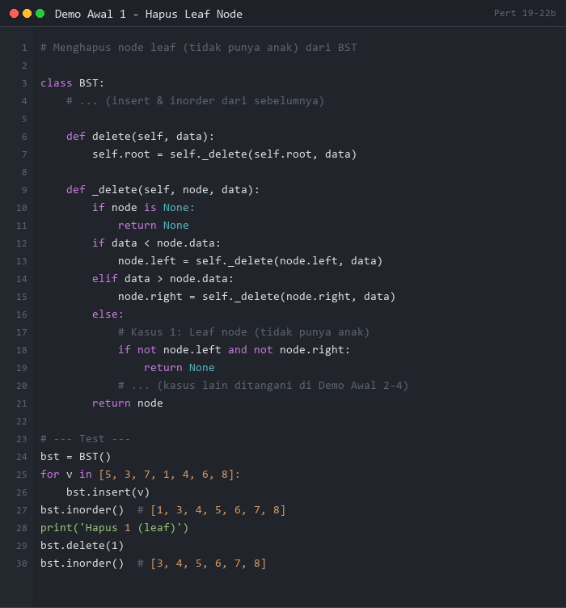
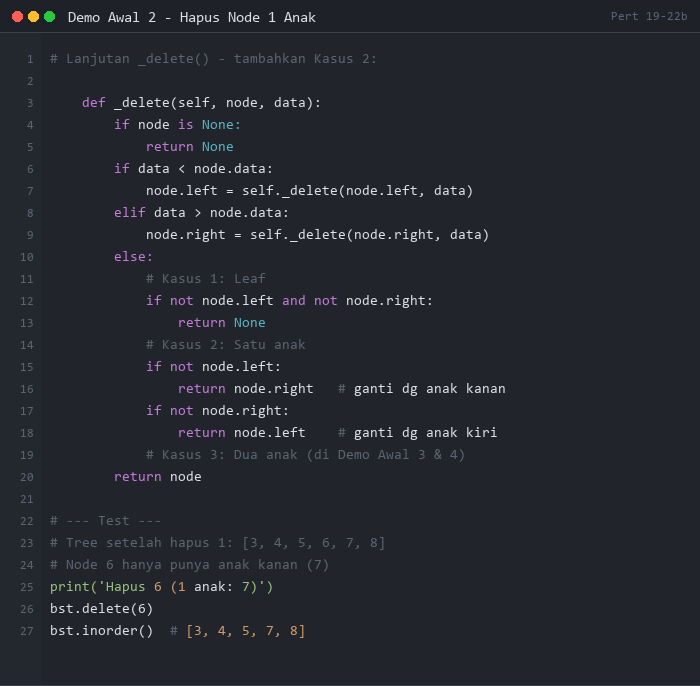
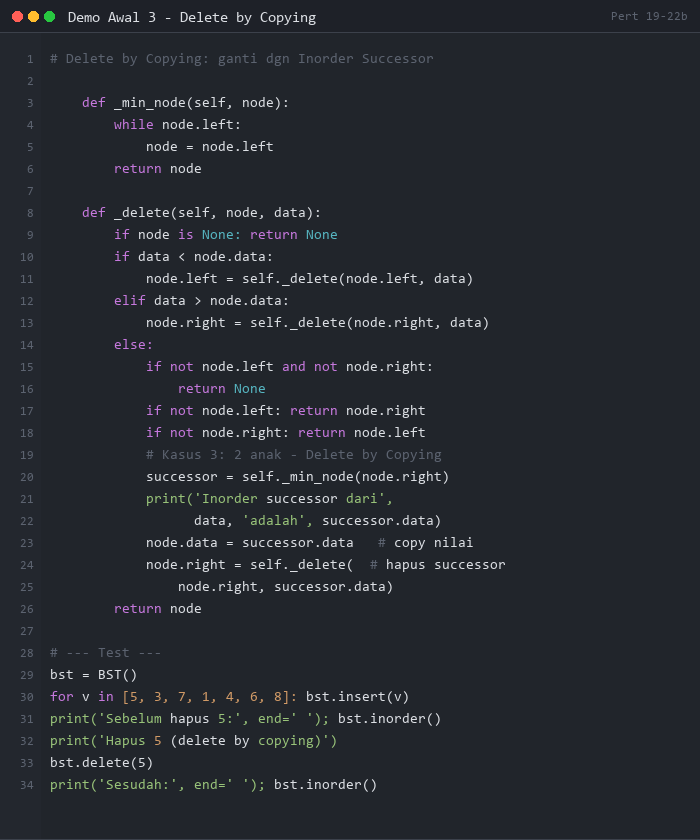
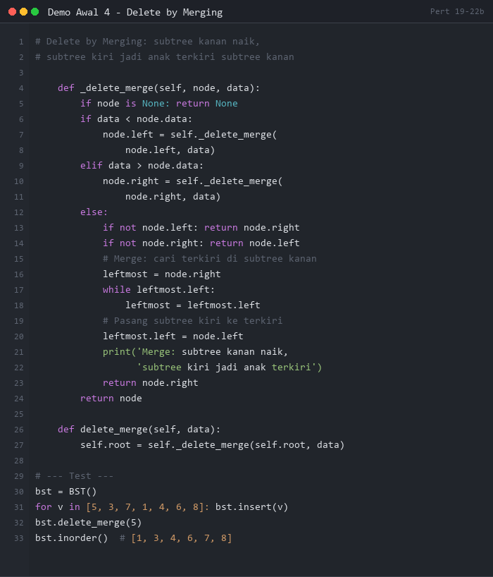

# PERTEMUAN 19-22 (Bagian B): MENEMUKAN INDUK NODE & MENGHAPUS SIMPUL BST

## SUMMARY MATERI

### 1. Menemukan Induk Node

Dalam BST, kadang kita perlu mengetahui **node induk** dari suatu node target. Ada tiga pendekatan:

#### 1.1 Cara 1: Telusuri dari Root

```
Cari induk dari node X:
1. Mulai dari root
2. Jika root.left.data == X atau root.right.data == X → root adalah induk
3. Jika tidak, rekursi ke subtree kiri atau kanan
```

- **Kelebihan**: Selalu berhasil
- **Kekurangan**: O(n) waktu

#### 1.2 Cara 2: Tree dengan Link ke Induk

Setiap node menyimpan pointer `parent` ke node induknya.

```
Struktur node:
+-------+--------+-------+--------+
| LEFT  |  INFO  | RIGHT | PARENT |
+-------+--------+-------+--------+
```

- **Kelebihan**: O(1) untuk menemukan induk
- **Kekurangan**: Memori lebih banyak

#### 1.3 Cara 3: Threaded Tree

Menggunakan pointer kiri/kanan yang kosong (NULL) untuk menunjuk ke **predecessor/successor** in-order, sehingga traversal bisa dilakukan tanpa rekursi dan tanpa stack.

- **Left thread**: menunjuk ke in-order predecessor induk
- **Right thread**: menunjuk ke in-order successor induk

---

### 2. Menghapus Simpul BST

Penghapusan bergantung pada **kondisi node yang akan dihapus**:

#### 2.1 Kondisi 1: Hapus Node yang Merupakan Leaf

Node tidak punya anak → **hapus langsung** tanpa masalah.

```
Sebelum hapus -4:        Sesudah:
    5                        5
   / \                      / \
  2   18                   2   18
 / \                        \
-4   3                       3
```

#### 2.2 Kondisi 2: Hapus Node dengan Satu Anak

Node hanya punya satu anak → **anak satu-satunya menjadi anak dari grandparent**.

```
Hapus 18 (punya 1 anak: 21):
  Sebelum:       Sesudah:
    5                5
   / \              / \
  2   18           2   21
     \            
      21
```

#### 2.3 Kondisi 3: Hapus Node dengan Dua Anak

Ada dua metode:

**3a. Delete by Merging**
- Subtree kanan naik menggantikan node yang dihapus
- Subtree kiri dipindahkan menjadi anak terkiri dari subtree kanan

```
Hapus N (punya 2 anak) — merge ke kanan:
- right(N) naik menggantikan N
- left(N) menjadi anak terkiri dari subtree right(N)
```

**3b. Delete by Copying**
- Ganti isi node yang dihapus dengan **immediate predecessor** atau **immediate successor** (in-order)
- Hapus node predecessor/successor tersebut dari posisi asalnya

```
Hapus N dengan copying menggunakan Inorder Successor:
1. Cari leftmost node dari subtree kanan (= inorder successor)
2. Copy nilai successor ke posisi N
3. Hapus successor dari posisinya (selalu leaf atau 1 anak)
```

**Contoh Delete by Copying (hapus 25):**
```
Sebelum:              Inorder successor 25 adalah 27
    35                    35
   /  \                  /  \
  25   40     →         27   40
 / \  / \              / \  / \
15 30 36 45          15 30 36 45
  / \                   / \
 20  27               20  29
   \
    29
```

---

### 3. Ringkasan Kompleksitas Operasi BST

| Operasi | Best Case | Average Case | Worst Case |
|---------|-----------|--------------|------------|
| Search | O(1) | O(log n) | O(n) |
| Insert | O(1) | O(log n) | O(n) |
| Delete | O(1) | O(log n) | O(n) |

> **Worst case O(n)** terjadi pada BST yang tidak seimbang (semua node ke satu sisi = seperti linked list).

---

## DEMO PYTHON

> **PERATURAN DEMO AWAL:**
> Demo Awal 1-4 di bawah ini ditampilkan sebagai **gambar** (tidak bisa di-copy-paste).
> Mahasiswa **WAJIB mengetik sendiri** kode program secara manual di Python.
> **Dilarang copy-paste!** Tujuannya agar mahasiswa memahami setiap baris kode.

---

### Demo Awal 1: Hapus Leaf Node

**Tujuan:** Memahami cara menghapus node leaf (tidak punya anak) dari BST.

**Instruksi:** Lihat gambar di bawah, lalu **ketik ulang** kode tersebut di Python dan jalankan.



**Output yang Diharapkan:**
```
Sebelum hapus 1: [1, 3, 4, 5, 6, 7, 8]
Hapus 1 (leaf)
Sesudah: [3, 4, 5, 6, 7, 8]
```

---

### Demo Awal 2: Hapus Node dengan Satu Anak

**Tujuan:** Memahami cara menghapus node yang hanya punya satu anak.

**Instruksi:** Lihat gambar di bawah, lalu **ketik ulang** kode tersebut di Python dan jalankan.



**Output yang Diharapkan:**
```
Sebelum hapus 6: [3, 4, 5, 6, 7, 8]
Hapus 6 (1 anak: 7)
Sesudah: [3, 4, 5, 7, 8]
```

---

### Demo Awal 3: Delete by Copying (Inorder Successor)

**Tujuan:** Memahami Delete by Copying menggunakan Inorder Successor (leftmost node dari subtree kanan).

**Instruksi:** Lihat gambar di bawah, lalu **ketik ulang** kode tersebut di Python dan jalankan.



**Output yang Diharapkan:**
```
Sebelum hapus 5: [1, 3, 4, 5, 6, 7, 8]
Inorder successor dari 5 adalah 6
Hapus 5 → ganti dengan 6 (delete by copying)
Sesudah: [1, 3, 4, 6, 7, 8]
```

---

### Demo Awal 4: Delete by Merging

**Tujuan:** Memahami Delete by Merging dimana subtree kanan naik menggantikan node yang dihapus.

**Instruksi:** Lihat gambar di bawah, lalu **ketik ulang** kode tersebut di Python dan jalankan.



**Output yang Diharapkan:**
```
Sebelum hapus 5: [1, 3, 4, 5, 6, 7, 8]
Merge: subtree kanan (7) naik, subtree kiri (3) jadi anak terkiri
Sesudah: [1, 3, 4, 6, 7, 8]
```

---

### Demo 1: BST - Delete Semua Kondisi

```python
"""
Demo 1: BST - Hapus Node (Semua 3 Kondisi)
Leaf, 1 anak, 2 anak (delete by copying - inorder successor)
"""

class TreeNode:
    def __init__(self, data):
        self.data = data
        self.left = None
        self.right = None


class BST:
    def __init__(self):
        self.root = None

    def insert(self, data):
        self.root = self._insert(self.root, data)

    def _insert(self, node, data):
        if node is None:
            return TreeNode(data)
        if data < node.data:
            node.left = self._insert(node.left, data)
        elif data > node.data:
            node.right = self._insert(node.right, data)
        return node

    def delete(self, data):
        """Hapus node (delete by copying - inorder successor)"""
        self.root, hapus = self._delete(self.root, data)
        if hapus:
            print(f"  ✓ Berhasil hapus: {data}")
        else:
            print(f"  ✗ {data} tidak ditemukan!")

    def _delete(self, node, data):
        if node is None:
            return node, False

        hapus = False
        if data < node.data:
            node.left, hapus = self._delete(node.left, data)
        elif data > node.data:
            node.right, hapus = self._delete(node.right, data)
        else:
            hapus = True
            # Kondisi 1: Leaf — hapus langsung
            if not node.left and not node.right:
                print(f"    Kondisi: LEAF — hapus langsung")
                return None, hapus

            # Kondisi 2: Satu anak — anak naik menggantikan
            elif not node.left:
                print(f"    Kondisi: 1 ANAK KANAN — anak kanan naik")
                return node.right, hapus
            elif not node.right:
                print(f"    Kondisi: 1 ANAK KIRI — anak kiri naik")
                return node.left, hapus

            # Kondisi 3: Dua anak — delete by copying (inorder successor)
            else:
                successor = self._min_node(node.right)
                print(f"    Kondisi: 2 ANAK — delete by copying")
                print(f"    Inorder successor: {successor.data}")
                node.data = successor.data
                node.right, _ = self._delete(node.right, successor.data)

        return node, hapus

    def _min_node(self, node):
        """Cari node terkecil (leftmost) dalam subtree"""
        while node.left:
            node = node.left
        return node

    def inorder(self):
        hasil = []
        self._inorder(self.root, hasil)
        return hasil

    def _inorder(self, node, hasil):
        if node:
            self._inorder(node.left, hasil)
            hasil.append(node.data)
            self._inorder(node.right, hasil)

    def cetak_tree(self, node=None, level=0, prefix="Root: ", _start=True):
        if _start:
            node = self.root
        if node:
            print("  " + "  " * level + prefix + str(node.data))
            if node.left or node.right:
                if node.left:
                    self.cetak_tree(node.left, level + 1, "L─ ", False)
                else:
                    print("  " + "  " * (level + 1) + "L─ None")
                if node.right:
                    self.cetak_tree(node.right, level + 1, "R─ ", False)
                else:
                    print("  " + "  " * (level + 1) + "R─ None")


print("=" * 60)
print("DEMO 1: BST - HAPUS NODE SEMUA KONDISI")
print("=" * 60)

bst = BST()
values = [5, 3, 7, 1, 4, 6, 8, 2]
for v in values:
    bst.insert(v)

print("\n1. BST awal:")
bst.cetak_tree()
print(f"  In-order: {bst.inorder()}")

print("\n2. Hapus LEAF (node 2):")
bst.delete(2)
print(f"  In-order: {bst.inorder()}")

print("\n3. Hapus node dengan 1 ANAK (node 1 — punya anak kanan):")
bst.delete(1)
print(f"  In-order: {bst.inorder()}")

print("\n4. Hapus node dengan 2 ANAK (node 3):")
bst.delete(3)
bst.cetak_tree()
print(f"  In-order: {bst.inorder()}")

print("\n5. Hapus ROOT (node 5):")
bst.delete(5)
bst.cetak_tree()
print(f"  In-order: {bst.inorder()}")

print("\n6. Hapus nilai yang tidak ada:")
bst.delete(99)
```

**Output:**
```
============================================================
DEMO 1: BST - HAPUS NODE SEMUA KONDISI
============================================================

1. BST awal:
  Root: 5
    L─ 3
      L─ 1
        L─ None
        R─ 2
      R─ 4
    R─ 7
      L─ 6
      R─ 8
  In-order: [1, 2, 3, 4, 5, 6, 7, 8]

2. Hapus LEAF (node 2):
    Kondisi: LEAF — hapus langsung
  ✓ Berhasil hapus: 2
  In-order: [1, 3, 4, 5, 6, 7, 8]

3. Hapus node dengan 1 ANAK (node 1 — punya anak kanan):
    Kondisi: 1 ANAK KANAN — anak kanan naik
  ✓ Berhasil hapus: 1
  In-order: [3, 4, 5, 6, 7, 8]

4. Hapus node dengan 2 ANAK (node 3):
    Kondisi: 2 ANAK — delete by copying
    Inorder successor: 4
  ✓ Berhasil hapus: 3
  Root: 5
    L─ 4
    R─ 7
      L─ 6
      R─ 8
  In-order: [4, 5, 6, 7, 8]

5. Hapus ROOT (node 5):
    Kondisi: 2 ANAK — delete by copying
    Inorder successor: 6
  ✓ Berhasil hapus: 5
  Root: 6
    L─ 4
    R─ 7
      R─ 8
  In-order: [4, 6, 7, 8]

6. Hapus nilai yang tidak ada:
  ✗ 99 tidak ditemukan!
```

---

### Demo 2: BST - Mencari Induk Node

```python
"""
Demo 2: Mencari Induk (Parent) Node dalam BST
Tiga pendekatan berbeda
"""

class TreeNode:
    def __init__(self, data):
        self.data = data
        self.left = None
        self.right = None


def build_bst(values):
    root = None

    def insert(node, val):
        if node is None:
            return TreeNode(val)
        if val < node.data:
            node.left = insert(node.left, val)
        elif val > node.data:
            node.right = insert(node.right, val)
        return node

    for v in values:
        root = insert(root, v)
    return root


def cari_induk(root, target):
    """Cara 1: Traversal dari root sampai temukan induk"""
    if root is None or root.data == target:
        return None  # target adalah root atau tidak ada

    # Cek apakah anak langsung adalah target
    if (root.left and root.left.data == target) or \
       (root.right and root.right.data == target):
        return root

    # Rekursi ke subtree yang relevan
    if target < root.data:
        return cari_induk(root.left, target)
    else:
        return cari_induk(root.right, target)


def cari_induk_semua(root, target, parent=None):
    """Cara alternatif: tracking parent saat traversal"""
    if root is None:
        return None
    if root.data == target:
        return parent
    if target < root.data:
        return cari_induk_semua(root.left, target, root)
    else:
        return cari_induk_semua(root.right, target, root)


print("=" * 60)
print("DEMO 2: MENCARI INDUK NODE")
print("=" * 60)

root = build_bst([10, 5, 15, 3, 7, 12, 18, 1, 4, 6, 8])

print("\nTree:")
print("          10")
print("         /  \\")
print("        5    15")
print("       / \\ / \\")
print("      3  7 12 18")
print("     /\\ /\\")
print("    1 4 6 8")

print("\nMencari induk node:")
test_nodes = [1, 3, 5, 6, 8, 10, 12, 15, 18, 99]

for target in test_nodes:
    induk = cari_induk_semua(root, target)
    if target == 10:
        print(f"  Induk dari {target:2d}: ROOT (tidak punya induk)")
    elif induk is None:
        print(f"  Induk dari {target:2d}: tidak ditemukan")
    else:
        anak_mana = "KIRI" if induk.left and induk.left.data == target else "KANAN"
        print(f"  Induk dari {target:2d}: {induk.data:2d}  (anak {anak_mana})")
```

**Output:**
```
============================================================
DEMO 2: MENCARI INDUK NODE
============================================================

Tree:
          10
         /  \
        5    15
       / \ / \
      3  7 12 18
     /\ /\
    1 4 6 8

Mencari induk node:
  Induk dari  1: 3  (anak KIRI)
  Induk dari  3: 5  (anak KIRI)
  Induk dari  5: 10  (anak KIRI)
  Induk dari  6: 7  (anak KIRI)
  Induk dari  8: 7  (anak KANAN)
  Induk dari 10: ROOT (tidak punya induk)
  Induk dari 12: 15  (anak KIRI)
  Induk dari 15: 10  (anak KANAN)
  Induk dari 18: 15  (anak KANAN)
  Induk dari 99: tidak ditemukan
```

---

### Demo 3: BST - Delete by Merging vs Delete by Copying

```python
"""
Demo 3: Perbandingan Delete by Merging vs Delete by Copying
"""

class TreeNode:
    def __init__(self, data):
        self.data = data
        self.left = None
        self.right = None


def insert(root, data):
    if root is None:
        return TreeNode(data)
    if data < root.data:
        root.left = insert(root.left, data)
    elif data > root.data:
        root.right = insert(root.right, data)
    return root


def inorder(node, hasil=None):
    if hasil is None:
        hasil = []
    if node:
        inorder(node.left, hasil)
        hasil.append(node.data)
        inorder(node.right, hasil)
    return hasil


def delete_by_merging(root, data):
    """Delete by Merging: subtree kanan naik, subtree kiri jadi anak terkiri"""
    if root is None:
        return None, False

    found = False
    if data < root.data:
        root.left, found = delete_by_merging(root.left, data)
    elif data > root.data:
        root.right, found = delete_by_merging(root.right, data)
    else:
        found = True
        if root.left is None:
            return root.right, found
        if root.right is None:
            return root.left, found

        # Merge: cari leftmost node dari subtree kanan
        leftmost = root.right
        while leftmost.left:
            leftmost = leftmost.left
        # Pasang subtree kiri ke leftmost
        leftmost.left = root.left
        print(f"    Merge: subtree kiri dipasang ke leftmost({leftmost.data})")
        return root.right, found

    return root, found


def delete_by_copying(root, data):
    """Delete by Copying: ganti dengan inorder successor"""
    if root is None:
        return None, False

    found = False
    if data < root.data:
        root.left, found = delete_by_copying(root.left, data)
    elif data > root.data:
        root.right, found = delete_by_copying(root.right, data)
    else:
        found = True
        if root.left is None:
            return root.right, found
        if root.right is None:
            return root.left, found

        # Copy: ganti dengan inorder successor (leftmost dari subtree kanan)
        successor = root.right
        while successor.left:
            successor = successor.left
        print(f"    Copy: ganti {root.data} dengan successor {successor.data}")
        root.data = successor.data
        root.right, _ = delete_by_copying(root.right, successor.data)

    return root, found


print("=" * 60)
print("DEMO 3: DELETE BY MERGING vs DELETE BY COPYING")
print("=" * 60)

values = [5, 3, 7, 1, 4, 6, 8, 2]

print("\n--- DELETE BY MERGING (hapus node 3) ---")
root1 = None
for v in values:
    root1 = insert(root1, v)
print(f"Sebelum: {inorder(root1)}")
root1, _ = delete_by_merging(root1, 3)
print(f"Sesudah: {inorder(root1)}")

print("\n--- DELETE BY COPYING (hapus node 3) ---")
root2 = None
for v in values:
    root2 = insert(root2, v)
print(f"Sebelum: {inorder(root2)}")
root2, _ = delete_by_copying(root2, 3)
print(f"Sesudah: {inorder(root2)}")

print("\nKeduanya menghasilkan BST yang valid!")
print(f"Hasil sama: {inorder(root1) == inorder(root2)}")
```

**Output:**
```
============================================================
DEMO 3: DELETE BY MERGING vs DELETE BY COPYING
============================================================

--- DELETE BY MERGING (hapus node 3) ---
Sebelum: [1, 2, 3, 4, 5, 6, 7, 8]
    Merge: subtree kiri dipasang ke leftmost(4)
Sesudah: [1, 2, 4, 5, 6, 7, 8]

--- DELETE BY COPYING (hapus node 3) ---
Sebelum: [1, 2, 3, 4, 5, 6, 7, 8]
    Copy: ganti 3 dengan successor 4
Sesudah: [1, 2, 4, 5, 6, 7, 8]

Keduanya menghasilkan BST yang valid!
Hasil sama: True
```

---

### Demo 4: BST Lengkap - CRUD Operations

```python
"""
Demo 4: BST Lengkap - CRUD (Create, Read, Update, Delete)
Aplikasi manajemen data produk
"""

class ProdukNode:
    def __init__(self, kode, nama, harga, stok):
        self.kode = kode
        self.nama = nama
        self.harga = harga
        self.stok = stok
        self.left = None
        self.right = None

    def __str__(self):
        return f"[{self.kode}] {self.nama:<20} Rp{self.harga:>10,} | Stok: {self.stok}"


class KatalogProduk:
    def __init__(self):
        self.root = None
        self.total = 0

    def tambah(self, kode, nama, harga, stok):
        """Insert produk berdasarkan kode (BST)"""
        new_node = ProdukNode(kode, nama, harga, stok)
        if not self.root:
            self.root = new_node
        else:
            self._insert(self.root, new_node)
        self.total += 1
        print(f"  + {new_node}")

    def _insert(self, node, new_node):
        if new_node.kode < node.kode:
            if not node.left:
                node.left = new_node
            else:
                self._insert(node.left, new_node)
        elif new_node.kode > node.kode:
            if not node.right:
                node.right = new_node
            else:
                self._insert(node.right, new_node)

    def cari(self, kode):
        """Cari produk berdasarkan kode"""
        return self._search(self.root, kode)

    def _search(self, node, kode):
        if not node:
            return None
        if kode == node.kode:
            return node
        elif kode < node.kode:
            return self._search(node.left, kode)
        else:
            return self._search(node.right, kode)

    def update_stok(self, kode, delta):
        """Update stok produk (+/-)"""
        produk = self.cari(kode)
        if not produk:
            print(f"  Produk {kode} tidak ditemukan!")
            return
        stok_lama = produk.stok
        produk.stok = max(0, produk.stok + delta)
        print(f"  Update stok {kode}: {stok_lama} → {produk.stok} ({'+' if delta > 0 else ''}{delta})")

    def hapus(self, kode):
        """Hapus produk"""
        self.root, found = self._delete(self.root, kode)
        if found:
            self.total -= 1
            print(f"  - Produk {kode} dihapus")
        else:
            print(f"  Produk {kode} tidak ditemukan!")

    def _delete(self, node, kode):
        if not node:
            return None, False
        found = False
        if kode < node.kode:
            node.left, found = self._delete(node.left, kode)
        elif kode > node.kode:
            node.right, found = self._delete(node.right, kode)
        else:
            found = True
            if not node.left:
                return node.right, found
            if not node.right:
                return node.left, found
            successor = node.right
            while successor.left:
                successor = successor.left
            node.kode = successor.kode
            node.nama = successor.nama
            node.harga = successor.harga
            node.stok = successor.stok
            node.right, _ = self._delete(node.right, successor.kode)
        return node, found

    def tampilkan(self):
        """Tampilkan semua produk urut kode (in-order)"""
        print(f"\n  {'Kode':<8} {'Nama':<20} {'Harga':>12} {'Stok':>6}")
        print("  " + "-" * 50)
        self._inorder_print(self.root)
        print(f"  Total: {self.total} produk")

    def _inorder_print(self, node):
        if node:
            self._inorder_print(node.left)
            print(f"  {node.kode:<8} {node.nama:<20} Rp{node.harga:>10,} {node.stok:>6}")
            self._inorder_print(node.right)


print("=" * 60)
print("DEMO 4: KATALOG PRODUK (BST FULL CRUD)")
print("=" * 60)

katalog = KatalogProduk()

print("\n1. Tambah produk:")
katalog.tambah("P005", "Laptop ASUS", 8500000, 10)
katalog.tambah("P002", "Mouse Logitech", 250000, 50)
katalog.tambah("P008", "Monitor LG", 3200000, 15)
katalog.tambah("P001", "Keyboard Mechanical", 450000, 30)
katalog.tambah("P006", "Headset Sony", 750000, 25)

print("\n2. Katalog (urut kode):")
katalog.tampilkan()

print("\n3. Cari produk P002:")
p = katalog.cari("P002")
if p:
    print(f"  Ditemukan: {p}")

print("\n4. Update stok:")
katalog.update_stok("P001", -5)
katalog.update_stok("P008", 10)

print("\n5. Hapus P005:")
katalog.hapus("P005")

print("\n6. Katalog akhir:")
katalog.tampilkan()
```

**Output:**
```
============================================================
DEMO 4: KATALOG PRODUK (BST FULL CRUD)
============================================================

1. Tambah produk:
  + [P005] Laptop ASUS         Rp 8,500,000 | Stok: 10
  + [P002] Mouse Logitech      Rp   250,000 | Stok: 50
  + [P008] Monitor LG          Rp 3,200,000 | Stok: 15
  + [P001] Keyboard Mechanical Rp   450,000 | Stok: 30
  + [P006] Headset Sony        Rp   750,000 | Stok: 25

2. Katalog (urut kode):
  Kode     Nama                  Harga       Stok
  --------------------------------------------------
  P001     Keyboard Mechanical  Rp   450,000     30
  P002     Mouse Logitech       Rp   250,000     50
  P005     Laptop ASUS          Rp 8,500,000     10
  P006     Headset Sony         Rp   750,000     25
  P008     Monitor LG           Rp 3,200,000     15
  Total: 5 produk

3. Cari produk P002:
  Ditemukan: [P002] Mouse Logitech      Rp   250,000 | Stok: 50

4. Update stok:
  Update stok P001: 30 → 25 (-5)
  Update stok P008: 15 → 25 (+10)

5. Hapus P005:
  - Produk P005 dihapus

6. Katalog akhir:
  Kode     Nama                  Harga       Stok
  --------------------------------------------------
  P001     Keyboard Mechanical  Rp   450,000     25
  P002     Mouse Logitech       Rp   250,000     50
  P006     Headset Sony         Rp   750,000     25
  P008     Monitor LG           Rp 3,200,000     25
  Total: 4 produk
```

---

## CARA MENJALANKAN DEMO

### Persiapan Awal

1. **Pastikan Python sudah terinstall**
   ```bash
   python --version
   ```

2. **Navigasi ke folder pert19-22b**
   ```bash
   cd d:\_CodeDev\strukturdatadanalgoritma\pert19-22b
   ```

### Menjalankan Demo

1. **Demo 1 - Delete Semua Kondisi**
   ```bash
   python demo1_bst_delete.py
   ```

2. **Demo 2 - Mencari Induk Node**
   ```bash
   python demo2_cari_induk.py
   ```

3. **Demo 3 - Merge vs Copying**
   ```bash
   python demo3_delete_compare.py
   ```

4. **Demo 4 - BST Full CRUD**
   ```bash
   python demo4_katalog_produk.py
   ```

---

## LATIHAN SOAL

### Soal 1: Sistem Manajemen Nilai BST (dengan Delete)

**Deskripsi:**
Lanjutkan dari Soal 1 Pert19-22a. Tambahkan fitur **edit** dan **hapus** data mahasiswa pada BST menggunakan metode delete by copying.

**Spesifikasi tambahan:**
1. `hapus(nim)`: Hapus mahasiswa berdasarkan NIM menggunakan delete by copying
2. `update_nilai(nim, nilai_baru)`: Update nilai mahasiswa (cari dulu, lalu ubah nilainya)
3. `cari_rentang(min_nilai, max_nilai)`: Tampilkan mahasiswa dengan nilai dalam rentang tertentu
   (Hint: in-order traversal, cetak hanya yang nilainya di rentang tersebut)

**Contoh Output yang Diharapkan:**
```
=== MANAJEMEN NILAI BST ===

Data awal (in-order NIM):
  2021001 Budi  85.0 | 2021002 Ani  78.0 | 2021003 Citra 92.5 | 2021004 Doni 67.5

Update nilai 2021002 menjadi 82.0:
  ✓ 2021002 Ani: 78.0 → 82.0

Hapus 2021001 (Budi):
  ✓ Berhasil hapus NIM 2021001

Cari rentang nilai 75-90:
  2021002 Ani        82.0
  2021004 - tidak ada di rentang
  2021003 - di atas rentang
  (hanya tampilkan yang masuk rentang)

Data akhir:
  2021002 Ani  82.0 | 2021003 Citra 92.5 | 2021004 Doni 67.5
```

---

### Soal 2: Sistem Pencarian Kontak (BST dengan Parent Link)

**Deskripsi:**
Buatlah program buku kontak menggunakan BST di mana setiap node juga menyimpan **pointer ke parent**-nya. Fitur ini memudahkan operasi traversal naik.

**Spesifikasi:**

1. Buatlah class `KontakNode` dengan atribut:
   - `nama` (string): kunci BST (berurutan abjad)
   - `telepon` (string): nomor telepon
   - `email` (string): alamat email
   - `parent`: pointer ke node induk (**Double Link ke atas**)
   - `left`, `right`: pointer ke anak

2. Buatlah class `BukuKontak` (BST + parent link) dengan fungsi:
   - `tambah(nama, telepon, email)`: insert ke BST dan set parent link
   - `hapus(nama)`: hapus kontak (perbarui parent link setelah delete)
   - `cari_induk(nama)`: kembalikan parent node menggunakan parent link (O(1))
   - `inorder_successor(nama)`: temukan successor dalam traversal in-order
   - `tampilkan()`: tampilkan semua kontak urut abjad

**Contoh Output yang Diharapkan:**
```
=== BUKU KONTAK ===

Tambah kontak:
  + Citra | 0812xxx | citra@email.com
  + Budi  | 0813xxx | budi@email.com
  + Eka   | 0814xxx | eka@email.com
  + Ani   | 0815xxx | ani@email.com

Kontak terurut abjad:
  Ani  | 0815xxx | ani@email.com
  Budi | 0813xxx | budi@email.com
  Citra| 0812xxx | citra@email.com
  Eka  | 0814xxx | eka@email.com

Induk dari Budi  : Citra  (via parent link — O(1)!)
Induk dari Ani   : Budi   (via parent link — O(1)!)
Successor dari Budi: Citra

Hapus Citra:
  ✓ Berhasil hapus Citra

Cek parent setelah delete:
  Induk dari Eka: Budi   (parent link diperbarui)
```

**Hint:**
- Saat `tambah()`, setelah menyisipkan `new_node`, set `new_node.parent = parent_node`
- Saat `hapus()`, pastikan update `parent` dari node penggantinya

---

## TIPS PENGERJAAN

1. **Delete 3 kondisi**: Leaf (langsung hapus), 1 anak (anak naik), 2 anak (gunakan successor/predecessor)
2. **Delete by Copying lebih aman**: Struktur tree tidak berubah drastis dibanding merging
3. **Inorder Successor = leftmost dari subtree kanan**: Selalu cek node yang paling kiri di subtree kanan
4. **Update parent link saat delete**: Jika menggunakan parent link, jangan lupa update saat ada penghapusan
5. **Validasi BST setelah delete**: In-order traversal harus tetap menghasilkan urutan ascending

**Selamat mengerjakan!**

---

*Catatan: File ini merupakan bagian dari materi Struktur Data dan Algoritma - Pertemuan 19-22 (Bagian B)*
