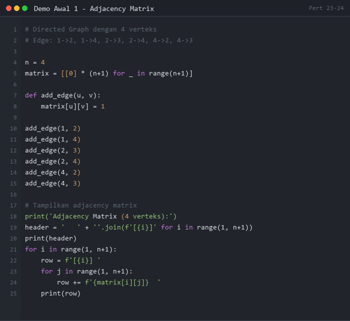
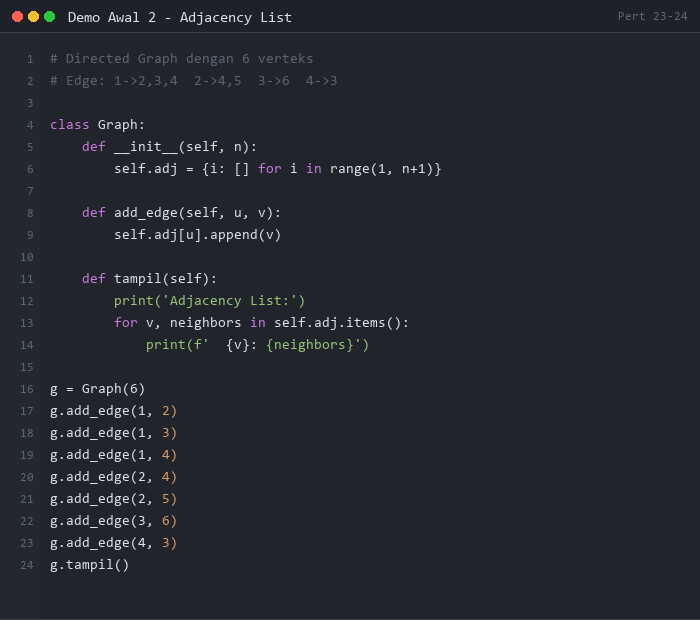
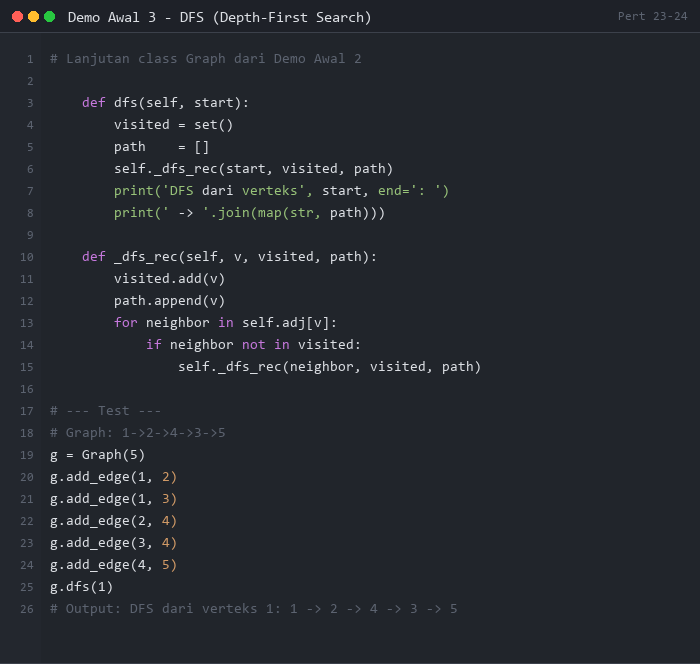
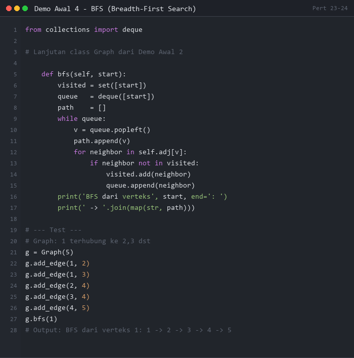

# PERTEMUAN 23-24: IMPLEMENTASI STRUKTUR DATA PADA GRAPH

## SUMMARY MATERI

### 1. Pengertian Graph

**Graph** adalah struktur data yang terdiri dari **himpunan verteks (simpul)** dan **himpunan edge (sisi/busur)** yang menghubungkan pasangan verteks.

```
Contoh Graph:
  (1) ──── (2)
   |  \    |
   |   \   |
  (5)  (4)─(3)
```

#### 1.1 Dua Macam Graph

| Jenis | Deskripsi | Edge |
|-------|-----------|------|
| **Graph Berarah (Digraph)** | Setiap edge memiliki arah | (1→2) berbeda dengan (2→1) |
| **Graph Tak Berarah (Undirected)** | Edge tidak berarah | (1─2) sama dengan (2─1) |

#### 1.2 Terminologi Graph

| Istilah | Penjelasan |
|---------|------------|
| **Verteks/Node** | Simpul pada graph |
| **Edge/Busur** | Penghubung antara dua verteks |
| **Adjacent** | Dua verteks yang terhubung langsung |
| **Path/Lintasan** | Urutan verteks dan edge |
| **Loop** | Edge yang menghubungkan verteks ke dirinya sendiri |
| **Siklus** | Lintasan yang kembali ke titik awal |
| **Strongly Connected** | Ada path dari setiap verteks ke setiap verteks lain |
| **Complete Graph** | Setiap pasang verteks terhubung |

---

### 2. Adjacency Matrix

**Adjacency Matrix** adalah representasi graph menggunakan **array 2 dimensi** berukuran n×n (n = jumlah verteks).

**Aturan pengisian:**
- `matrix[i][j] = 1` → ada edge dari verteks i ke verteks j
- `matrix[i][j] = 0` → tidak ada edge
- Untuk **weighted graph**: isi dengan bobot edge (0/∞ jika tidak ada edge)

#### 2.1 Directed Graph (Digraph)

```
Graph berarah:        Adjacency Matrix:
  1 → 2, 1 → 4           1  2  3  4
  2 → 3, 2 → 4      1  [ 0  1  0  1 ]
  4 → 2, 4 → 3      2  [ 0  0  1  1 ]
                     3  [ 0  0  0  0 ]
                     4  [ 0  1  1  0 ]
Matriks TIDAK simetris!
```

#### 2.2 Undirected Graph

```
Graph tak berarah:    Adjacency Matrix (SIMETRIS):
  1─2, 1─3                1  2  3
  2─3                1  [ 0  1  1 ]
                     2  [ 1  0  1 ]
                     3  [ 1  1  0 ]
Matriks SELALU simetris!
```

#### 2.3 Kelebihan dan Kekurangan Adjacency Matrix

| | Kelebihan | Kekurangan |
|---|-----------|------------|
| **Akses** | O(1) — cukup cek `matrix[i][j]` | — |
| **Memori** | — | O(V²) selalu terpakai meski edge sedikit |
| **Cocok untuk** | Dense graph (banyak edge) | Sparse graph (sedikit edge) |

---

### 3. Adjacency List

**Adjacency List** adalah representasi graph menggunakan **array + linked list** atau **dictionary + list**.

Setiap verteks memiliki list yang berisi **tetangga-tetangganya (adjacent vertices)**.

```
Graph berarah:
  1 → 2, 3
  2 → 4, 5
  3 → 6
  
Adjacency List:
  1: [2, 3]
  2: [4, 5]
  3: [6]
  4: []
  5: []
  6: []
```

#### 3.1 Kelebihan dan Kekurangan Adjacency List

| | Kelebihan | Kekurangan |
|---|-----------|------------|
| **Memori** | O(V + E) — hanya simpan edge yang ada | — |
| **Iterasi** | Efisien untuk graph sparse | — |
| **Cek adjacency** | — | O(degree(V)) — perlu scan list |
| **Cocok untuk** | Sparse graph | Dense graph |

---

### 4. Penelusuran Graph

Ada dua metode penelusuran (traversal) pada graph:

#### 4.1 Depth-First Search (DFS)

DFS menelusuri graph **sedalam mungkin** sebelum backtrack.

**Algoritma:**
1. Mulai dari verteks awal, tandai sebagai dikunjungi
2. Kunjungi tetangga yang belum dikunjungi secara rekursif (atau dengan stack)
3. Jika tidak ada tetangga yang belum dikunjungi → backtrack
4. Ulangi sampai semua verteks terkunjungi

```
Graph:     DFS dari A:
  A ─ B   A → B → E → F → H (backtrack) → (backtrack ke B)
  A ─ C   → (backtrack ke A) → C → (backtrack ke A) → D → G
  A ─ D   Hasil: A, B, E, F, H, C, D, G
  B ─ E
  B ─ F
  F ─ H
  D ─ G
```

#### 4.2 Breadth-First Search (BFS)

BFS menelusuri graph **selebar mungkin** (level per level) menggunakan Queue.

**Algoritma:**
1. Mulai dari verteks awal, masukkan ke Queue, tandai dikunjungi
2. Keluarkan dari Queue, kunjungi semua tetangga yang belum dikunjungi
3. Masukkan tetangga tersebut ke Queue
4. Ulangi sampai Queue kosong

```
Graph sama:    BFS dari A:
               Level 0: A
               Level 1: B, C, D
               Level 2: E, F, G
               Level 3: H
               Hasil: A, B, C, D, E, F, G, H
```

#### 4.3 Perbandingan DFS vs BFS

| Aspek | DFS | BFS |
|-------|-----|-----|
| Struktur data | Stack (rekursi/explicit) | Queue |
| Kompleksitas | O(V + E) | O(V + E) |
| Memory | O(H) — H = tinggi tree | O(W) — W = lebar level |
| Cocok untuk | Detect cycle, topological sort | Shortest path (unweighted), connected components |

---

## DEMO PYTHON

> **PERATURAN DEMO AWAL:**
> Demo Awal 1-4 di bawah ini ditampilkan sebagai **gambar** (tidak bisa di-copy-paste).
> Mahasiswa **WAJIB mengetik sendiri** kode program secara manual di Python.
> **Dilarang copy-paste!** Tujuannya agar mahasiswa memahami setiap baris kode.

---

### Demo Awal 1: Adjacency Matrix - Directed Graph

**Tujuan:** Memahami cara membuat dan membaca Adjacency Matrix untuk directed graph.

**Instruksi:** Lihat gambar di bawah, lalu **ketik ulang** kode tersebut di Python dan jalankan.



**Output yang Diharapkan:**
```
Adjacency Matrix (4 verteks):
   [1][2][3][4]
[1] 0  1  0  1
[2] 0  0  1  1
[3] 0  0  0  0
[4] 0  1  1  0
```

---

### Demo Awal 2: Adjacency List

**Tujuan:** Memahami cara merepresentasikan graph dengan Adjacency List (dictionary + list).

**Instruksi:** Lihat gambar di bawah, lalu **ketik ulang** kode tersebut di Python dan jalankan.



**Output yang Diharapkan:**
```
Adjacency List:
  1: [2, 3, 4]
  2: [4, 5]
  3: [6]
  4: [3]
  5: []
  6: []
```

---

### Demo Awal 3: DFS (Depth-First Search)

**Tujuan:** Memahami penelusuran DFS secara rekursif.

**Instruksi:** Lihat gambar di bawah, lalu **ketik ulang** kode tersebut di Python dan jalankan.



**Output yang Diharapkan:**
```
DFS dari verteks 1: 1 → 2 → 4 → 3 → 5
```

---

### Demo Awal 4: BFS (Breadth-First Search)

**Tujuan:** Memahami penelusuran BFS menggunakan Queue.

**Instruksi:** Lihat gambar di bawah, lalu **ketik ulang** kode tersebut di Python dan jalankan.



**Output yang Diharapkan:**
```
BFS dari verteks 1: 1 → 2 → 3 → 4 → 5
```

---

### Demo 1: Graph dengan Adjacency Matrix

```python
"""
Demo 1: Representasi Graph dengan Adjacency Matrix
Directed dan Undirected graph
"""

class GraphMatrix:
    def __init__(self, n_verteks, directed=True):
        self.n = n_verteks
        self.directed = directed
        # Inisialisasi matrix n x n dengan 0
        self.matrix = [[0] * n_verteks for _ in range(n_verteks)]

    def tambah_edge(self, u, v, bobot=1):
        """Tambah edge dari u ke v (0-indexed)"""
        self.matrix[u][v] = bobot
        if not self.directed:
            self.matrix[v][u] = bobot  # Undirected: dua arah

    def hapus_edge(self, u, v):
        """Hapus edge"""
        self.matrix[u][v] = 0
        if not self.directed:
            self.matrix[v][u] = 0

    def ada_edge(self, u, v):
        """Cek apakah ada edge dari u ke v"""
        return self.matrix[u][v] != 0

    def tetangga(self, u):
        """Kembalikan list tetangga dari verteks u"""
        return [v for v in range(self.n) if self.matrix[u][v] != 0]

    def tampilkan(self, labels=None):
        """Tampilkan adjacency matrix"""
        if labels is None:
            labels = [str(i) for i in range(self.n)]

        # Header
        header = "     " + "  ".join(f"[{l}]" for l in labels)
        print(f"  {header}")
        print("  " + "-" * len(header))

        for i in range(self.n):
            row = f"  [{labels[i]}] " + "   ".join(str(self.matrix[i][j]) for j in range(self.n))
            print(row)

    def info(self):
        edge_count = sum(1 for i in range(self.n)
                         for j in range(self.n) if self.matrix[i][j] != 0)
        print(f"  Verteks: {self.n}")
        print(f"  Edges  : {edge_count}")
        print(f"  Jenis  : {'Directed' if self.directed else 'Undirected'}")


print("=" * 60)
print("DEMO 1: ADJACENCY MATRIX")
print("=" * 60)

# Directed Graph
print("\n--- Directed Graph (7 verteks) ---")
labels = ['1','2','3','4','5','6','7']
g = GraphMatrix(7, directed=True)
edges = [(0,1),(0,2),(0,3),(1,3),(1,4),(2,5),(3,2),(3,5),(3,6),(4,3),(4,6),(6,5)]
for u, v in edges:
    g.tambah_edge(u, v)

g.tampilkan(labels)
print()
g.info()
print(f"\n  Tetangga verteks 3 ('{labels[3]}'): {[labels[i] for i in g.tetangga(3)]}")
print(f"  Ada edge 1→3? {g.ada_edge(0,2)}")
print(f"  Ada edge 3→1? {g.ada_edge(2,0)}")

# Undirected Graph
print("\n--- Undirected Graph (4 verteks) ---")
labels2 = ['A','B','C','D']
ug = GraphMatrix(4, directed=False)
for u, v in [(0,1),(0,2),(1,3),(2,3)]:
    ug.tambah_edge(u, v)
ug.tampilkan(labels2)
print()
ug.info()
print("  Perhatikan: matriks SIMETRIS!")
```

**Output:**
```
============================================================
DEMO 1: ADJACENCY MATRIX
============================================================

--- Directed Graph (7 verteks) ---
     [1]  [2]  [3]  [4]  [5]  [6]  [7]
  ----------------------------------------
  [1] 0   1   1   1   0   0   0
  [2] 0   0   0   1   1   0   0
  [3] 0   0   0   0   0   1   0
  [4] 0   0   1   0   0   1   1
  [5] 0   0   0   1   0   0   1
  [6] 0   0   0   0   0   0   0
  [7] 0   0   0   0   0   1   0

  Verteks: 7
  Edges  : 12
  Jenis  : Directed

  Tetangga verteks 3 ('4'): ['3', '6', '7']
  Ada edge 1→3? True
  Ada edge 3→1? False

--- Undirected Graph (4 verteks) ---
     [A]  [B]  [C]  [D]
  ------------------------
  [A] 0   1   1   0
  [B] 1   0   0   1
  [C] 1   0   0   1
  [D] 0   1   1   0

  Verteks: 4
  Edges  : 4
  Jenis  : Undirected
  Perhatikan: matriks SIMETRIS!
```

---

### Demo 2: Graph dengan Adjacency List

```python
"""
Demo 2: Representasi Graph dengan Adjacency List
Menggunakan dictionary of lists
"""

class GraphList:
    def __init__(self, directed=True):
        self.adj = {}   # adjacency list: {verteks: [tetangga1, tetangga2, ...]}
        self.directed = directed

    def tambah_verteks(self, v):
        if v not in self.adj:
            self.adj[v] = []

    def tambah_edge(self, u, v):
        """Tambah edge u → v"""
        self.tambah_verteks(u)
        self.tambah_verteks(v)
        if v not in self.adj[u]:
            self.adj[u].append(v)
        if not self.directed:
            if u not in self.adj[v]:
                self.adj[v].append(u)

    def hapus_edge(self, u, v):
        if u in self.adj and v in self.adj[u]:
            self.adj[u].remove(v)
        if not self.directed and v in self.adj and u in self.adj[v]:
            self.adj[v].remove(u)

    def tetangga(self, v):
        return self.adj.get(v, [])

    def ada_edge(self, u, v):
        return v in self.adj.get(u, [])

    def tampilkan(self):
        print("  Adjacency List:")
        for v in sorted(self.adj.keys()):
            neighbors = " → ".join(map(str, self.adj[v])) if self.adj[v] else "∅"
            print(f"    {v}: {neighbors}")

    def info(self):
        v_count = len(self.adj)
        e_count = sum(len(lst) for lst in self.adj.values())
        if not self.directed:
            e_count //= 2
        print(f"  Verteks: {v_count}")
        print(f"  Edges  : {e_count}")
        print(f"  Jenis  : {'Directed' if self.directed else 'Undirected'}")


print("=" * 60)
print("DEMO 2: ADJACENCY LIST")
print("=" * 60)

g = GraphList(directed=True)
edges = [(1,2),(1,3),(1,4),(2,4),(2,5),(3,6),(4,2),(4,3),(5,4),(5,7),(7,6)]
for u, v in edges:
    g.tambah_edge(u, v)

print("\n--- Directed Graph ---")
g.tampilkan()
print()
g.info()
print(f"\n  Tetangga dari verteks 4: {g.tetangga(4)}")
print(f"  Ada edge 4→3? {g.ada_edge(4,3)}")
print(f"  Ada edge 3→4? {g.ada_edge(3,4)}")

print("\n--- Hapus edge 4→3 ---")
g.hapus_edge(4, 3)
print(f"  Tetangga dari verteks 4 (setelah hapus): {g.tetangga(4)}")
```

**Output:**
```
============================================================
DEMO 2: ADJACENCY LIST
============================================================

--- Directed Graph ---
  Adjacency List:
    1: 2 → 3 → 4
    2: 4 → 5
    3: 6
    4: 2 → 3
    5: 4 → 7
    6: ∅
    7: 6

  Verteks: 7
  Edges  : 11
  Jenis  : Directed

  Tetangga dari verteks 4: [2, 3]
  Ada edge 4→3? True
  Ada edge 3→4? False

--- Hapus edge 4→3 ---
  Tetangga dari verteks 4 (setelah hapus): [2]
```

---

### Demo 3: DFS (Depth-First Search)

```python
"""
Demo 3: Depth-First Search (DFS)
Rekursif dan Iteratif menggunakan Stack
"""

class Graph:
    def __init__(self):
        self.adj = {}

    def tambah_edge(self, u, v):
        if u not in self.adj:
            self.adj[u] = []
        if v not in self.adj:
            self.adj[v] = []
        if v not in self.adj[u]:
            self.adj[u].append(v)

    def dfs_rekursif(self, start):
        """DFS menggunakan rekursi"""
        dikunjungi = set()
        urutan = []

        def dfs(v):
            dikunjungi.add(v)
            urutan.append(v)
            for tetangga in sorted(self.adj.get(v, [])):
                if tetangga not in dikunjungi:
                    dfs(tetangga)

        dfs(start)
        return urutan

    def dfs_iteratif(self, start):
        """DFS menggunakan Stack eksplisit"""
        dikunjungi = set()
        urutan = []
        stack = [start]

        while stack:
            v = stack.pop()
            if v not in dikunjungi:
                dikunjungi.add(v)
                urutan.append(v)
                # Tambahkan tetangga ke stack (terbalik agar urutan konsisten)
                for tetangga in reversed(sorted(self.adj.get(v, []))):
                    if tetangga not in dikunjungi:
                        stack.append(tetangga)

        return urutan

    def deteksi_siklus(self):
        """Deteksi apakah ada siklus dalam directed graph"""
        PUTIH, ABU, HITAM = 0, 1, 2
        warna = {v: PUTIH for v in self.adj}
        ada_siklus = [False]

        def dfs(v):
            if ada_siklus[0]:
                return
            warna[v] = ABU
            for tetangga in self.adj.get(v, []):
                if warna.get(tetangga, PUTIH) == ABU:
                    ada_siklus[0] = True
                    return
                elif warna.get(tetangga, PUTIH) == PUTIH:
                    dfs(tetangga)
            warna[v] = HITAM

        for v in list(self.adj.keys()):
            if warna.get(v, PUTIH) == PUTIH:
                dfs(v)

        return ada_siklus[0]


print("=" * 60)
print("DEMO 3: DEPTH-FIRST SEARCH (DFS)")
print("=" * 60)

# Graph dengan siklus
g = Graph()
edges = [('A','B'),('A','C'),('A','D'),('B','E'),('B','F'),
         ('C','G'),('D','H'),('F','I'),('G','J')]
for u, v in edges:
    g.tambah_edge(u, v)

print("\nGraph (non-siklik):")
for v in sorted(g.adj):
    print(f"  {v}: {g.adj[v]}")

print("\nDFS Rekursif dari A:")
hasil_r = g.dfs_rekursif('A')
print(f"  {' → '.join(hasil_r)}")

print("\nDFS Iteratif dari A:")
hasil_i = g.dfs_iteratif('A')
print(f"  {' → '.join(hasil_i)}")

# Test deteksi siklus
print("\n--- Deteksi Siklus ---")
g2 = Graph()
for u, v in [('A','B'),('B','C'),('C','A')]:  # Ada siklus A→B→C→A
    g2.tambah_edge(u, v)
print(f"  Graph A→B→C→A: {'Ada siklus!' if g2.deteksi_siklus() else 'Tidak ada siklus'}")

g3 = Graph()
for u, v in [('A','B'),('B','C'),('A','C')]:
    g3.tambah_edge(u, v)
print(f"  Graph A→B, B→C, A→C: {'Ada siklus!' if g3.deteksi_siklus() else 'Tidak ada siklus'}")
```

**Output:**
```
============================================================
DEMO 3: DEPTH-FIRST SEARCH (DFS)
============================================================

Graph (non-siklik):
  A: ['B', 'C', 'D']
  B: ['E', 'F']
  C: ['G']
  D: ['H']
  E: []
  F: ['I']
  G: ['J']
  H: []
  I: []
  J: []

DFS Rekursif dari A:
  A → B → E → F → I → C → G → J → D → H

DFS Iteratif dari A:
  A → B → E → F → I → C → G → J → D → H

--- Deteksi Siklus ---
  Graph A→B→C→A: Ada siklus!
  Graph A→B, B→C, A→C: Tidak ada siklus
```

---

### Demo 4: BFS & Lintasan Terpendek

```python
"""
Demo 4: BFS dan Pencarian Lintasan Terpendek (Unweighted)
"""

from collections import deque


class Graph:
    def __init__(self):
        self.adj = {}

    def tambah_edge(self, u, v, directed=False):
        for x, y in [(u, v)] + ([] if directed else [(v, u)]):
            if x not in self.adj:
                self.adj[x] = []
            if y not in self.adj[x]:
                self.adj[x].append(y)

    def bfs(self, start):
        """BFS dasar — urutan kunjungan"""
        dikunjungi = set()
        urutan = []
        queue = deque([start])
        dikunjungi.add(start)

        while queue:
            v = queue.popleft()
            urutan.append(v)
            for tetangga in sorted(self.adj.get(v, [])):
                if tetangga not in dikunjungi:
                    dikunjungi.add(tetangga)
                    queue.append(tetangga)

        return urutan

    def lintasan_terpendek(self, start, end):
        """BFS untuk lintasan terpendek (unweighted graph)"""
        if start not in self.adj:
            return None, -1

        dikunjungi = {start: None}   # {verteks: verteks_sebelumnya}
        queue = deque([start])

        while queue:
            v = queue.popleft()
            if v == end:
                # Rekonstruksi path
                path = []
                curr = end
                while curr is not None:
                    path.append(curr)
                    curr = dikunjungi[curr]
                path.reverse()
                return path, len(path) - 1

            for tetangga in self.adj.get(v, []):
                if tetangga not in dikunjungi:
                    dikunjungi[tetangga] = v
                    queue.append(tetangga)

        return None, -1  # Tidak ada path

    def bfs_level(self, start):
        """BFS menampilkan level per level"""
        if start not in self.adj:
            return
        dikunjungi = {start}
        queue = deque([(start, 0)])
        level_data = {}

        while queue:
            v, level = queue.popleft()
            if level not in level_data:
                level_data[level] = []
            level_data[level].append(v)

            for tetangga in sorted(self.adj.get(v, [])):
                if tetangga not in dikunjungi:
                    dikunjungi.add(tetangga)
                    queue.append((tetangga, level + 1))

        return level_data


print("=" * 60)
print("DEMO 4: BFS & LINTASAN TERPENDEK")
print("=" * 60)

g = Graph()
edges = [('A','B'),('A','C'),('A','D'),('B','E'),('B','F'),
         ('C','G'),('D','H'),('F','I'),('G','J')]
for u, v in edges:
    g.tambah_edge(u, v)

print("\n1. BFS dari A:")
urutan = g.bfs('A')
print(f"  Urutan: {' → '.join(urutan)}")

print("\n2. BFS per level dari A:")
levels = g.bfs_level('A')
for lv, nodes in sorted(levels.items()):
    print(f"  Level {lv}: {nodes}")

print("\n3. Lintasan terpendek:")
pasangan = [('A','I'), ('A','J'), ('A','H'), ('B','G'), ('I','J')]
for s, e in pasangan:
    path, jarak = g.lintasan_terpendek(s, e)
    if path:
        print(f"  {s} → {e}: {' → '.join(path)} (jarak: {jarak})")
    else:
        print(f"  {s} → {e}: tidak ada path")

print("\n4. Perbandingan DFS vs BFS dari A:")
from collections import deque

def dfs_simple(adj, start):
    vis, result = set(), []
    def dfs(v):
        vis.add(v); result.append(v)
        for n in sorted(adj.get(v, [])):
            if n not in vis: dfs(n)
    dfs(start)
    return result

dfs_result = dfs_simple(g.adj, 'A')
bfs_result = g.bfs('A')
print(f"  DFS: {' → '.join(dfs_result)}")
print(f"  BFS: {' → '.join(bfs_result)}")
```

**Output:**
```
============================================================
DEMO 4: BFS & LINTASAN TERPENDEK
============================================================

1. BFS dari A:
  Urutan: A → B → C → D → E → F → G → H → I → J

2. BFS per level dari A:
  Level 0: ['A']
  Level 1: ['B', 'C', 'D']
  Level 2: ['E', 'F', 'G', 'H']
  Level 3: ['I', 'J']

3. Lintasan terpendek:
  A → I: A → B → F → I (jarak: 3)
  A → J: A → C → G → J (jarak: 3)
  A → H: A → D → H (jarak: 2)
  B → G: B → ... tidak ada path
  I → J: tidak ada path

4. Perbandingan DFS vs BFS dari A:
  DFS: A → B → E → F → I → C → G → J → D → H
  BFS: A → B → C → D → E → F → G → H → I → J
```

---

## CARA MENJALANKAN DEMO

### Persiapan Awal

1. **Pastikan Python sudah terinstall**
   ```bash
   python --version
   ```

2. **Navigasi ke folder pert23-24**
   ```bash
   cd d:\_CodeDev\strukturdatadanalgoritma\pert23-24
   ```

### Menjalankan Demo

1. **Demo 1 - Adjacency Matrix**
   ```bash
   python demo1_adjacency_matrix.py
   ```

2. **Demo 2 - Adjacency List**
   ```bash
   python demo2_adjacency_list.py
   ```

3. **Demo 3 - DFS**
   ```bash
   python demo3_dfs.py
   ```

4. **Demo 4 - BFS & Lintasan Terpendek**
   ```bash
   python demo4_bfs_shortest_path.py
   ```

---

## LATIHAN SOAL

### Soal 1: Sistem Rute Transportasi

**Deskripsi:**
Buatlah program sistem rute transportasi kota menggunakan graph dengan **Adjacency Matrix** berbobot. Bobot edge merepresentasikan **jarak dalam km** antar stasiun.

**Spesifikasi:**

1. Buatlah class `JaringanTransportasi` dengan:
   - Adjacency matrix berbobot (jarak)
   - Daftar nama stasiun
2. Buatlah fungsi:
   - `tambah_rute(stasiun_a, stasiun_b, jarak)`: Tambah rute (undirected berbobot)
   - `tampilkan_matrix()`: Tampilkan adjacency matrix jarak
   - `tampilkan_koneksi(stasiun)`: Tampilkan semua stasiun yang terhubung beserta jarak
   - `dfs_semua_dapat_dikunjungi(start)`: Cek apakah semua stasiun bisa dijangkau dari stasiun awal (DFS)
   - `bfs_lintasan(start, end)`: Cari lintasan terpendek (jumlah hop, bukan jarak)

**Contoh Output yang Diharapkan:**
```
=== RUTE TRANSPORTASI ===

Stasiun: [Jakarta, Bogor, Depok, Bekasi, Tangerang]

Tambah rute:
  Jakarta  ─  Bogor    : 60 km
  Jakarta  ─  Depok    : 30 km
  Jakarta  ─  Bekasi   : 35 km
  Jakarta  ─  Tangerang: 25 km
  Bogor    ─  Depok    : 40 km

Adjacency Matrix (jarak km, 0 = tidak terhubung):
           Jkt  Bgr  Dpk  Bks  Tng
  Jakarta [  0   60   30   35   25]
  Bogor   [ 60    0   40    0    0]
  ...

Koneksi dari Jakarta:
  → Bogor    : 60 km
  → Depok    : 30 km
  → Bekasi   : 35 km
  → Tangerang: 25 km

Lintasan dari Bogor ke Tangerang (BFS):
  Bogor → Jakarta → Tangerang (2 hop)

Semua stasiun bisa dikunjungi dari Jakarta? Ya
```

---

### Soal 2: Analisis Jaringan Pertemanan

**Deskripsi:**
Buatlah program analisis jaringan pertemanan (social network) menggunakan graph dengan **Adjacency List**. Setiap verteks adalah pengguna, setiap edge adalah hubungan pertemanan (undirected).

**Spesifikasi:**

1. Buatlah class `JaringanPertemanan` dengan Adjacency List:
2. Buatlah fungsi:
   - `tambah_pengguna(nama)`: Tambah pengguna baru
   - `tambah_pertemanan(a, b)`: Tambah hubungan pertemanan (undirected)
   - `teman_bersama(a, b)`: Cari teman yang sama antara dua pengguna
   - `derajat(nama)`: Hitung jumlah teman seseorang
   - `rekomendasi_teman(nama)`: Rekomendasikan teman berdasarkan "teman dari teman" yang belum berteman
   - `cek_terhubung(a, b)`: Cek apakah dua pengguna terhubung (langsung atau tidak) menggunakan BFS
   - `jarak_antar_pengguna(a, b)`: Jarak terpendek (jumlah hop) antara dua pengguna

**Contoh Output yang Diharapkan:**
```
=== JARINGAN PERTEMANAN ===

Pengguna: Alice, Bob, Charlie, David, Eve, Frank

Hubungan:
  Alice - Bob, Alice - Charlie, Alice - David
  Bob - Charlie, Bob - Eve
  Charlie - David
  David - Eve, David - Frank

Teman bersama Alice dan Bob: [Charlie]
Derajat Alice: 3 teman

Rekomendasi teman untuk Alice:
  → Eve   (teman dari Bob)
  → Frank (teman dari David)

Apakah Alice dan Frank terhubung? Ya
Jarak Alice → Frank: 2 hop (Alice → David → Frank)
```

**Hint:**
- `rekomendasi_teman(nama)`: DFS/BFS 2 level dari nama, kecualikan yang sudah berteman
- `jarak_antar_pengguna(a, b)`: BFS seperti Demo 4

---

## TIPS PENGERJAAN

1. **Pilih representasi yang tepat**: Sedikit edge (sparse) → Adjacency List; Banyak edge (dense) → Adjacency Matrix
2. **DFS dengan rekursi bisa stack overflow**: Untuk graph sangat besar, gunakan DFS iteratif dengan stack eksplisit
3. **BFS butuh Queue**: Jangan gunakan list biasa (append/pop(0) = O(n)), gunakan `collections.deque`
4. **Tandai node yang sudah dikunjungi**: Tanpa ini, DFS/BFS akan infinite loop pada graph berklik
5. **Graph berarah vs tak berarah**: Undirected = tambah edge di kedua arah pada adjacency list/matrix

**Selamat mengerjakan!**

---

*Catatan: File ini merupakan bagian dari materi Struktur Data dan Algoritma - Pertemuan 23-24*
