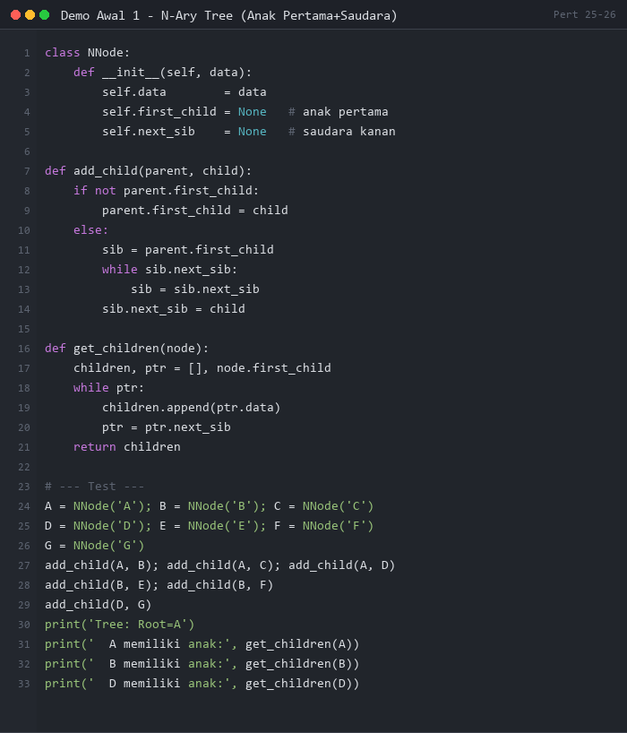
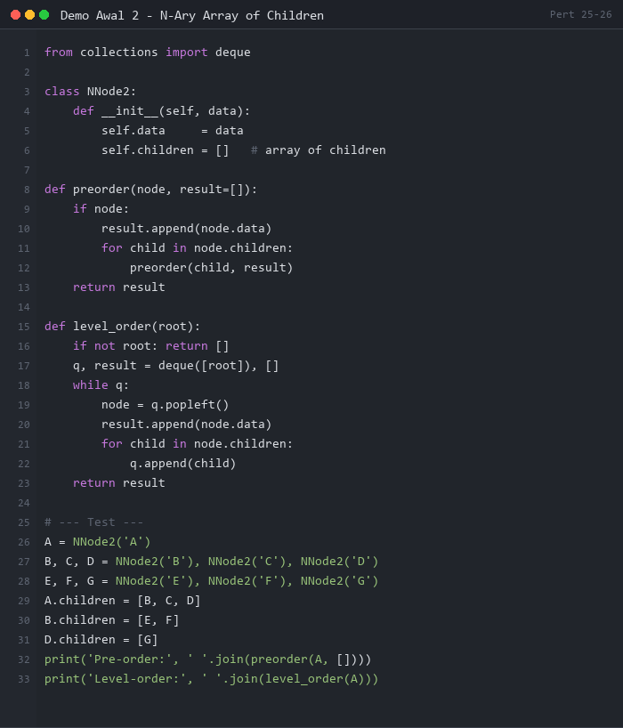
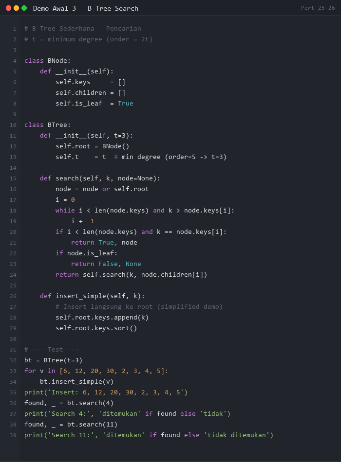
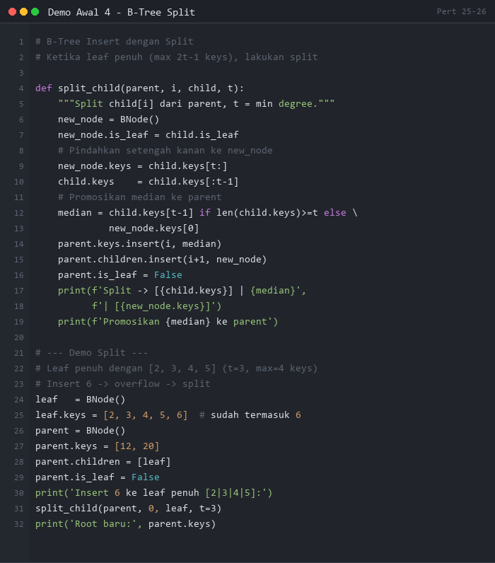

# PERTEMUAN 25-26: MULTIARY TREE DAN B-TREE

## SUMMARY MATERI

### 1. Multiary Tree (N-Ary Tree)

**Multiary Tree** (N-Ary Tree) adalah tree di mana setiap node dapat memiliki **lebih dari dua anak**.

#### 1.1 Dua Cara Implementasi Multiary Tree

| Cara | Deskripsi | Kelebihan |
|------|-----------|-----------|
| **Node → anak pertama + saudara** | Link ke anak pertama, link ke saudara berikutnya | Penyimpanan optimal |
| **Node → banyak Link anak** | Array of children (n slot) | Akses langsung ke anak ke-i |

#### 1.2 Multiway Tree

**Multiway Tree dengan Order m** adalah generalisasi BST di mana setiap node memiliki:
- **m anak** dan **m-1 key**
- Key disusun secara **ascending**
- Key pada **first-i children < key ke-i**
- Key pada **last m-i children > key ke-i**

**Contoh Multiway Tree Order 5 (maks 4 key, 5 cabang):**
```
         | d | e | p | v |
        /    |       |    \
  |b|c| |h|j|k|l| |r| |w|x|y|z|
  |a|  |f|g| |i|  |m|n|o| |q| |s|t|u|
```

---

### 2. B-Tree

**B-Tree** adalah varian dari Multiway Tree yang banyak digunakan dalam database dan sistem file karena efisiennya untuk akses disk.

> **PENTING:** B-Tree ≠ Binary Tree. B-Tree bisa punya lebih dari 2 anak!

#### 2.1 Properti B-Tree Order m

1. **Setiap root (selain leaf)** memiliki minimal 2 subtree
2. **Setiap non-root non-leaf** memiliki `k-1` keys dan `k` pointers di mana ⌈m/2⌉ ≤ k ≤ m
3. **Setiap leaf node** memiliki `k-1` keys di mana ⌈m/2⌉ ≤ k ≤ m
4. **Semua leaf berada pada level yang sama**

```
B-Tree Order 5 (maks 4 key, maks 5 anak):
              | 6 | 12 | 20 | 30 |
             /    |        |     \
  |2|3|4|5| |7|8|10|11| |14|15|18|19| |21|23|25|28| |31|33|34|35|
```

#### 2.2 Insert pada B-Tree

B-Tree dibangun **bottom-up** (dari bawah ke atas).

**Tiga situasi insert:**

1. **Leaf masih ada ruang** → insert langsung (tetap ascending)
2. **Leaf penuh** → split leaf, promosikan key tengah ke parent
3. **Root penuh** → split root, buat root baru

**Contoh Insert 6 ke tree dengan leaf penuh:**
```
Sebelum: leaf [2|5|7|8] penuh, insert 6

Langkah:
1. Coba masukkan 6 ke leaf [2|5|7|8] → penuh! [2|5|6|7|8]
2. Split: [2|5] | 6 | [7|8]
3. Promosikan 6 ke parent
4. Parent: | 6 | 12 | ... |
```

#### 2.3 Delete dari B-Tree

**Dua kasus:**

**Kasus 1: Hapus dari Leaf**
- Jika setelah hapus jumlah key ≥ ⌈m/2⌉ → hapus langsung
- Jika kurang → cari pinjaman dari sibling atau merge

**Kasus 2: Hapus dari Non-leaf**
- Ganti key yang dihapus dengan **immediate predecessor** atau **immediate successor** (dari leaf)
- Lalu hapus predecessor/successor dari leaf (reduksi ke kasus 1)

---

### 3. Ringkasan Perbandingan Tree

| Jenis Tree | Max Anak per Node | Penggunaan Utama |
|------------|-------------------|------------------|
| Binary Tree | 2 | Pencarian umum |
| BST | 2 | Pencarian terurut |
| B-Tree | m (variabel) | Database, sistem file |
| Multiary Tree | n (variabel) | Hierarki umum |

---

## DEMO PYTHON

> **PERATURAN DEMO AWAL:**
> Demo Awal 1-4 di bawah ini ditampilkan sebagai **gambar** (tidak bisa di-copy-paste).
> Mahasiswa **WAJIB mengetik sendiri** kode program secara manual di Python.
> **Dilarang copy-paste!** Tujuannya agar mahasiswa memahami setiap baris kode.

---

### Demo Awal 1: N-Ary Tree (Anak Pertama + Saudara)

**Tujuan:** Memahami representasi N-Ary Tree dengan link ke anak pertama dan saudara.

**Instruksi:** Lihat gambar di bawah, lalu **ketik ulang** kode tersebut di Python dan jalankan.



**Output yang Diharapkan:**
```
Tree: Root=A
  A memiliki anak: B, C, D
  B memiliki anak: E, F
  D memiliki anak: G
```

---

### Demo Awal 2: N-Ary Tree dengan Array of Children

**Tujuan:** Memahami representasi N-Ary Tree dengan array of children.

**Instruksi:** Lihat gambar di bawah, lalu **ketik ulang** kode tersebut di Python dan jalankan.



**Output yang Diharapkan:**
```
Pre-order: A B E F C D G
Level-order: A B C D E F G
```

---

### Demo Awal 3: B-Tree Order 5 - Pencarian

**Tujuan:** Memahami cara menyisipkan key ke B-Tree dan melakukan pencarian.

**Instruksi:** Lihat gambar di bawah, lalu **ketik ulang** kode tersebut di Python dan jalankan.



**Output yang Diharapkan:**
```
Insert: 6, 12, 20, 30
Insert: 2, 3, 4, 5 (ke leaf pertama)
Search 4: ditemukan di level 1
Search 11: tidak ditemukan
```

---

### Demo Awal 4: B-Tree Order 5 - Insert dengan Split

**Tujuan:** Memahami proses split node saat key melebihi kapasitas B-Tree.

**Instruksi:** Lihat gambar di bawah, lalu **ketik ulang** kode tersebut di Python dan jalankan.



**Output yang Diharapkan:**
```
Insert 6 ke leaf penuh [2|3|4|5]:
  Split → [2|3] | 4 | [5|6]
  Promosikan 4 ke parent
Root baru: | 4 | 12 | ... |
```

---

### Demo 1: N-Ary Tree - Representasi dan Traversal

```python
"""
Demo 1: N-Ary Tree
Representasi dengan array of children
Traversal Pre-order dan Level-order
"""

from collections import deque


class NAryNode:
    def __init__(self, data):
        self.data = data
        self.children = []   # List anak (bisa 0 sampai n)

    def tambah_anak(self, anak):
        self.children.append(anak)
        return anak


class NAryTree:
    def __init__(self):
        self.root = None

    def preorder(self, node=None, hasil=None, _start=True):
        """V → semua anak secara rekursif"""
        if _start:
            node = self.root
            hasil = []
        if node:
            hasil.append(node.data)
            for anak in node.children:
                self.preorder(anak, hasil, False)
        if _start:
            return hasil
        return hasil

    def postorder(self, node=None, hasil=None, _start=True):
        """Semua anak dulu, lalu root"""
        if _start:
            node = self.root
            hasil = []
        if node:
            for anak in node.children:
                self.postorder(anak, hasil, False)
            hasil.append(node.data)
        if _start:
            return hasil
        return hasil

    def level_order(self):
        """BFS per level"""
        if not self.root:
            return []
        hasil = []
        queue = deque([self.root])
        while queue:
            node = queue.popleft()
            hasil.append(node.data)
            for anak in node.children:
                queue.append(anak)
        return hasil

    def level_order_per_level(self):
        """Tampilkan per level"""
        if not self.root:
            return
        queue = deque([(self.root, 0)])
        level_data = {}
        while queue:
            node, level = queue.popleft()
            if level not in level_data:
                level_data[level] = []
            level_data[level].append(node.data)
            for anak in node.children:
                queue.append((anak, level + 1))
        return level_data

    def height(self, node=None, _start=True):
        if _start:
            node = self.root
        if not node:
            return 0
        if not node.children:
            return 1
        return 1 + max(self.height(anak, False) for anak in node.children)

    def count_nodes(self, node=None, _start=True):
        if _start:
            node = self.root
        if not node:
            return 0
        return 1 + sum(self.count_nodes(anak, False) for anak in node.children)

    def cetak(self, node=None, level=0, _start=True):
        if _start:
            node = self.root
        if node:
            prefix = "  " * level + ("└─ " if level > 0 else "")
            print(f"  {prefix}{node.data}")
            for anak in node.children:
                self.cetak(anak, level + 1, False)


print("=" * 60)
print("DEMO 1: N-ARY TREE")
print("=" * 60)

tree = NAryTree()

# Bangun tree:
#           A
#       /   |   \
#      B    C    D
#     / \       |
#    E   F      G
#   /
#  H

tree.root = NAryNode('A')
b = tree.root.tambah_anak(NAryNode('B'))
c = tree.root.tambah_anak(NAryNode('C'))
d = tree.root.tambah_anak(NAryNode('D'))
e = b.tambah_anak(NAryNode('E'))
f = b.tambah_anak(NAryNode('F'))
g = d.tambah_anak(NAryNode('G'))
h = e.tambah_anak(NAryNode('H'))

print("\n1. Struktur tree:")
tree.cetak()

print("\n2. Pre-order (V, semua anak):")
print(f"  {' → '.join(tree.preorder())}")

print("\n3. Post-order (anak dulu, lalu root):")
print(f"  {' → '.join(tree.postorder())}")

print("\n4. Level-order (BFS):")
print(f"  {' → '.join(tree.level_order())}")

print("\n5. Level per level:")
levels = tree.level_order_per_level()
for lv, nodes in sorted(levels.items()):
    print(f"  Level {lv}: {nodes}")

print(f"\n6. Tinggi tree : {tree.height()}")
print(f"   Jumlah node : {tree.count_nodes()}")
```

**Output:**
```
============================================================
DEMO 1: N-ARY TREE
============================================================

1. Struktur tree:
  A
    └─ B
      └─ E
        └─ H
      └─ F
    └─ C
    └─ D
      └─ G

2. Pre-order (V, semua anak):
  A → B → E → H → F → C → D → G

3. Post-order (anak dulu, lalu root):
  H → E → F → B → C → G → D → A

4. Level-order (BFS):
  A → B → C → D → E → F → G → H

5. Level per level:
  Level 0: ['A']
  Level 1: ['B', 'C', 'D']
  Level 2: ['E', 'F', 'G']
  Level 3: ['H']

6. Tinggi tree : 4
   Jumlah node : 8
```

---

### Demo 2: B-Tree Order 5 - Implementasi Dasar

```python
"""
Demo 2: B-Tree Order 5 — Implementasi
Insert, Search, dan tampilkan struktur
"""

class BTreeNode:
    def __init__(self, is_leaf=True):
        self.keys = []          # List key (maks t*2-1)
        self.children = []      # List pointer anak
        self.is_leaf = is_leaf

    def __str__(self):
        return str(self.keys)


class BTree:
    def __init__(self, t=3):
        """
        t = minimum degree
        - Maks keys per node: 2t - 1
        - Min keys per non-root: t - 1
        - Maks anak per node: 2t
        """
        self.t = t
        self.root = BTreeNode(is_leaf=True)
        self.min_keys = t - 1
        self.max_keys = 2 * t - 1

    def search(self, k, node=None):
        """Cari key k dalam B-Tree"""
        if node is None:
            node = self.root

        # Cari posisi key terkecil yang >= k
        i = 0
        while i < len(node.keys) and k > node.keys[i]:
            i += 1

        if i < len(node.keys) and node.keys[i] == k:
            return True  # Ditemukan

        if node.is_leaf:
            return False  # Tidak ditemukan

        return self.search(k, node.children[i])

    def insert(self, k):
        """Insert key k ke B-Tree"""
        root = self.root

        if len(root.keys) == self.max_keys:
            # Root penuh — perlu split
            new_root = BTreeNode(is_leaf=False)
            new_root.children.append(self.root)
            self._split_child(new_root, 0)
            self.root = new_root

        self._insert_non_full(self.root, k)

    def _insert_non_full(self, node, k):
        """Insert key ke node yang belum penuh"""
        i = len(node.keys) - 1

        if node.is_leaf:
            # Insert ke leaf — tetap terurut
            node.keys.append(None)
            while i >= 0 and k < node.keys[i]:
                node.keys[i + 1] = node.keys[i]
                i -= 1
            node.keys[i + 1] = k
        else:
            # Cari anak yang tepat
            while i >= 0 and k < node.keys[i]:
                i -= 1
            i += 1

            if len(node.children[i].keys) == self.max_keys:
                self._split_child(node, i)
                if k > node.keys[i]:
                    i += 1

            self._insert_non_full(node.children[i], k)

    def _split_child(self, parent, i):
        """Split anak ke-i dari parent"""
        t = self.t
        anak_penuh = parent.children[i]
        anak_baru = BTreeNode(is_leaf=anak_penuh.is_leaf)

        # Key tengah naik ke parent
        key_tengah = anak_penuh.keys[t - 1]

        # Bagian kanan ke anak_baru
        anak_baru.keys = anak_penuh.keys[t:]
        anak_penuh.keys = anak_penuh.keys[:t - 1]

        # Jika bukan leaf, pindahkan juga anak-anak
        if not anak_penuh.is_leaf:
            anak_baru.children = anak_penuh.children[t:]
            anak_penuh.children = anak_penuh.children[:t]

        # Sisipkan key tengah ke parent
        parent.keys.insert(i, key_tengah)
        parent.children.insert(i + 1, anak_baru)

    def tampilkan(self, node=None, level=0, _start=True):
        """Tampilkan struktur B-Tree"""
        if _start:
            node = self.root
        indent = "  " * level
        print(f"{indent}Level {level}: {node.keys}")
        if not node.is_leaf:
            for anak in node.children:
                self.tampilkan(anak, level + 1, False)

    def tampilkan_inorder(self, node=None, hasil=None, _start=True):
        """Tampilkan semua key in-order (harus ascending)"""
        if _start:
            node = self.root
            hasil = []
        if node.is_leaf:
            hasil.extend(node.keys)
        else:
            for i, anak in enumerate(node.children):
                self.tampilkan_inorder(anak, hasil, False)
                if i < len(node.keys):
                    hasil.append(node.keys[i])
        if _start:
            return hasil
        return hasil


print("=" * 60)
print("DEMO 2: B-TREE ORDER 5 (t=3, maks 5 keys per node)")
print("=" * 60)

bt = BTree(t=3)  # max_keys = 5, min_keys = 2

print(f"\nOrder: t={bt.t}, maks keys per node: {bt.max_keys}, min: {bt.min_keys}")

values = [6, 12, 20, 30, 2, 3, 4, 5, 7, 8, 10, 11, 14, 15, 18, 19, 21, 23, 25, 28, 31, 33, 34, 35]

print("\n1. Insert bertahap:")
for v in values:
    bt.insert(v)
    if v in [5, 11, 19, 35]:  # Tampilkan di beberapa titik
        print(f"\n  Setelah insert {v}:")
        bt.tampilkan()

print("\n2. Struktur akhir B-Tree:")
bt.tampilkan()

print("\n3. Semua key (in-order, harus ascending):")
print(f"  {bt.tampilkan_inorder()}")

print("\n4. Pencarian:")
test = [6, 12, 15, 99, 35, 22]
for k in test:
    found = bt.search(k)
    status = "✓ ditemukan" if found else "✗ tidak ada"
    print(f"  Search {k:3d}: {status}")
```

**Output:**
```
============================================================
DEMO 2: B-TREE ORDER 5 (t=3, maks 5 keys per node)
============================================================

Order: t=3, maks keys per node: 5, min: 2

1. Insert bertahap:

  Setelah insert 5:
Level 0: [6, 12, 20, 30]
  Level 1: [2, 3, 4, 5]
  Level 1: [7, 8, 10, 11]
  ...

2. Struktur akhir B-Tree:
Level 0: [6, 12, 20, 30]
  Level 1: [2, 3, 4, 5]
  Level 1: [7, 8, 10, 11]
  Level 1: [14, 15, 18, 19]
  Level 1: [21, 23, 25, 28]
  Level 1: [31, 33, 34, 35]

3. Semua key (in-order, harus ascending):
  [2, 3, 4, 5, 6, 7, 8, 10, 11, 12, 14, 15, 18, 19, 20, 21, 23, 25, 28, 30, 31, 33, 34, 35]

4. Pencarian:
  Search   6: ✓ ditemukan
  Search  12: ✓ ditemukan
  Search  15: ✓ ditemukan
  Search  99: ✗ tidak ada
  Search  35: ✓ ditemukan
  Search  22: ✗ tidak ada
```

---

### Demo 3: Multiway Tree - Representasi dan Traversal

```python
"""
Demo 3: Multiway Tree Order m
Struktur umum tree dengan m anak dan m-1 key per node
"""

class MultiwayNode:
    def __init__(self, order):
        self.order = order          # Order m
        self.keys = []              # Maks m-1 key
        self.children = []          # Maks m anak

    def is_leaf(self):
        return len(self.children) == 0

    def is_full(self):
        return len(self.keys) >= self.order - 1

    def __str__(self):
        return f"[{' | '.join(map(str, self.keys))}]"


class MultiwayTree:
    def __init__(self, order=5):
        self.order = order
        self.root = None

    def bangun_manual(self, struktur):
        """
        Bangun tree dari struktur dict:
        {
          'keys': [d, e, p, v],
          'children': [
              {'keys': [b, c], 'children': [...]}
              ...
          ]
        }
        """
        def build(data):
            node = MultiwayNode(self.order)
            node.keys = data['keys'][:]
            for child_data in data.get('children', []):
                node.children.append(build(child_data))
            return node

        self.root = build(struktur)

    def search(self, k, node=None, level=0):
        """Cari key dalam multiway tree"""
        if node is None:
            node = self.root
        if node is None:
            return False, -1

        # Cari posisi yang tepat di antara key-key
        for i, key in enumerate(node.keys):
            if k == key:
                return True, level
            if k < key:
                if i < len(node.children):
                    return self.search(k, node.children[i], level + 1)
                return False, -1

        # Lebih besar dari semua key
        if len(node.children) > len(node.keys):
            return self.search(k, node.children[-1], level + 1)
        return False, -1

    def tampilkan(self, node=None, level=0, _start=True):
        """Tampilkan struktur tree"""
        if _start:
            node = self.root
        if node:
            indent = "  " * level
            print(f"  {indent}Level {level}: {node}")
            for i, anak in enumerate(node.children):
                self.tampilkan(anak, level + 1, False)

    def inorder(self, node=None, hasil=None, _start=True):
        """In-order traversal multiway tree"""
        if _start:
            node = self.root
            hasil = []
        if node:
            for i in range(len(node.keys)):
                if i < len(node.children):
                    self.inorder(node.children[i], hasil, False)
                hasil.append(node.keys[i])
            if len(node.children) > len(node.keys):
                self.inorder(node.children[-1], hasil, False)
        if _start:
            return hasil
        return hasil


print("=" * 60)
print("DEMO 3: MULTIWAY TREE ORDER 5")
print("=" * 60)

# Bangun tree dari contoh PDF
tree = MultiwayTree(order=5)

# Struktur dari contoh:
#         |d|e|p|v|
#        /  |   |  \
#   |b|c| |h|j|k|l| |r| |w|x|y|z|
#   /        |       /\       \
#  |a| |f|g| |i| |m|n|o| |q| |s|t|u|

struktur = {
    'keys': ['d', 'e', 'p', 'v'],
    'children': [
        {
            'keys': ['b', 'c'],
            'children': [
                {'keys': ['a']},
                {'keys': ['f', 'g']},
            ]
        },
        {
            'keys': ['h', 'j', 'k', 'l'],
            'children': [
                {'keys': ['i']},
            ]
        },
        {
            'keys': ['r'],
            'children': [
                {'keys': ['m', 'n', 'o']},
                {'keys': ['q']},
            ]
        },
        {
            'keys': ['w', 'x', 'y', 'z'],
            'children': [
                {'keys': ['s', 't', 'u']},
            ]
        },
    ]
}

tree.bangun_manual(struktur)

print("\n1. Struktur Multiway Tree Order 5:")
tree.tampilkan()

print("\n2. In-order traversal (harus ascending abjad):")
print(f"  {' → '.join(tree.inorder())}")

print("\n3. Pencarian:")
test_keys = ['h', 'z', 'r', 'q', 'y', 'x']
for k in test_keys:
    found, lv = tree.search(k)
    if found:
        print(f"  '{k}': ditemukan di level {lv}")
    else:
        print(f"  '{k}': tidak ditemukan")
```

**Output:**
```
============================================================
DEMO 3: MULTIWAY TREE ORDER 5
============================================================

1. Struktur Multiway Tree Order 5:
  Level 0: [d | e | p | v]
    Level 1: [b | c]
      Level 2: [a]
      Level 2: [f | g]
    Level 1: [h | j | k | l]
      Level 2: [i]
    Level 1: [r]
      Level 2: [m | n | o]
      Level 2: [q]
    Level 1: [w | x | y | z]
      Level 2: [s | t | u]

2. In-order traversal (harus ascending abjad):
  a → b → c → d → e → f → g → h → i → j → k → l → m → n → o → p → q → r → s → t → u → v → w → x → y → z

3. Pencarian:
  'h': ditemukan di level 1
  'z': ditemukan di level 1
  'r': ditemukan di level 1
  'q': ditemukan di level 2
  'y': ditemukan di level 1
  'x': ditemukan di level 1
```

---

### Demo 4: Aplikasi N-Ary Tree - Struktur Organisasi

```python
"""
Demo 4: Aplikasi N-Ary Tree - Struktur Organisasi Perusahaan
Setiap node adalah karyawan, anak-anaknya adalah bawahan langsung
"""

from collections import deque


class KaryawanNode:
    def __init__(self, nama, jabatan, gaji):
        self.nama = nama
        self.jabatan = jabatan
        self.gaji = gaji
        self.bawahan = []  # N-ary: bisa punya banyak bawahan

    def tambah_bawahan(self, karyawan):
        self.bawahan.append(karyawan)
        return karyawan

    def __str__(self):
        return f"{self.nama} ({self.jabatan})"


class OrganisasiPerusahaan:
    def __init__(self, ceo):
        self.ceo = ceo

    def tampilkan_org_chart(self, node=None, level=0, _start=True):
        """Tampilkan bagan organisasi"""
        if _start:
            node = self.ceo
        indent = "  " * level
        marker = "┌─ " if level == 0 else "├─ "
        print(f"  {indent}{marker}{node}")
        for i, bawahan in enumerate(node.bawahan):
            self.tampilkan_org_chart(bawahan, level + 1, False)

    def total_karyawan(self, node=None, _start=True):
        if _start:
            node = self.ceo
        if not node:
            return 0
        return 1 + sum(self.total_karyawan(b, False) for b in node.bawahan)

    def total_gaji(self, node=None, _start=True):
        if _start:
            node = self.ceo
        if not node:
            return 0
        return node.gaji + sum(self.total_gaji(b, False) for b in node.bawahan)

    def cari_karyawan(self, nama, node=None, _start=True):
        if _start:
            node = self.ceo
        if not node:
            return None
        if node.nama.lower() == nama.lower():
            return node
        for bawahan in node.bawahan:
            hasil = self.cari_karyawan(nama, bawahan, False)
            if hasil:
                return hasil
        return None

    def daftar_per_level(self):
        """BFS: tampilkan karyawan per level"""
        queue = deque([(self.ceo, 0)])
        level_data = {}
        while queue:
            node, level = queue.popleft()
            if level not in level_data:
                level_data[level] = []
            level_data[level].append(str(node))
            for bawahan in node.bawahan:
                queue.append((bawahan, level + 1))
        return level_data

    def jumlah_bawahan(self, nama):
        """Hitung total bawahan (langsung dan tidak langsung)"""
        node = self.cari_karyawan(nama)
        if not node:
            return -1
        return self.total_karyawan(node) - 1  # Kurangi diri sendiri


print("=" * 60)
print("DEMO 4: STRUKTUR ORGANISASI PERUSAHAAN (N-ARY TREE)")
print("=" * 60)

# Bangun struktur organisasi
ceo = KaryawanNode("Ahmad Direktur", "CEO", 50_000_000)

# Level 1: VP
vp_ops = ceo.tambah_bawahan(KaryawanNode("Budi VP", "VP Operations", 35_000_000))
vp_tech = ceo.tambah_bawahan(KaryawanNode("Citra VP", "VP Technology", 35_000_000))
vp_fin = ceo.tambah_bawahan(KaryawanNode("Doni VP", "VP Finance", 35_000_000))

# Level 2: Manager
mgr_prod = vp_ops.tambah_bawahan(KaryawanNode("Eka Manager", "Production Mgr", 25_000_000))
mgr_dist = vp_ops.tambah_bawahan(KaryawanNode("Fajar Manager", "Distribution Mgr", 25_000_000))
mgr_dev = vp_tech.tambah_bawahan(KaryawanNode("Gita Manager", "Dev Manager", 25_000_000))
mgr_infra = vp_tech.tambah_bawahan(KaryawanNode("Hadi Manager", "Infra Manager", 25_000_000))
mgr_acc = vp_fin.tambah_bawahan(KaryawanNode("Indah Manager", "Accounting Mgr", 25_000_000))

# Level 3: Staf
mgr_dev.tambah_bawahan(KaryawanNode("Joko Staf", "Senior Dev", 18_000_000))
mgr_dev.tambah_bawahan(KaryawanNode("Kiki Staf", "Junior Dev", 12_000_000))
mgr_dev.tambah_bawahan(KaryawanNode("Luna Staf", "QA Engineer", 15_000_000))
mgr_infra.tambah_bawahan(KaryawanNode("Miko Staf", "SysAdmin", 16_000_000))

org = OrganisasiPerusahaan(ceo)

print("\n1. Bagan Organisasi:")
org.tampilkan_org_chart()

print(f"\n2. Total karyawan: {org.total_karyawan()}")
print(f"   Total gaji/bulan: Rp {org.total_gaji():,}")

print("\n3. Daftar per level:")
levels = org.daftar_per_level()
nama_level = {0: "C-Level", 1: "Vice President", 2: "Manager", 3: "Staf"}
for lv, karyawan in sorted(levels.items()):
    print(f"  Level {lv} ({nama_level.get(lv, 'Staf')}):")
    for k in karyawan:
        print(f"    - {k}")

print("\n4. Info karyawan:")
for nama in ["Citra VP", "Gita Manager", "Kiki Staf"]:
    bawahan = org.jumlah_bawahan(nama)
    print(f"  {nama}: {bawahan} bawahan (total)")
```

**Output:**
```
============================================================
DEMO 4: STRUKTUR ORGANISASI PERUSAHAAN (N-ARY TREE)
============================================================

1. Bagan Organisasi:
  ┌─ Ahmad Direktur (CEO)
    ├─ Budi VP (VP Operations)
      ├─ Eka Manager (Production Mgr)
      ├─ Fajar Manager (Distribution Mgr)
    ├─ Citra VP (VP Technology)
      ├─ Gita Manager (Dev Manager)
        ├─ Joko Staf (Senior Dev)
        ├─ Kiki Staf (Junior Dev)
        ├─ Luna Staf (QA Engineer)
      ├─ Hadi Manager (Infra Manager)
        ├─ Miko Staf (SysAdmin)
    ├─ Doni VP (VP Finance)
      ├─ Indah Manager (Accounting Mgr)

2. Total karyawan: 13
   Total gaji/bulan: Rp 370,000,000

3. Daftar per level:
  Level 0 (C-Level):
    - Ahmad Direktur (CEO)
  Level 1 (Vice President):
    - Budi VP (VP Operations)
    - Citra VP (VP Technology)
    - Doni VP (VP Finance)
  Level 2 (Manager):
    - Eka Manager (Production Mgr)
    - Fajar Manager (Distribution Mgr)
    - Gita Manager (Dev Manager)
    - Hadi Manager (Infra Manager)
    - Indah Manager (Accounting Mgr)
  Level 3 (Staf):
    - Joko Staf (Senior Dev)
    - Kiki Staf (Junior Dev)
    - Luna Staf (QA Engineer)
    - Miko Staf (SysAdmin)

4. Info karyawan:
  Citra VP: 5 bawahan (total)
  Gita Manager: 3 bawahan (total)
  Kiki Staf: 0 bawahan (total)
```

---

## CARA MENJALANKAN DEMO

### Persiapan Awal

1. **Pastikan Python sudah terinstall**
   ```bash
   python --version
   ```

2. **Navigasi ke folder pert25-26**
   ```bash
   cd d:\_CodeDev\strukturdatadanalgoritma\pert25-26
   ```

### Menjalankan Demo

1. **Demo 1 - N-Ary Tree**
   ```bash
   python demo1_nary_tree.py
   ```

2. **Demo 2 - B-Tree Order 5**
   ```bash
   python demo2_btree.py
   ```

3. **Demo 3 - Multiway Tree**
   ```bash
   python demo3_multiway_tree.py
   ```

4. **Demo 4 - Struktur Organisasi**
   ```bash
   python demo4_struktur_organisasi.py
   ```

---

## LATIHAN SOAL

### Soal 1: Sistem Berkas (File System) dengan N-Ary Tree

**Deskripsi:**
Buatlah simulasi **sistem berkas (file system)** menggunakan N-Ary Tree. Setiap node dapat berupa folder (punya anak) atau file (leaf). Struktur mirip seperti sistem file di komputer.

**Spesifikasi:**

1. Buatlah class `FileSystemNode` dengan atribut:
   - `nama` (string): nama file/folder
   - `tipe` (string): `"folder"` atau `"file"`
   - `ukuran` (int): ukuran dalam KB (0 untuk folder)
   - `children` (list): list anak (N-Ary)

2. Buatlah class `FileSystem` dengan fungsi:
   - `buat_folder(path, nama)`: Buat folder baru pada path tertentu
   - `buat_file(path, nama, ukuran)`: Buat file baru pada path tertentu
   - `hapus(path, nama)`: Hapus file/folder beserta isinya
   - `tampilkan(path)`: Tampilkan struktur direktori seperti perintah `tree`
   - `total_ukuran(path)`: Hitung total ukuran folder beserta isinya
   - `cari(nama)`: Cari file/folder berdasarkan nama (DFS/BFS)

**Contoh Output yang Diharapkan:**
```
=== SISTEM BERKAS ===

Buat struktur:
  + /home/
  + /home/kevin/
  + /home/kevin/documents/
  + /home/kevin/documents/skripsi.docx (1200 KB)
  + /home/kevin/documents/laporan.pdf (800 KB)
  + /home/kevin/pictures/
  + /home/kevin/pictures/foto1.jpg (2048 KB)

Tampilkan /home:
  /home/
  ├── kevin/
  │   ├── documents/
  │   │   ├── skripsi.docx (1200 KB)
  │   │   └── laporan.pdf (800 KB)
  │   └── pictures/
  │       └── foto1.jpg (2048 KB)

Total ukuran /home/kevin: 4048 KB

Cari 'skripsi.docx': ditemukan di /home/kevin/documents/
```

---

### Soal 2: B-Tree sebagai Index Database

**Deskripsi:**
Simulasikan penggunaan **B-Tree sebagai index database** untuk tabel data mahasiswa. B-Tree menyimpan NIM sebagai key dan memungkinkan pencarian O(log n).

**Spesifikasi:**

1. Gunakan kelas B-Tree dari Demo 2 sebagai basis
2. Buatlah class `IndexMahasiswa` yang:
   - Menyimpan pasangan `(NIM, referensi_data)` di B-Tree
   - `tambah(nim, nama, ipk)`: Insert ke index B-Tree
   - `cari(nim)`: Cari mahasiswa berdasarkan NIM via B-Tree
   - `rentang(nim_min, nim_max)`: Tampilkan semua mahasiswa dalam rentang NIM
   - `statistik()`: Tampilkan jumlah node, tinggi tree, dan efisiensi pencarian

3. Bandingkan performa: cari secara **linear search** vs **B-Tree search**

**Contoh Output yang Diharapkan:**
```
=== INDEX DATABASE MAHASISWA (B-TREE) ===

Insert 20 mahasiswa...
Struktur B-Tree (order 5):
  Level 0: [2021005 | 2021010 | 2021015]
  Level 1: [2021001 | 2021002 | 2021003 | 2021004]
  Level 1: [2021006 | 2021007 | 2021008 | 2021009]
  ...

Cari NIM 2021007:
  B-Tree Search: ditemukan! Joko | IPK: 3.75
  Langkah perbandingan: 3 (hanya 3 node dibandingkan!)
  vs Linear Search: perlu cek 7 record

Rentang NIM 2021005 - 2021010:
  2021005 Eka    IPK: 3.20
  2021006 Fajar  IPK: 3.85
  2021007 Joko   IPK: 3.75
  2021008 Kiki   IPK: 2.90
  2021009 Luna   IPK: 3.45
  2021010 Miko   IPK: 3.60
```

**Hint:**
- Untuk rentang query: in-order traversal, filter yang masuk rentang
- Untuk perbandingan: hitung berapa node yang dibandingkan saat search di B-Tree vs sequential scan

---

## TIPS PENGERJAAN

1. **N-Ary Tree = fleksibel**: Gunakan `list` untuk children, bukan fixed array
2. **B-Tree split adalah kunci**: Pahami kapan dan bagaimana split terjadi — ini yang membuat B-Tree tetap seimbang
3. **Semua leaf B-Tree di level sama**: Selalu verifikasi property ini setelah insert/delete
4. **In-order B-Tree = terurut**: Seperti BST, in-order traversal B-Tree menghasilkan key terurut ascending
5. **B-Tree untuk disk**: Di dunia nyata, setiap node = satu block disk. Meminimalkan akses disk = efisien

**Selamat mengerjakan!**

---

*Catatan: File ini merupakan bagian dari materi Struktur Data dan Algoritma - Pertemuan 25-26*
