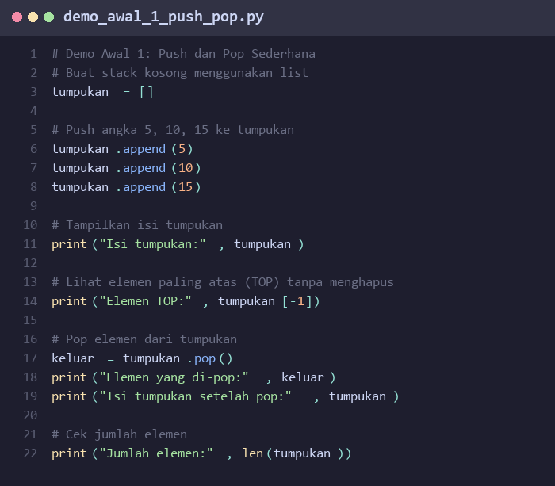
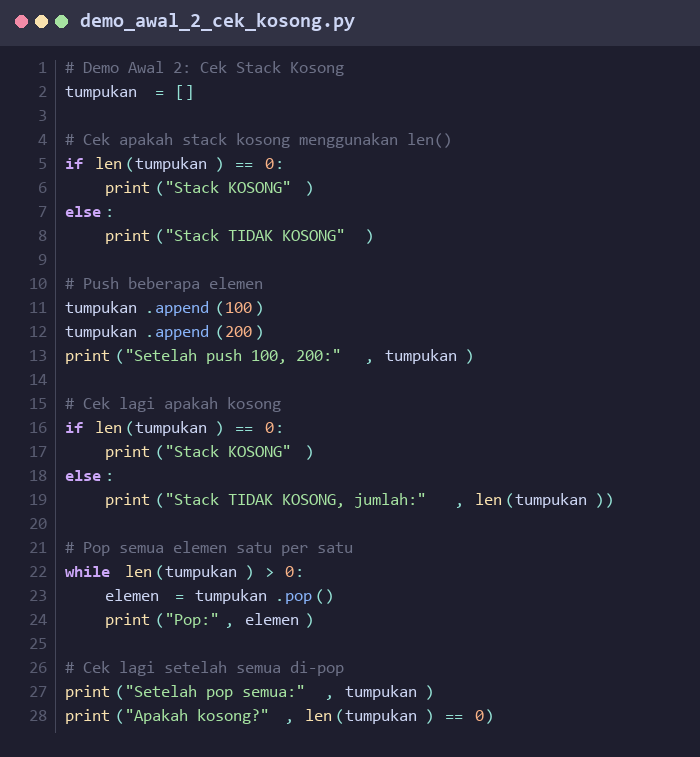
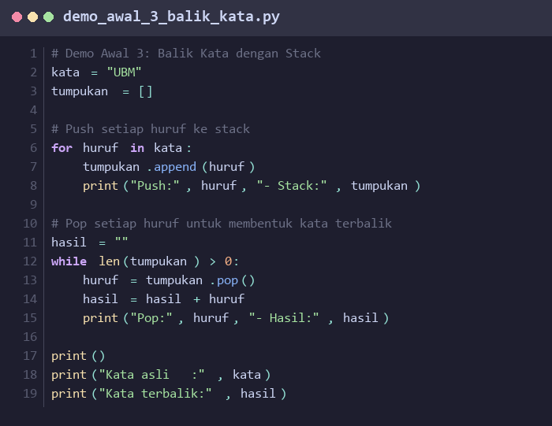
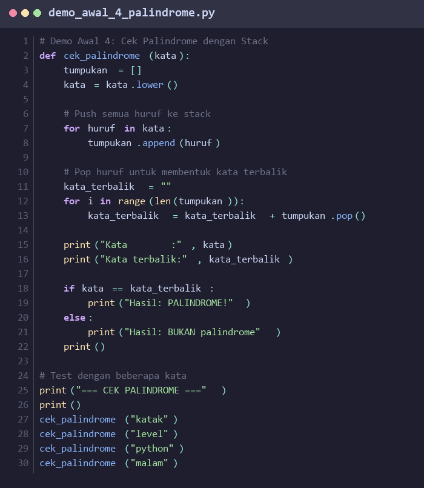

# PERTEMUAN 5-6: STACK BERBASIS ARRAY

## SUMMARY MATERI

### 1. Pengertian Stack

**Stack** (Tumpukan) adalah struktur data linear yang mengikuti prinsip **LIFO (Last In First Out)**, yang berarti elemen yang terakhir masuk akan menjadi yang pertama keluar.

**Analogi:**
- Seperti tumpukan piring: piring yang terakhir ditaruh di atas akan diambil pertama kali
- Seperti tumpukan buku: buku yang paling atas diakses terlebih dahulu

**Karakteristik Stack:**
- Hanya dapat mengakses elemen di bagian **TOP** (puncak)
- Operasi penambahan dan penghapusan hanya dilakukan di satu ujung
- Mengikuti prinsip LIFO (Last In First Out)
- Bersifat linear dan dinamis

### 2. Operasi Dasar Stack

Stack memiliki beberapa operasi fundamental:

| Operasi | Deskripsi | Keterangan |
|---------|-----------|------------|
| `push(el)` | Menambahkan elemen ke puncak stack | Memasukkan elemen baru di TOP |
| `pop()` | Menghapus dan mengembalikan elemen di puncak | Mengeluarkan elemen dari TOP |
| `top()` / `peek()` | Melihat elemen puncak tanpa menghapus | Membaca nilai TOP tanpa mengubah stack |
| `isEmpty()` | Mengecek apakah stack kosong | Return True jika kosong |
| `clear()` | Mengosongkan seluruh stack | Menghapus semua elemen |
| `size()` | Mengembalikan jumlah elemen | Menghitung total elemen dalam stack |

### 3. Implementasi Stack dengan Array

Stack dapat diimplementasikan menggunakan **array** (list dalam Python) dengan cara:

**Variabel yang Dibutuhkan:**
- `pool[]` : Array untuk menyimpan elemen-elemen stack
- `PoolSize` : Variabel integer untuk menyimpan jumlah elemen dalam stack

**Konsep Implementasi:**
- **TOP** = `PoolSize - 1` (indeks elemen terakhir)
- Ketika stack kosong: `PoolSize = 0`
- Ketika stack penuh: `PoolSize = MAX_SIZE` (untuk array statis)

**Ilustrasi:**
```
TOP ↓
[10, 20, 30, 40, 50]
 ↑              ↑
 0              4 (PoolSize-1)
```

### 4. Implementasi Stack di Python

Python menggunakan **List** yang bersifat dinamis, sehingga tidak perlu khawatir tentang ukuran maksimum:

```python
class Stack:
    def __init__(self):
        self.pool = []

    def push(self, element):
        """Menambahkan elemen ke puncak stack"""
        self.pool.append(element)

    def pop(self):
        """Menghapus dan mengembalikan elemen puncak"""
        if self.isEmpty():
            return None
        return self.pool.pop()

    def top(self):
        """Melihat elemen puncak tanpa menghapus"""
        if self.isEmpty():
            return None
        return self.pool[-1]

    def isEmpty(self):
        """Mengecek apakah stack kosong"""
        return len(self.pool) == 0

    def clear(self):
        """Mengosongkan stack"""
        self.pool.clear()

    def size(self):
        """Mengembalikan jumlah elemen"""
        return len(self.pool)
```

### 5. Kompleksitas Waktu Stack

| Operasi | Kompleksitas |
|---------|--------------|
| `push()` | O(1) - Constant |
| `pop()` | O(1) - Constant |
| `top()` | O(1) - Constant |
| `isEmpty()` | O(1) - Constant |
| `size()` | O(1) - Constant |

Semua operasi stack memiliki kompleksitas **O(1)** karena hanya mengakses elemen di satu ujung.

### 6. Aplikasi Stack dalam Pemrograman

Stack digunakan dalam berbagai aplikasi:

1. **Function Call Stack**: Penyimpanan pemanggilan fungsi dalam program
2. **Undo/Redo**: Fitur undo di text editor
3. **Expression Evaluation**: Evaluasi ekspresi matematika (postfix, prefix)
4. **Bracket Matching**: Pengecekan pasangan kurung dalam kode
5. **Backtracking Algorithms**: Algoritma maze solving, DFS
6. **Browser History**: Tombol back pada browser
7. **Syntax Parsing**: Compiler dan interpreter

### 7. Stack vs Array

| Aspek | Stack | Array |
|-------|-------|-------|
| Akses | Hanya TOP | Semua elemen dengan indeks |
| Operasi | push, pop, top | insert, delete, update di mana saja |
| Prinsip | LIFO | Random Access |
| Fleksibilitas | Terbatas | Lebih fleksibel |
| Use Case | Spesifik (undo, recursion) | General purpose |

---

## DEMO PYTHON

> **⚠️ PERATURAN DEMO AWAL:**
> Demo Awal 1-4 di bawah ini ditampilkan sebagai **gambar** (tidak bisa di-copy-paste).
> Mahasiswa **WAJIB mengetik sendiri** kode program secara manual di Python.
> **Dilarang copy-paste!** Tujuannya agar mahasiswa memahami setiap baris kode.

---

### Demo Awal 1: Mengenal Push dan Pop

**Tujuan:** Memahami cara kerja `push` (`append`) dan `pop` pada stack menggunakan list Python.

**Instruksi:** Lihat gambar di bawah, lalu **ketik ulang** kode tersebut di Python dan jalankan.



**Output yang Diharapkan:**
```
Isi tumpukan: [5, 10, 15]
Elemen TOP: 15
Elemen yang di-pop: 15
Isi tumpukan setelah pop: [5, 10]
Jumlah elemen: 2
```

---

### Demo Awal 2: Stack Kosong dan Pengecekan

**Tujuan:** Memahami cara mengecek apakah stack kosong dan menangani pop dari stack kosong.

**Instruksi:** Lihat gambar di bawah, lalu **ketik ulang** kode tersebut di Python dan jalankan.



**Output yang Diharapkan:**
```
Stack KOSONG
Setelah push 100, 200: [100, 200]
Stack TIDAK KOSONG, jumlah: 2
Pop: 200
Pop: 100
Setelah pop semua: []
Apakah kosong? True
```

---

### Demo Awal 3: Membalik Kata dengan Stack

**Tujuan:** Menggunakan prinsip LIFO pada stack untuk membalik urutan huruf dalam sebuah kata.

**Instruksi:** Lihat gambar di bawah, lalu **ketik ulang** kode tersebut di Python dan jalankan.



**Output yang Diharapkan:**
```
Push: U - Stack: ['U']
Push: B - Stack: ['U', 'B']
Push: M - Stack: ['U', 'B', 'M']
Pop: M - Hasil: M
Pop: B - Hasil: MB
Pop: U - Hasil: MBU

Kata asli   : UBM
Kata terbalik: MBU
```

---

### Demo Awal 4: Cek Palindrome dengan Stack

**Tujuan:** Menggunakan stack untuk mengecek apakah sebuah kata adalah **palindrome** (dibaca sama dari depan dan belakang).

**Instruksi:** Lihat gambar di bawah, lalu **ketik ulang** kode tersebut di Python dan jalankan.



**Output yang Diharapkan:**
```
=== CEK PALINDROME ===

Kata        : katak
Kata terbalik: katak
Hasil: PALINDROME!

Kata        : level
Kata terbalik: level
Hasil: PALINDROME!

Kata        : python
Kata terbalik: nohtyp
Hasil: BUKAN palindrome

Kata        : malam
Kata terbalik: malam
Hasil: PALINDROME!
```

---

### Demo 1: Implementasi Dasar Stack

```python
"""
Demo 1: Implementasi Dasar Stack
Demonstrasi class Stack dengan operasi-operasi dasar
"""

class Stack:
    def __init__(self):
        self.pool = []

    def push(self, element):
        """Menambahkan elemen ke puncak stack"""
        self.pool.append(element)
        print(f"  Push: {element}")

    def pop(self):
        """Menghapus dan mengembalikan elemen puncak"""
        if self.isEmpty():
            print("  Stack kosong! Tidak dapat pop.")
            return None
        element = self.pool.pop()
        print(f"  Pop: {element}")
        return element

    def top(self):
        """Melihat elemen puncak tanpa menghapus"""
        if self.isEmpty():
            return None
        return self.pool[-1]

    def isEmpty(self):
        """Mengecek apakah stack kosong"""
        return len(self.pool) == 0

    def clear(self):
        """Mengosongkan stack"""
        self.pool.clear()
        print("  Stack cleared!")

    def size(self):
        """Mengembalikan jumlah elemen"""
        return len(self.pool)

    def display(self):
        """Menampilkan isi stack"""
        if self.isEmpty():
            print("  Stack: []")
        else:
            print(f"  Stack: {self.pool} (TOP: {self.top()})")


print("=" * 50)
print("DEMO 1: IMPLEMENTASI DASAR STACK")
print("=" * 50)

# Membuat stack baru
stack = Stack()
print("\n1. Stack baru (kosong):")
stack.display()
print(f"   isEmpty: {stack.isEmpty()}")
print(f"   Size: {stack.size()}")

# Push beberapa elemen
print("\n2. Push elemen 10, 20, 30:")
stack.push(10)
stack.push(20)
stack.push(30)
stack.display()

# Melihat top
print(f"\n3. Top element: {stack.top()}")
stack.display()

# Pop elemen
print("\n4. Pop 2 elemen:")
stack.pop()
stack.pop()
stack.display()

# Push lagi
print("\n5. Push elemen 40, 50:")
stack.push(40)
stack.push(50)
stack.display()
print(f"   Size: {stack.size()}")

# Clear stack
print("\n6. Clear stack:")
stack.clear()
stack.display()

# Pop dari stack kosong
print("\n7. Coba pop dari stack kosong:")
stack.pop()
```

**Output:**
```
==================================================
DEMO 1: IMPLEMENTASI DASAR STACK
==================================================

1. Stack baru (kosong):
  Stack: []
   isEmpty: True
   Size: 0

2. Push elemen 10, 20, 30:
  Push: 10
  Push: 20
  Push: 30
  Stack: [10, 20, 30] (TOP: 30)

3. Top element: 30
  Stack: [10, 20, 30] (TOP: 30)

4. Pop 2 elemen:
  Pop: 30
  Pop: 20
  Stack: [10] (TOP: 10)

5. Push elemen 40, 50:
  Push: 40
  Push: 50
  Stack: [10, 40, 50] (TOP: 50)
   Size: 3

6. Clear stack:
  Stack cleared!
  Stack: []

7. Coba pop dari stack kosong:
  Stack kosong! Tidak dapat pop.
```

---

### Demo 2: Aplikasi - Bracket Matching

```python
"""
Demo 2: Aplikasi Stack - Bracket Matching
Mengecek apakah pasangan kurung dalam ekspresi valid
"""

class Stack:
    def __init__(self):
        self.pool = []

    def push(self, element):
        self.pool.append(element)

    def pop(self):
        if self.isEmpty():
            return None
        return self.pool.pop()

    def isEmpty(self):
        return len(self.pool) == 0


def is_matching_pair(opening, closing):
    """Mengecek apakah kurung opening dan closing cocok"""
    pairs = {'(': ')', '[': ']', '{': '}'}
    return pairs.get(opening) == closing


def check_brackets(expression):
    """
    Mengecek apakah semua kurung dalam ekspresi seimbang
    Return: (is_valid, message)
    """
    stack = Stack()
    opening_brackets = '([{'
    closing_brackets = ')]}'

    for i, char in enumerate(expression):
        if char in opening_brackets:
            # Push kurung pembuka
            stack.push(char)
            print(f"  Pos {i}: '{char}' → Push ke stack")

        elif char in closing_brackets:
            # Cek kurung penutup
            if stack.isEmpty():
                return False, f"Error di posisi {i}: '{char}' tidak punya pasangan"

            top = stack.pop()
            print(f"  Pos {i}: '{char}' → Pop '{top}' dari stack")

            if not is_matching_pair(top, char):
                return False, f"Error di posisi {i}: '{char}' tidak cocok dengan '{top}'"

    # Cek apakah masih ada kurung yang belum tertutup
    if not stack.isEmpty():
        return False, "Error: Ada kurung pembuka yang belum tertutup"

    return True, "Valid! Semua kurung seimbang"


print("=" * 60)
print("DEMO 2: BRACKET MATCHING DENGAN STACK")
print("=" * 60)

# Test cases
test_cases = [
    "((a + b) * c)",
    "{[a + b] * (c - d)}",
    "((a + b)",
    "{[a + b)]",
    ")(a + b)",
    "{[(a + b) * c] - d}",
]

for i, expr in enumerate(test_cases, 1):
    print(f"\nTest {i}: {expr}")
    print("-" * 60)
    is_valid, message = check_brackets(expr)

    status = "✓ VALID" if is_valid else "✗ INVALID"
    print(f"\nResult: {status}")
    print(f"Message: {message}")
```

**Output:**
```
============================================================
DEMO 2: BRACKET MATCHING DENGAN STACK
============================================================

Test 1: ((a + b) * c)
------------------------------------------------------------
  Pos 0: '(' → Push ke stack
  Pos 1: '(' → Push ke stack
  Pos 6: ')' → Pop '(' dari stack
  Pos 12: ')' → Pop '(' dari stack

Result: ✓ VALID
Message: Valid! Semua kurung seimbang

Test 2: {[a + b] * (c - d)}
------------------------------------------------------------
  Pos 0: '{' → Push ke stack
  Pos 1: '[' → Push ke stack
  Pos 7: ']' → Pop '[' dari stack
  Pos 11: '(' → Push ke stack
  Pos 16: ')' → Pop '(' dari stack
  Pos 17: '}' → Pop '{' dari stack

Result: ✓ VALID
Message: Valid! Semua kurung seimbang

Test 3: ((a + b)
------------------------------------------------------------
  Pos 0: '(' → Push ke stack
  Pos 1: '(' → Push ke stack
  Pos 7: ')' → Pop '(' dari stack

Result: ✗ INVALID
Message: Error: Ada kurung pembuka yang belum tertutup

Test 4: {[a + b)]
------------------------------------------------------------
  Pos 0: '{' → Push ke stack
  Pos 1: '[' → Push ke stack
  Pos 7: ')' → Pop '[' dari stack

Result: ✗ INVALID
Message: Error di posisi 7: ')' tidak cocok dengan '['

Test 5: )(a + b)
------------------------------------------------------------
  Pos 0: ')' → Pop '' dari stack

Result: ✗ INVALID
Message: Error di posisi 0: ')' tidak punya pasangan

Test 6: {[(a + b) * c] - d}
------------------------------------------------------------
  Pos 0: '{' → Push ke stack
  Pos 1: '[' → Push ke stack
  Pos 2: '(' → Push ke stack
  Pos 8: ')' → Pop '(' dari stack
  Pos 13: ']' → Pop '[' dari stack
  Pos 18: '}' → Pop '{' dari stack

Result: ✓ VALID
Message: Valid! Semua kurung seimbang
```

---

### Demo 3: Aplikasi - Konversi Infix ke Postfix

```python
"""
Demo 3: Aplikasi Stack - Konversi Infix ke Postfix
Mengonversi ekspresi matematika dari notasi infix ke postfix
Infix: a + b * c
Postfix: a b c * +
"""

class Stack:
    def __init__(self):
        self.pool = []

    def push(self, element):
        self.pool.append(element)

    def pop(self):
        if self.isEmpty():
            return None
        return self.pool.pop()

    def top(self):
        if self.isEmpty():
            return None
        return self.pool[-1]

    def isEmpty(self):
        return len(self.pool) == 0


def get_precedence(operator):
    """Mengembalikan tingkat prioritas operator"""
    precedence = {'+': 1, '-': 1, '*': 2, '/': 2, '^': 3}
    return precedence.get(operator, 0)


def is_operator(char):
    """Mengecek apakah karakter adalah operator"""
    return char in ['+', '-', '*', '/', '^']


def infix_to_postfix(infix):
    """
    Mengonversi ekspresi infix ke postfix menggunakan stack
    """
    stack = Stack()
    postfix = []

    print(f"\nKonversi: {infix}")
    print("-" * 60)
    print(f"{'Step':<5} {'Token':<8} {'Stack':<20} {'Postfix':<25}")
    print("-" * 60)

    step = 0
    for char in infix:
        # Skip whitespace
        if char == ' ':
            continue

        step += 1

        # Jika operand (huruf atau angka)
        if char.isalnum():
            postfix.append(char)
            print(f"{step:<5} {char:<8} {str(stack.pool):<20} {' '.join(postfix):<25}")

        # Jika kurung buka
        elif char == '(':
            stack.push(char)
            print(f"{step:<5} {char:<8} {str(stack.pool):<20} {' '.join(postfix):<25}")

        # Jika kurung tutup
        elif char == ')':
            while not stack.isEmpty() and stack.top() != '(':
                postfix.append(stack.pop())
            stack.pop()  # Pop '('
            print(f"{step:<5} {char:<8} {str(stack.pool):<20} {' '.join(postfix):<25}")

        # Jika operator
        elif is_operator(char):
            while (not stack.isEmpty() and
                   stack.top() != '(' and
                   get_precedence(stack.top()) >= get_precedence(char)):
                postfix.append(stack.pop())

            stack.push(char)
            print(f"{step:<5} {char:<8} {str(stack.pool):<20} {' '.join(postfix):<25}")

    # Pop semua operator yang tersisa
    while not stack.isEmpty():
        postfix.append(stack.pop())

    print("-" * 60)
    result = ' '.join(postfix)
    print(f"Result: {result}\n")
    return result


print("=" * 60)
print("DEMO 3: KONVERSI INFIX KE POSTFIX")
print("=" * 60)

# Test cases
test_expressions = [
    "a+b*c",
    "a+b*c-d",
    "(a+b)*c",
    "a+b*(c-d)",
    "a+b*c/d-e",
    "((a+b)*c-d)/e",
]

for expr in test_expressions:
    result = infix_to_postfix(expr)
```

**Output:**
```
============================================================
DEMO 3: KONVERSI INFIX KE POSTFIX
============================================================

Konversi: a+b*c
------------------------------------------------------------
Step  Token    Stack                Postfix
------------------------------------------------------------
1     a        []                   a
2     +        ['+']                a
3     b        ['+']                a b
4     *        ['+', '*']           a b
5     c        ['+', '*']           a b c
------------------------------------------------------------
Result: a b c * +


Konversi: a+b*c-d
------------------------------------------------------------
Step  Token    Stack                Postfix
------------------------------------------------------------
1     a        []                   a
2     +        ['+']                a
3     b        ['+']                a b
4     *        ['+', '*']           a b
5     c        ['+', '*']           a b c
6     -        ['-']                a b c * +
7     d        ['-']                a b c * + d
------------------------------------------------------------
Result: a b c * + d -


Konversi: (a+b)*c
------------------------------------------------------------
Step  Token    Stack                Postfix
------------------------------------------------------------
1     (        ['(']
2     a        ['(']                a
3     +        ['(', '+']           a
4     b        ['(', '+']           a b
5     )        []                   a b +
6     *        ['*']                a b +
7     c        ['*']                a b + c
------------------------------------------------------------
Result: a b + c *


Konversi: a+b*(c-d)
------------------------------------------------------------
Step  Token    Stack                Postfix
------------------------------------------------------------
1     a        []                   a
2     +        ['+']                a
3     b        ['+']                a b
4     *        ['+', '*']           a b
5     (        ['+', '*', '(']      a b
6     c        ['+', '*', '(']      a b c
7     -        ['+', '*', '(', '-'] a b c
8     d        ['+', '*', '(', '-'] a b c d
9     )        ['+', '*']           a b c d -
------------------------------------------------------------
Result: a b c d - * +


Konversi: a+b*c/d-e
------------------------------------------------------------
Step  Token    Stack                Postfix
------------------------------------------------------------
1     a        []                   a
2     +        ['+']                a
3     b        ['+']                a b
4     *        ['+', '*']           a b
5     c        ['+', '*']           a b c
6     /        ['+', '/']           a b c *
7     d        ['+', '/']           a b c * d
8     -        ['-']                a b c * d / +
9     e        ['-']                a b c * d / + e
------------------------------------------------------------
Result: a b c * d / + e -


Konversi: ((a+b)*c-d)/e
------------------------------------------------------------
Step  Token    Stack                Postfix
------------------------------------------------------------
1     (        ['(']
2     (        ['(', '(']
3     a        ['(', '(']           a
4     +        ['(', '(', '+']      a
5     b        ['(', '(', '+']      a b
6     )        ['(']                a b +
7     *        ['(', '*']           a b +
8     c        ['(', '*']           a b + c
9     -        ['(', '-']           a b + c *
10    d        ['(', '-']           a b + c * d
11    )        []                   a b + c * d -
12    /        ['/']                a b + c * d -
13    e        ['/']                a b + c * d - e
------------------------------------------------------------
Result: a b + c * d - e /
```

---

### Demo 4: Aplikasi - Reverse String

```python
"""
Demo 4: Aplikasi Stack - Membalik String
Menggunakan stack untuk membalik urutan karakter
"""

class Stack:
    def __init__(self):
        self.pool = []

    def push(self, element):
        self.pool.append(element)

    def pop(self):
        if self.isEmpty():
            return None
        return self.pool.pop()

    def isEmpty(self):
        return len(self.pool) == 0


def reverse_string(text):
    """Membalik string menggunakan stack"""
    stack = Stack()

    print(f"\nOriginal: '{text}'")
    print("\nProses:")

    # Push semua karakter ke stack
    print("1. Push karakter ke stack:")
    for char in text:
        stack.push(char)
        print(f"   Push: '{char}' → Stack: {stack.pool}")

    # Pop semua karakter untuk membuat string terbalik
    print("\n2. Pop karakter dari stack:")
    reversed_text = ""
    while not stack.isEmpty():
        char = stack.pop()
        reversed_text += char
        print(f"   Pop: '{char}' → Result so far: '{reversed_text}'")

    print(f"\nReversed: '{reversed_text}'")
    return reversed_text


print("=" * 60)
print("DEMO 4: REVERSE STRING DENGAN STACK")
print("=" * 60)

# Test cases
test_strings = [
    "HELLO",
    "Python",
    "12345",
]

for text in test_strings:
    reverse_string(text)
    print()
```

**Output:**
```
============================================================
DEMO 4: REVERSE STRING DENGAN STACK
============================================================

Original: 'HELLO'

Proses:
1. Push karakter ke stack:
   Push: 'H' → Stack: ['H']
   Push: 'E' → Stack: ['H', 'E']
   Push: 'L' → Stack: ['H', 'E', 'L']
   Push: 'L' → Stack: ['H', 'E', 'L', 'L']
   Push: 'O' → Stack: ['H', 'E', 'L', 'L', 'O']

2. Pop karakter dari stack:
   Pop: 'O' → Result so far: 'O'
   Pop: 'L' → Result so far: 'OL'
   Pop: 'L' → Result so far: 'OLL'
   Pop: 'E' → Result so far: 'OLLE'
   Pop: 'H' → Result so far: 'OLLEH'

Reversed: 'OLLEH'


Original: 'Python'

Proses:
1. Push karakter ke stack:
   Push: 'P' → Stack: ['P']
   Push: 'y' → Stack: ['P', 'y']
   Push: 't' → Stack: ['P', 'y', 't']
   Push: 'h' → Stack: ['P', 'y', 't', 'h']
   Push: 'o' → Stack: ['P', 'y', 't', 'h', 'o']
   Push: 'n' → Stack: ['P', 'y', 't', 'h', 'o', 'n']

2. Pop karakter dari stack:
   Pop: 'n' → Result so far: 'n'
   Pop: 'o' → Result so far: 'no'
   Pop: 'h' → Result so far: 'noh'
   Pop: 't' → Result so far: 'noht'
   Pop: 'y' → Result so far: 'nohty'
   Pop: 'P' → Result so far: 'nohtyP'

Reversed: 'nohtyP'


Original: '12345'

Proses:
1. Push karakter ke stack:
   Push: '1' → Stack: ['1']
   Push: '2' → Stack: ['1', '2']
   Push: '3' → Stack: ['1', '2', '3']
   Push: '4' → Stack: ['1', '2', '3', '4']
   Push: '5' → Stack: ['1', '2', '3', '4', '5']

2. Pop karakter dari stack:
   Pop: '5' → Result so far: '5'
   Pop: '4' → Result so far: '54'
   Pop: '3' → Result so far: '543'
   Pop: '2' → Result so far: '5432'
   Pop: '1' → Result so far: '54321'

Reversed: '54321'
```

---

## CARA MENJALANKAN DEMO

Semua file demo dapat dijalankan langsung menggunakan Python.

### Persiapan Awal

1. **Pastikan Python sudah terinstall**
   ```bash
   python --version
   ```

2. **Navigasi ke folder pert5-6**
   ```bash
   cd d:\_CodeDev\strukturdatadanalgoritma\pert5-6
   ```

### Menjalankan Demo

1. **Demo 1 - Implementasi Dasar Stack**
   ```bash
   python demo1_stack_basic.py
   ```
   Yang akan ditampilkan:
   - Operasi push, pop, top
   - Display isi stack
   - Size dan isEmpty
   - Clear stack

2. **Demo 2 - Bracket Matching**
   ```bash
   python demo2_bracket_matching.py
   ```
   Yang akan ditampilkan:
   - Validasi pasangan kurung
   - Proses push/pop untuk setiap kurung
   - Test cases valid dan invalid

3. **Demo 3 - Infix ke Postfix**
   ```bash
   python demo3_infix_to_postfix.py
   ```
   Yang akan ditampilkan:
   - Konversi ekspresi matematika
   - Step-by-step proses konversi
   - Isi stack di setiap langkah

4. **Demo 4 - Reverse String**
   ```bash
   python demo4_reverse_string.py
   ```
   Yang akan ditampilkan:
   - Proses push karakter
   - Proses pop karakter
   - String hasil pembalikan

---

## LATIHAN SOAL

### Soal 1: Sistem Undo untuk Text Editor

**Deskripsi:**
Buatlah simulator text editor sederhana yang mengimplementasikan fitur **Undo** menggunakan Stack.

**Spesifikasi:**

1. Buatlah class `TextEditor` yang memiliki:
   - `text` (string): Teks saat ini
   - `history` (Stack): Stack untuk menyimpan history perubahan

2. Implementasikan fungsi-fungsi berikut:
   - `write(text)`: Menambahkan teks
   - `undo()`: Membatalkan perubahan terakhir
   - `show()`: Menampilkan teks saat ini

3. Setiap kali melakukan `write()`, simpan state sebelumnya ke stack

**Contoh Output yang Diharapkan:**
```
=== TEXT EDITOR DENGAN UNDO ===

1. Write: "Hello"
   Text: Hello

2. Write: " World"
   Text: Hello World

3. Write: "!"
   Text: Hello World!

4. Undo
   Text: Hello World

5. Undo
   Text: Hello

6. Write: " Python"
   Text: Hello Python

7. Undo
   Text: Hello
```

**Hint:** Setiap kali write(), push state lama ke stack. Saat undo(), pop dari stack.

---

### Soal 2: Evaluasi Ekspresi Postfix

**Deskripsi:**
Buatlah program untuk mengevaluasi (menghitung hasil) ekspresi **postfix** menggunakan Stack.

**Spesifikasi:**

1. Program menerima input ekspresi postfix (contoh: "5 3 + 2 *")
2. Gunakan stack untuk evaluasi:
   - Jika angka: push ke stack
   - Jika operator: pop 2 angka, hitung, push hasil
3. Tampilkan proses step-by-step

**Contoh Input dan Output:**
```
=== EVALUASI POSTFIX ===

Expression: 5 3 + 2 *

Step-by-step:
1. Token: 5 → Push 5 → Stack: [5]
2. Token: 3 → Push 3 → Stack: [5, 3]
3. Token: + → Pop 3, 5 → Calculate 5+3=8 → Push 8 → Stack: [8]
4. Token: 2 → Push 2 → Stack: [8, 2]
5. Token: * → Pop 2, 8 → Calculate 8*2=16 → Push 16 → Stack: [16]

Result: 16
```

**Test Cases:**
- "5 3 +" → 8
- "5 3 + 2 *" → 16
- "15 7 1 1 + - / 3 * 2 1 1 + + -" → 5

**Hint:** Split string dengan space, iterasi setiap token, gunakan stack untuk operand.

---

## TIPS PENGERJAAN

1. **Pahami prinsip LIFO**: Elemen terakhir masuk akan keluar pertama
2. **Gunakan list Python**: `append()` untuk push, `pop()` untuk pop
3. **Selalu cek isEmpty()**: Sebelum pop atau top, cek apakah stack kosong
4. **Debug dengan print**: Tampilkan isi stack di setiap langkah
5. **Test edge cases**: Stack kosong, stack dengan 1 elemen, dll

**Selamat mengerjakan! 🚀**

---

*Catatan: File ini merupakan bagian dari materi Struktur Data dan Algoritma - Pertemuan 5-6*
