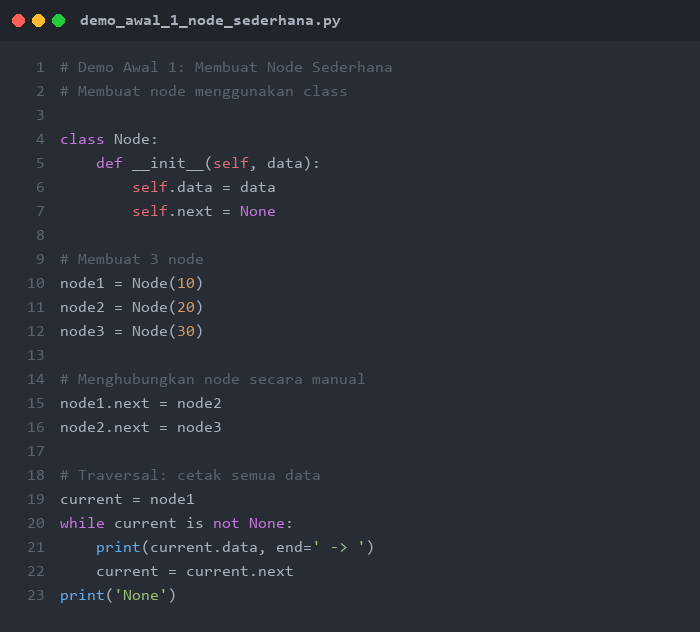
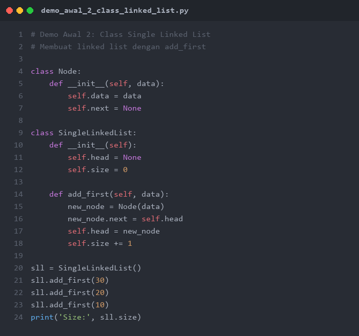
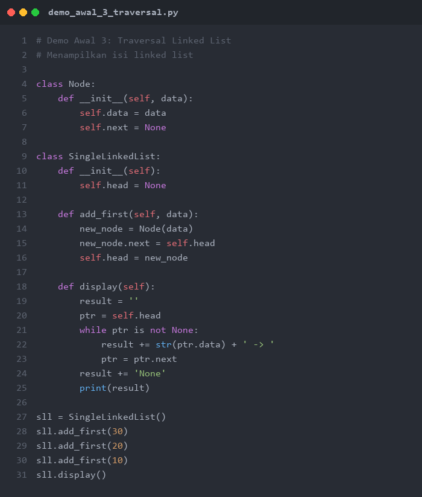
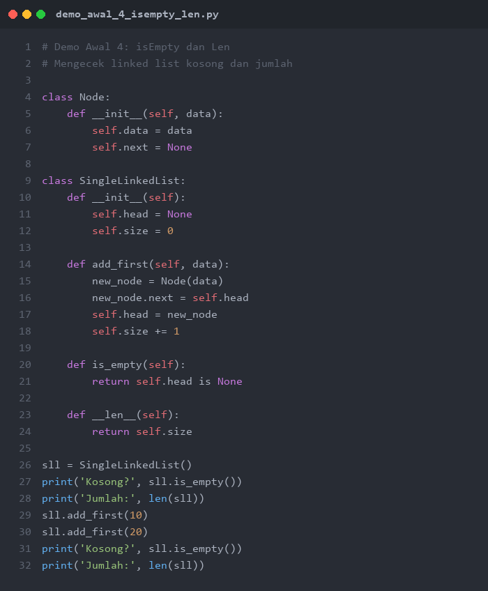

# PERTEMUAN 9-10: SINGLE LINKED LIST - KONSEP DAN PEMBUATAN

## SUMMARY MATERI

### 1. Pengertian Linked List

**Linked List** (Senarai) adalah struktur data linear yang terdiri dari urutan elemen (node/simpul) yang saling terhubung melalui **pointer/reference**. Berbeda dengan array yang menyimpan data secara berurutan di memori, linked list menyimpan data di lokasi memori yang berbeda-beda dan dihubungkan melalui link.

**Analogi:**
- Seperti gerbong kereta: setiap gerbong (node) terhubung ke gerbong berikutnya
- Seperti rantai: setiap mata rantai terhubung ke mata rantai berikutnya
- Seperti treasure hunt: setiap clue menunjuk ke lokasi clue berikutnya

**Komponen Node:**
- **Data/Information**: Menyimpan nilai atau informasi
- **Next/Link**: Menyimpan referensi (alamat) ke node berikutnya

```
Node = [Data | Next] --> [Data | Next] --> [Data | Next] --> None
```

### 2. Dua Variabel Penting Linked List

| Variabel | Fungsi |
|----------|--------|
| **Head/Kepala** | Menyimpan referensi ke node pertama dalam linked list |
| **Current/Pointer** | Menyimpan referensi ke node yang sedang diakses |

**PENTING:** Head adalah variabel paling krusial! Dengan Head, kita dapat menuju ke node pertama dan bergerak maju ke node tujuan. **Jika Head hilang, seluruh linked list hilang!**

> **"Never ever lose your HEAD!!!"**

### 3. Variants Linked List

| Jenis | Deskripsi |
|-------|-----------|
| **Single Linked List** | Setiap node memiliki satu link (next) |
| **Double Linked List** | Setiap node memiliki dua link (prev dan next) |
| **Circular Linked List** | Node terakhir menunjuk kembali ke node pertama |
| **Multilevel List** | Node memiliki link ke level/tingkat berbeda |

### 4. Single Linked List

**Single Linked List** adalah linked list dimana setiap node hanya memiliki **satu link (next)** yang menunjuk ke node berikutnya.

```
Head --> [10|*] --> [20|*] --> [30|*] --> None
```

**Karakteristik:**
- Tiap node memiliki alamat memori dan link next yang berisi alamat node berikutnya
- Head selalu menunjuk ke node pertama
- Node terakhir memiliki next = None (penanda akhir list)
- Traversal hanya bisa dilakukan **satu arah** (maju/forward)

### 5. Class dan Object di Python

Pada Python, Single Linked List dibuat menggunakan **Class** dan **Object**.

**Class** adalah blueprint/template untuk membuat objek. Class mendefinisikan atribut dan metode.

**Object** adalah instansi konkret dari suatu class.

```python
# Contoh sederhana class dan object
class Kendaraan:
    def __init__(self, jenis, roda):
        self.jenis = jenis
        self.roda = roda

    def info(self):
        print(f"Jenis: {self.jenis}, Roda: {self.roda}")

# Membuat object
mobil = Kendaraan("Mobil", 4)
sepeda = Kendaraan("Sepeda", 2)
```

### 6. Membuat Single Linked List di Python

**Langkah-langkah:**
1. Buat class `Node` untuk merepresentasikan simpul
2. Buat class `SingleLinkedList` untuk mengelola linked list
3. Implementasikan operasi dasar (add_first, display, len)

```python
class SingleLinkedList:
    class _Node:
        def __init__(self, element, next_node=None):
            self.element = element
            self.next_node = next_node

    def __init__(self):
        self._head = None
        self._size = 0
```

**Operasi Dasar:**

| Operasi | Deskripsi |
|---------|-----------|
| `add_first(data)` | Menambahkan node baru di awal list |
| `display()` | Menampilkan semua elemen dalam list |
| `is_empty()` | Mengecek apakah list kosong |
| `__len__()` | Mengembalikan jumlah elemen |

### 7. Proses Add First

**Langkah-langkah Add First:**
1. Buat node baru
2. Arahkan next node baru ke Head (node pertama saat ini)
3. Ubah Head agar menunjuk ke node baru
4. Tambah size + 1

```
Sebelum: Head --> [10|*] --> [20|*] --> None

Add First (5):
1. Buat node baru [5|*]
2. [5|*] --> [10|*] --> [20|*] --> None
3. Head --> [5|*] --> [10|*] --> [20|*] --> None
```

### 8. Proses Traversal (Display)

**Traversal** adalah proses mengunjungi setiap node dari Head sampai None.

```
Langkah:
1. ptr = Head (arahkan pointer ke Head)
2. Selama ptr != None:
   - Cetak ptr.data
   - ptr = ptr.next (pindah ke node berikutnya)
```

### 9. Linked List vs Array

| Aspek | Linked List | Array |
|-------|-------------|-------|
| Ukuran | Dinamis | Statis (Python: dinamis) |
| Memori | Tersebar | Berurutan |
| Insert di awal | O(1) | O(n) |
| Akses elemen ke-i | O(n) | O(1) |
| Penggunaan memori | Lebih banyak (data + pointer) | Lebih sedikit |
| Insert/Delete di tengah | Efisien (ubah pointer) | Perlu geser elemen |

---

## DEMO PYTHON

> **PERATURAN DEMO AWAL:**
> Demo Awal 1-4 di bawah ini ditampilkan sebagai **gambar** (tidak bisa di-copy-paste).
> Mahasiswa **WAJIB mengetik sendiri** kode program secara manual di Python.
> **Dilarang copy-paste!** Tujuannya agar mahasiswa memahami setiap baris kode.

---

### Demo Awal 1: Membuat Node Sederhana

**Tujuan:** Memahami cara membuat node menggunakan class dan menghubungkan node secara manual.

**Instruksi:** Lihat gambar di bawah, lalu **ketik ulang** kode tersebut di Python dan jalankan.



**Output yang Diharapkan:**
```
10 -> 20 -> 30 -> None
```

---

### Demo Awal 2: Class Single Linked List dengan Add First

**Tujuan:** Memahami cara membuat class SingleLinkedList dan operasi add_first.

**Instruksi:** Lihat gambar di bawah, lalu **ketik ulang** kode tersebut di Python dan jalankan.



**Output yang Diharapkan:**
```
Size: 3
```

---

### Demo Awal 3: Traversal Linked List

**Tujuan:** Memahami cara melakukan traversal (penelusuran) untuk menampilkan semua elemen.

**Instruksi:** Lihat gambar di bawah, lalu **ketik ulang** kode tersebut di Python dan jalankan.



**Output yang Diharapkan:**
```
10 -> 20 -> 30 -> None
```

---

### Demo Awal 4: isEmpty dan Len

**Tujuan:** Memahami cara mengecek apakah linked list kosong dan menghitung jumlah elemen.

**Instruksi:** Lihat gambar di bawah, lalu **ketik ulang** kode tersebut di Python dan jalankan.



**Output yang Diharapkan:**
```
Kosong? True
Jumlah: 0
Kosong? False
Jumlah: 2
```

---

### Demo 1: Implementasi Lengkap Single Linked List

```python
"""
Demo 1: Implementasi Lengkap Single Linked List
Demonstrasi class SingleLinkedList dengan operasi dasar
"""

class Node:
    def __init__(self, data):
        self.data = data
        self.next = None

class SingleLinkedList:
    def __init__(self):
        self.head = None
        self.size = 0

    def add_first(self, data):
        """Menambahkan node baru di awal linked list"""
        new_node = Node(data)
        new_node.next = self.head
        self.head = new_node
        self.size += 1
        print(f"  Add First: {data}")

    def display(self):
        """Menampilkan seluruh isi linked list"""
        if self.is_empty():
            print("  Linked List: [kosong]")
            return
        result = "  Linked List: "
        ptr = self.head
        while ptr is not None:
            result += str(ptr.data) + " -> "
            ptr = ptr.next
        result += "None"
        print(result)

    def is_empty(self):
        """Mengecek apakah linked list kosong"""
        return self.head is None

    def __len__(self):
        """Mengembalikan jumlah elemen"""
        return self.size

    def get_first(self):
        """Melihat data node pertama"""
        if self.is_empty():
            return None
        return self.head.data

    def get_last(self):
        """Melihat data node terakhir"""
        if self.is_empty():
            return None
        ptr = self.head
        while ptr.next is not None:
            ptr = ptr.next
        return ptr.data


print("=" * 60)
print("DEMO 1: IMPLEMENTASI LENGKAP SINGLE LINKED LIST")
print("=" * 60)

# Membuat linked list baru
sll = SingleLinkedList()
print("\n1. Linked list baru (kosong):")
sll.display()
print(f"   isEmpty: {sll.is_empty()}")
print(f"   Size: {len(sll)}")

# Add First beberapa elemen
print("\n2. Add First 30, 20, 10:")
sll.add_first(30)
sll.add_first(20)
sll.add_first(10)
sll.display()

# Cek first dan last
print(f"\n3. First: {sll.get_first()}, Last: {sll.get_last()}")
print(f"   Size: {len(sll)}")

# Add First lagi
print("\n4. Add First 5:")
sll.add_first(5)
sll.display()
print(f"   Size: {len(sll)}")

# Cek isEmpty
print(f"\n5. isEmpty: {sll.is_empty()}")
```

**Output:**
```
============================================================
DEMO 1: IMPLEMENTASI LENGKAP SINGLE LINKED LIST
============================================================

1. Linked list baru (kosong):
  Linked List: [kosong]
   isEmpty: True
   Size: 0

2. Add First 30, 20, 10:
  Add First: 30
  Add First: 20
  Add First: 10
  Linked List: 10 -> 20 -> 30 -> None

3. First: 10, Last: 30
   Size: 3

4. Add First 5:
  Add First: 5
  Linked List: 5 -> 10 -> 20 -> 30 -> None
   Size: 4

5. isEmpty: False
```

---

### Demo 2: Linked List Data Mahasiswa

```python
"""
Demo 2: Linked List Data Mahasiswa
Menggunakan linked list untuk menyimpan data mahasiswa (record)
"""

class MahasiswaNode:
    def __init__(self, nama, nim, nilai):
        self.nama = nama
        self.nim = nim
        self.nilai = nilai
        self.next = None

    def __str__(self):
        return f"{self.nim} - {self.nama} (Nilai: {self.nilai})"


class DaftarMahasiswa:
    def __init__(self):
        self.head = None
        self.size = 0

    def tambah_awal(self, nama, nim, nilai):
        """Menambahkan mahasiswa di awal daftar"""
        new_node = MahasiswaNode(nama, nim, nilai)
        new_node.next = self.head
        self.head = new_node
        self.size += 1
        print(f"  Ditambahkan: {nim} - {nama}")

    def tampilkan(self):
        """Menampilkan seluruh daftar mahasiswa"""
        if self.head is None:
            print("  Daftar kosong!")
            return

        print(f"\n  {'No':<4} {'NIM':<12} {'Nama':<20} {'Nilai':<8}")
        print("  " + "-" * 44)

        ptr = self.head
        no = 1
        while ptr is not None:
            print(f"  {no:<4} {ptr.nim:<12} {ptr.nama:<20} {ptr.nilai:<8}")
            ptr = ptr.next
            no += 1

        print(f"\n  Total mahasiswa: {self.size}")

    def cari_nim(self, nim):
        """Mencari mahasiswa berdasarkan NIM"""
        ptr = self.head
        while ptr is not None:
            if ptr.nim == nim:
                return ptr
            ptr = ptr.next
        return None

    def rata_rata_nilai(self):
        """Menghitung rata-rata nilai"""
        if self.head is None:
            return 0
        total = 0
        ptr = self.head
        while ptr is not None:
            total += ptr.nilai
            ptr = ptr.next
        return total / self.size

    def nilai_tertinggi(self):
        """Mencari mahasiswa dengan nilai tertinggi"""
        if self.head is None:
            return None
        terbaik = self.head
        ptr = self.head.next
        while ptr is not None:
            if ptr.nilai > terbaik.nilai:
                terbaik = ptr
            ptr = ptr.next
        return terbaik


print("=" * 60)
print("DEMO 2: LINKED LIST DATA MAHASISWA")
print("=" * 60)

daftar = DaftarMahasiswa()

# Menambahkan data mahasiswa
print("\n1. Menambahkan data mahasiswa:")
daftar.tambah_awal("Eka Putri", "2024005", 88)
daftar.tambah_awal("Doni Pratama", "2024004", 75)
daftar.tambah_awal("Citra Dewi", "2024003", 92)
daftar.tambah_awal("Ani Wijaya", "2024002", 85)
daftar.tambah_awal("Budi Santoso", "2024001", 78)

# Tampilkan daftar
print("\n2. Daftar mahasiswa:")
daftar.tampilkan()

# Cari mahasiswa
print("\n3. Cari NIM 2024003:")
mhs = daftar.cari_nim("2024003")
if mhs:
    print(f"  Ditemukan: {mhs}")
else:
    print("  Tidak ditemukan")

# Statistik
print(f"\n4. Rata-rata nilai: {daftar.rata_rata_nilai():.2f}")

terbaik = daftar.nilai_tertinggi()
print(f"5. Nilai tertinggi: {terbaik}")
```

**Output:**
```
============================================================
DEMO 2: LINKED LIST DATA MAHASISWA
============================================================

1. Menambahkan data mahasiswa:
  Ditambahkan: 2024005 - Eka Putri
  Ditambahkan: 2024004 - Doni Pratama
  Ditambahkan: 2024003 - Citra Dewi
  Ditambahkan: 2024002 - Ani Wijaya
  Ditambahkan: 2024001 - Budi Santoso

2. Daftar mahasiswa:

  No   NIM          Nama                 Nilai
  --------------------------------------------
  1    2024001      Budi Santoso         78
  2    2024002      Ani Wijaya           85
  3    2024003      Citra Dewi           92
  4    2024004      Doni Pratama         75
  5    2024005      Eka Putri            88

  Total mahasiswa: 5

3. Cari NIM 2024003:
  Ditemukan: 2024003 - Citra Dewi (Nilai: 92)

4. Rata-rata nilai: 83.60
5. Nilai tertinggi: 2024003 - Citra Dewi (Nilai: 92)
```

---

### Demo 3: Search / Locate Node

```python
"""
Demo 3: Search / Locate Node pada Single Linked List
Demonstrasi pencarian node berdasarkan nilai dan posisi
"""

class Node:
    def __init__(self, data):
        self.data = data
        self.next = None


class SingleLinkedList:
    def __init__(self):
        self.head = None
        self.size = 0

    def add_first(self, data):
        new_node = Node(data)
        new_node.next = self.head
        self.head = new_node
        self.size += 1

    def display(self):
        result = "  "
        ptr = self.head
        while ptr:
            result += str(ptr.data) + " -> "
            ptr = ptr.next
        result += "None"
        print(result)

    def search(self, target):
        """Mencari node dengan nilai tertentu"""
        ptr = self.head
        position = 0

        print(f"\n  Mencari nilai: {target}")
        while ptr is not None:
            print(f"    Cek posisi {position}: data = {ptr.data}", end="")
            if ptr.data == target:
                print(f" --> DITEMUKAN!")
                return position
            print()
            ptr = ptr.next
            position += 1

        print(f"    Nilai {target} TIDAK ditemukan!")
        return -1

    def get_at(self, position):
        """Mengambil data pada posisi tertentu"""
        if position < 0 or position >= self.size:
            print(f"  Error: Posisi {position} di luar jangkauan!")
            return None

        ptr = self.head
        for i in range(position):
            ptr = ptr.next

        print(f"  Data pada posisi {position}: {ptr.data}")
        return ptr.data

    def count_occurrences(self, target):
        """Menghitung berapa kali nilai muncul"""
        count = 0
        ptr = self.head
        while ptr is not None:
            if ptr.data == target:
                count += 1
            ptr = ptr.next
        return count


print("=" * 60)
print("DEMO 3: SEARCH / LOCATE NODE")
print("=" * 60)

sll = SingleLinkedList()
data = [15, 30, 10, 25, 30, 20, 30]
for d in reversed(data):
    sll.add_first(d)

print("\n1. Isi Linked List:")
sll.display()

# Search by value
print("\n2. Search nilai 25:")
pos = sll.search(25)
if pos >= 0:
    print(f"  Hasil: Ditemukan di posisi {pos}")

print("\n3. Search nilai 99:")
pos = sll.search(99)
if pos < 0:
    print(f"  Hasil: Tidak ditemukan")

# Get at position
print("\n4. Akses berdasarkan posisi:")
sll.get_at(0)
sll.get_at(3)
sll.get_at(6)
sll.get_at(10)

# Count occurrences
print(f"\n5. Jumlah kemunculan nilai 30: {sll.count_occurrences(30)} kali")
print(f"   Jumlah kemunculan nilai 10: {sll.count_occurrences(10)} kali")
print(f"   Jumlah kemunculan nilai 50: {sll.count_occurrences(50)} kali")
```

**Output:**
```
============================================================
DEMO 3: SEARCH / LOCATE NODE
============================================================

1. Isi Linked List:
  15 -> 30 -> 10 -> 25 -> 30 -> 20 -> 30 -> None

2. Search nilai 25:

  Mencari nilai: 25
    Cek posisi 0: data = 15
    Cek posisi 1: data = 30
    Cek posisi 2: data = 10
    Cek posisi 3: data = 25 --> DITEMUKAN!
  Hasil: Ditemukan di posisi 3

3. Search nilai 99:

  Mencari nilai: 99
    Cek posisi 0: data = 15
    Cek posisi 1: data = 30
    Cek posisi 2: data = 10
    Cek posisi 3: data = 25
    Cek posisi 4: data = 30
    Cek posisi 5: data = 20
    Cek posisi 6: data = 30
    Nilai 99 TIDAK ditemukan!
  Hasil: Tidak ditemukan

4. Akses berdasarkan posisi:
  Data pada posisi 0: 15
  Data pada posisi 3: 25
  Data pada posisi 6: 30
  Error: Posisi 10 di luar jangkauan!

5. Jumlah kemunculan nilai 30: 3 kali
   Jumlah kemunculan nilai 10: 1 kali
   Jumlah kemunculan nilai 50: 0 kali
```

---

### Demo 4: Add Last (Append)

```python
"""
Demo 4: Add Last (Append) pada Single Linked List
Menambahkan node baru di akhir linked list
"""

class Node:
    def __init__(self, data):
        self.data = data
        self.next = None


class SingleLinkedList:
    def __init__(self):
        self.head = None
        self.size = 0

    def add_first(self, data):
        """Menambahkan di awal"""
        new_node = Node(data)
        new_node.next = self.head
        self.head = new_node
        self.size += 1
        print(f"  Add First: {data}")

    def add_last(self, data):
        """Menambahkan di akhir linked list"""
        new_node = Node(data)

        if self.head is None:
            # Jika list kosong, node baru jadi head
            self.head = new_node
        else:
            # Traversal sampai node terakhir
            ptr = self.head
            while ptr.next is not None:
                ptr = ptr.next
            # Hubungkan node terakhir ke node baru
            ptr.next = new_node

        self.size += 1
        print(f"  Add Last: {data}")

    def display(self):
        if self.head is None:
            print("  Linked List: [kosong]")
            return
        result = "  Linked List: "
        ptr = self.head
        while ptr:
            result += str(ptr.data) + " -> "
            ptr = ptr.next
        result += "None"
        print(result)

    def __len__(self):
        return self.size


print("=" * 60)
print("DEMO 4: ADD LAST (APPEND)")
print("=" * 60)

sll = SingleLinkedList()

# Add Last pada list kosong
print("\n1. Add Last pada list kosong:")
sll.add_last(10)
sll.display()

# Add Last beberapa elemen
print("\n2. Add Last 20, 30, 40:")
sll.add_last(20)
sll.add_last(30)
sll.add_last(40)
sll.display()

# Kombinasi Add First dan Add Last
print("\n3. Kombinasi - Add First 5, Add Last 50:")
sll.add_first(5)
sll.add_last(50)
sll.display()

# Hasil akhir
print(f"\n4. Total elemen: {len(sll)}")
sll.display()

# Perbandingan
print("\n5. Perbandingan Add First vs Add Last:")
print("   Add First: O(1) - Langsung masuk di depan")
print("   Add Last : O(n) - Harus traversal sampai akhir")
```

**Output:**
```
============================================================
DEMO 4: ADD LAST (APPEND)
============================================================

1. Add Last pada list kosong:
  Add Last: 10
  Linked List: 10 -> None

2. Add Last 20, 30, 40:
  Add Last: 20
  Add Last: 30
  Add Last: 40
  Linked List: 10 -> 20 -> 30 -> 40 -> None

3. Kombinasi - Add First 5, Add Last 50:
  Add First: 5
  Add Last: 50
  Linked List: 5 -> 10 -> 20 -> 30 -> 40 -> 50 -> None

4. Total elemen: 6
  Linked List: 5 -> 10 -> 20 -> 30 -> 40 -> 50 -> None

5. Perbandingan Add First vs Add Last:
   Add First: O(1) - Langsung masuk di depan
   Add Last : O(n) - Harus traversal sampai akhir
```

---

## CARA MENJALANKAN DEMO

Semua file demo dapat dijalankan langsung menggunakan Python.

### Persiapan Awal

1. **Pastikan Python sudah terinstall**
   ```bash
   python --version
   ```

2. **Navigasi ke folder pert9-10**
   ```bash
   cd d:\_CodeDev\strukturdatadanalgoritma\pert9-10
   ```

### Menjalankan Demo

1. **Demo 1 - Implementasi Lengkap Single Linked List**
   ```bash
   python demo1_single_linked_list.py
   ```
   Yang akan ditampilkan:
   - Operasi add_first, display, is_empty
   - Get first dan get last
   - Ukuran linked list

2. **Demo 2 - Linked List Data Mahasiswa**
   ```bash
   python demo2_data_mahasiswa.py
   ```
   Yang akan ditampilkan:
   - Linked list dengan data record mahasiswa
   - Pencarian berdasarkan NIM
   - Statistik nilai (rata-rata, tertinggi)

3. **Demo 3 - Search / Locate Node**
   ```bash
   python demo3_search_locate.py
   ```
   Yang akan ditampilkan:
   - Pencarian node berdasarkan nilai
   - Akses node berdasarkan posisi
   - Menghitung kemunculan nilai

4. **Demo 4 - Add Last (Append)**
   ```bash
   python demo4_add_last.py
   ```
   Yang akan ditampilkan:
   - Menambahkan node di akhir linked list
   - Kombinasi add_first dan add_last
   - Perbandingan kompleksitas

---

## LATIHAN SOAL

### Soal 1: Daftar Belanja dengan Linked List

**Deskripsi:**
Buatlah program daftar belanja (shopping list) menggunakan Single Linked List.

**Spesifikasi:**

1. Buatlah class `ItemNode` dengan atribut:
   - `nama` (string): Nama barang
   - `jumlah` (int): Jumlah yang dibeli
   - `harga` (int): Harga per item
   - `next`: Pointer ke node berikutnya

2. Buatlah class `DaftarBelanja` dengan fungsi:
   - `tambah_awal(nama, jumlah, harga)`: Menambahkan item di awal
   - `tambah_akhir(nama, jumlah, harga)`: Menambahkan item di akhir
   - `tampilkan()`: Menampilkan daftar belanja dalam bentuk tabel
   - `total_belanja()`: Menghitung total harga seluruh belanjaan
   - `cari_item(nama)`: Mencari item berdasarkan nama

**Contoh Output yang Diharapkan:**
```
=== DAFTAR BELANJA ===

1. Tambah item:
   + Beras (2 x Rp 65000)
   + Minyak Goreng (1 x Rp 28000)
   + Telur (2 x Rp 30000)
   + Gula (1 x Rp 18000)

2. Daftar Belanja:
   No  Nama              Jumlah  Harga      Subtotal
   --------------------------------------------------
   1   Beras             2       Rp 65000   Rp 130000
   2   Minyak Goreng     1       Rp 28000   Rp 28000
   3   Telur             2       Rp 30000   Rp 60000
   4   Gula              1       Rp 18000   Rp 18000

   Total Belanja: Rp 236000

3. Cari "Telur": Ditemukan (2 x Rp 30000)
   Cari "Susu" : Tidak ditemukan
```

---

### Soal 2: Antrian Mahasiswa Bimbingan

**Deskripsi:**
Buatlah sistem antrian mahasiswa untuk bimbingan skripsi menggunakan Single Linked List. Mahasiswa ditambahkan di akhir antrian (add_last) dan dilayani dari depan (FIFO).

**Spesifikasi:**

1. Buatlah class `MahasiswaNode` dengan atribut:
   - `nama` (string): Nama mahasiswa
   - `nim` (string): NIM
   - `topik` (string): Topik bimbingan
   - `next`: Pointer ke node berikutnya

2. Buatlah class `AntrianBimbingan` dengan fungsi:
   - `daftar(nama, nim, topik)`: Menambahkan mahasiswa ke antrian (add_last)
   - `panggil()`: Memanggil mahasiswa pertama (hapus head)
   - `tampilkan()`: Menampilkan daftar antrian
   - `cari_mahasiswa(nim)`: Mencari posisi mahasiswa dalam antrian
   - `jumlah_antrian()`: Mengembalikan jumlah mahasiswa dalam antrian

**Contoh Output yang Diharapkan:**
```
=== ANTRIAN BIMBINGAN SKRIPSI ===

1. Pendaftaran:
   + Budi (2024001) - Topik: Machine Learning
   + Ani (2024002) - Topik: Web Development
   + Citra (2024003) - Topik: Data Mining
   + Doni (2024004) - Topik: IoT

2. Daftar Antrian:
   1. 2024001 - Budi (Machine Learning)
   2. 2024002 - Ani (Web Development)
   3. 2024003 - Citra (Data Mining)
   4. 2024004 - Doni (IoT)
   Jumlah antrian: 4

3. Panggil mahasiswa:
   Dipanggil: 2024001 - Budi (Machine Learning)
   Sisa antrian: 3

4. Cari NIM 2024003: Posisi antrian ke-2
```

**Hint:** Gunakan add_last untuk menambahkan di akhir dan manipulasi head untuk menghapus dari depan.

---

## TIPS PENGERJAAN

1. **Pahami konsep node**: Setiap node terdiri dari data dan pointer next
2. **Jangan kehilangan Head**: Head adalah kunci akses ke seluruh linked list
3. **Gunakan traversal**: Untuk mengakses node, mulai dari head dan bergerak maju
4. **Cek kondisi kosong**: Selalu cek apakah list kosong sebelum operasi
5. **Perhatikan pointer**: Saat menghubungkan node, pastikan urutan assignment benar
6. **Debug dengan display**: Tampilkan isi linked list di setiap langkah untuk verifikasi

**Selamat mengerjakan!**

---

*Catatan: File ini merupakan bagian dari materi Struktur Data dan Algoritma - Pertemuan 9-10*
